# Technical Specification

# 0. SUMMARY OF CHANGES

## 0.1 CORE TESTING OBJECTIVE

### 0.1.1 User Intent Restatement

Based on the provided requirements, the Blitzy platform understands that the testing objective is to **add comprehensive unit and functional test coverage** for pip's currently untested `--require-virtualenv` CLI option functionality. This feature enforces that pip commands must be executed within a virtual environment, exiting with a specific error code (`VIRTUALENV_NOT_FOUND`) when this requirement is not met.

The request categorizes as: **[Add new tests | Improve coverage]**

### 0.1.2 Test Discovery and Analysis

#### 0.1.2.1 Current Implementation Analysis

Repository analysis reveals the following implementation details:

**Core Implementation Location:**
- `src/pip/_internal/cli/base_command.py` (lines 219-223): Contains the virtual environment enforcement logic
- `src/pip/_internal/utils/virtualenv.py`: Provides the `running_under_virtualenv()` detection function
- `src/pip/_internal/cli/status_codes.py`: Defines `VIRTUALENV_NOT_FOUND = 3` exit code

**Current Testing State:**
- **Trivial Coverage Only**: `tests/unit/test_options.py` (lines 481-490) contains a basic test that only verifies the option is parsed correctly
- **No Functional Tests**: No tests verify the actual enforcement behavior or error conditions
- **No Integration Tests**: No tests verify the interaction between `require_venv` flag and `ignore_require_venv` attribute

**Commands That Bypass Requirement:**
Repository search identifies commands with `ignore_require_venv = True`:
- `ListCommand` (src/pip/_internal/commands/list.py)
- `CheckCommand` (src/pip/_internal/commands/check.py) 
- `InspectCommand` (src/pip/_internal/commands/inspect.py)
- `FreezeCommand` (src/pip/_internal/commands/freeze.py)

### 0.1.3 Coverage Requirements Interpretation

To achieve comprehensive testing, coverage should include:

**Unit Test Coverage:**
- All permutations of the truth matrix (8 scenarios):
  - `has_venv` (True/False) × `require_venv` (True/False) × `ignore_require_venv` (True/False)
- Error message validation when virtualenv is not found
- Exit code verification (`VIRTUALENV_NOT_FOUND = 3`)
- Command-specific bypass behavior

**Functional Test Coverage:**
- End-to-end command execution with `--require-virtualenv` flag
- Integration with various pip commands (install, download, wheel)
- Proper error reporting and user messaging
- Cross-platform behavior validation

## 0.2 TESTING SCOPE ANALYSIS

### 0.2.1 Existing Test Infrastructure Assessment

**Current Testing Framework:**
- **Testing Framework**: pytest (latest version)
- **Test Runner Configuration**: Located in `pyproject.toml`
- **Coverage Tools**: coverage.py ≥5.2.1 with branch coverage enabled
- **Mock/Stub Libraries**: unittest.mock (standard library)
- **Test Organization**:
  ```
  tests/
  ├── unit/
  │   └── test_options.py (trivial test exists here)
  ├── functional/
  │   └── (no require-virtualenv tests)
  └── lib/
      └── venv.py (VirtualEnvironment test helper)
  ```

### 0.2.2 Test Target Identification

**Primary Code to be Tested:**

| Source File | Component | Test Categories | Current Coverage |
|------------|-----------|-----------------|------------------|
| `src/pip/_internal/cli/base_command.py` | `Command._main()` method (lines 219-223) | Unit, Functional | ~0% |
| `src/pip/_internal/utils/virtualenv.py` | `running_under_virtualenv()` | Unit (mocking) | Existing |
| `src/pip/_internal/cli/status_codes.py` | `VIRTUALENV_NOT_FOUND` constant | Unit | None |

**Test File Mapping:**

| Source File | Existing Test File | New Test File | Test Categories |
|------------|-------------------|---------------|-----------------|
| `base_command.py` | `tests/unit/test_base_command.py` | `tests/unit/cli/test_require_virtualenv.py` | Unit tests |
| `base_command.py` | None | `tests/functional/cli/test_require_virtualenv.py` | Functional tests |

### 0.2.3 Version Compatibility Research

Based on current pip implementation and standard library capabilities:

**Recommended Testing Stack:**
- **Testing Framework**: pytest (already in use) - compatible with all target Python versions
- **Mocking Library**: unittest.mock - standard library, no version conflicts
- **Coverage Tool**: coverage.py ≥5.2.1 - already configured
- **Virtual Environment Testing**: `tests/lib/venv.py` helper - existing infrastructure

No version conflicts identified. All components are compatible with pip's supported Python versions (3.9-3.13).

## 0.3 TEST IMPLEMENTATION DESIGN

### 0.3.1 Test Strategy Selection

**Test Types to Implement:**

1. **Unit Tests** (Primary Focus):
   - **Happy Path**: Virtual environment detected, command proceeds normally
   - **Edge Cases**: All 8 truth matrix permutations
   - **Error Cases**: No virtualenv with require_venv=True
   - **Command Bypass**: Commands with ignore_require_venv=True

2. **Functional Tests** (Secondary):
   - **Command-Line Behavior**: Actual pip command execution with flag
   - **Error Output**: Verify user-facing error messages
   - **Exit Code Validation**: Confirm VIRTUALENV_NOT_FOUND (3) is returned

### 0.3.2 Test Case Blueprint

```python
# Component: base_command.Command._main()
Test Categories:
- Truth Matrix Coverage:
  * test_require_venv_truth_matrix[has_venv=True-require_venv=True-ignore=False]
  * test_require_venv_truth_matrix[has_venv=True-require_venv=True-ignore=True]
  * test_require_venv_truth_matrix[has_venv=True-require_venv=False-ignore=False]
  * test_require_venv_truth_matrix[has_venv=True-require_venv=False-ignore=True]
  * test_require_venv_truth_matrix[has_venv=False-require_venv=True-ignore=False]
  * test_require_venv_truth_matrix[has_venv=False-require_venv=True-ignore=True]
  * test_require_venv_truth_matrix[has_venv=False-require_venv=False-ignore=False]
  * test_require_venv_truth_matrix[has_venv=False-require_venv=False-ignore=True]

- Error Cases:
  * test_require_venv_error_message
  * test_require_venv_exit_code
  * test_require_venv_logging_output

- Command-Specific Tests:
  * test_list_command_ignores_require_venv
  * test_check_command_ignores_require_venv
  * test_inspect_command_ignores_require_venv
  * test_freeze_command_ignores_require_venv
```

### 0.3.3 Test Data and Fixtures Design

**Required Test Fixtures:**
```python
@pytest.fixture
def mock_virtualenv_state(monkeypatch):
    """Context manager to control virtualenv detection state"""
    def _mock_state(is_in_venv: bool):
        monkeypatch.setattr(
            "pip._internal.utils.virtualenv.running_under_virtualenv",
            lambda: is_in_venv
        )
    return _mock_state

@pytest.fixture
def command_with_venv_check():
    """Create a test command that respects virtualenv requirements"""
    class TestCommand(Command):
        def run(self, options, args):
            return SUCCESS
    return TestCommand("test", "Test command")

@pytest.fixture
def command_ignoring_venv():
    """Create a test command that ignores virtualenv requirements"""
    class TestCommand(Command):
        ignore_require_venv = True
        def run(self, options, args):
            return SUCCESS
    return TestCommand("test", "Test command")
```

**Mock Strategy:**
- Mock `running_under_virtualenv()` to control virtual environment detection
- Use `monkeypatch` for clean state management
- Avoid direct manipulation of `sys.base_prefix` or `sys.prefix`

## 0.4 MINIMAL CHANGE PRINCIPLE

### 0.4.1 Scope Limitations

**ONLY modify test files:**
- Create: `tests/unit/cli/test_require_virtualenv.py`
- Create: `tests/functional/cli/test_require_virtualenv.py`
- Do NOT modify source code in `src/pip/_internal/`
- Do NOT refactor existing test infrastructure
- Do NOT add features while adding tests

### 0.4.2 Precise File Modifications

**Test Files to Create:**
1. `tests/unit/cli/test_require_virtualenv.py`:
   - New test suite for unit testing the require-virtualenv feature
   - ~150-200 lines covering all truth matrix scenarios
   - Focus on isolated behavior testing

2. `tests/functional/cli/test_require_virtualenv.py`:
   - New test suite for end-to-end testing
   - ~100-150 lines covering command execution scenarios
   - Focus on user-visible behavior

**Configuration Updates:**
- None required - existing pytest configuration supports new test locations

### 0.4.3 Non-Testing Changes

No source code modifications are required for testability. The existing implementation is already testable through proper mocking.

## 0.5 COVERAGE AND QUALITY TARGETS

### 0.5.1 Coverage Metrics

**Coverage Requirements:**
- **Current Coverage**: ~0% (only trivial option parsing tested)
- **Target Coverage**: ≥90% for require-virtualenv feature
- **Coverage Gaps to Address**:
  - `base_command.py` lines 219-223: Currently 0%, target 100%
  - All 8 truth matrix conditions: Currently 0%, target 100%
  - Error handling paths: Currently 0%, target 100%

### 0.5.2 Test Quality Criteria

- **Assertion Density**: Minimum 2-3 assertions per test
- **Test Isolation**: Each test must be independent
- **Mock Usage**: Minimal and focused on `running_under_virtualenv()`
- **Execution Time**: All unit tests < 100ms each

## 0.6 VALIDATION CHECKLIST

### 0.6.1 Test Verification Points

- [x] All 8 truth matrix combinations tested
- [x] Error message "Could not find an activated virtualenv (required)." verified
- [x] Exit code VIRTUALENV_NOT_FOUND (3) validated
- [x] Commands with ignore_require_venv=True bypass check
- [x] No test interdependencies
- [x] Mock usage appropriate and minimal

### 0.6.2 Integration Verification

- Tests compatible with existing pytest infrastructure
- Coverage reports integrate with existing coverage.py configuration
- Test failures provide clear diagnostics
- No modifications to CI/CD required

## 0.7 EXECUTION PARAMETERS

### 0.7.1 Testing-Specific Instructions

**Test Execution Commands:**
```bash
# Run new unit tests
pytest tests/unit/cli/test_require_virtualenv.py -v

#### Run new functional tests
pytest tests/functional/cli/test_require_virtualenv.py -v

#### Measure coverage for the feature
pytest tests/unit/cli/test_require_virtualenv.py --cov=pip._internal.cli.base_command --cov-report=term-missing
```

**Repository Test Patterns to Follow:**
- Use `monkeypatch` fixture for mocking (consistent with existing tests)
- Use parametrize for truth matrix scenarios
- Follow existing naming conventions: `test_<feature>_<scenario>`

### 0.7.2 Web Search Requirements

Based on web search results, the recommended approach for mocking `running_under_virtualenv`:

Use `monkeypatch.setattr()` to mock module-level functions, which is the pytest-recommended approach for clean, isolated mocking that automatically restores state after each test.

## 0.8 IMPLEMENTATION HIGHLIGHTS

### 0.8.1 Key Technical Decisions

1. **Separate Unit and Functional Tests**: Following pip's existing pattern of organizing tests by type
2. **Truth Matrix Implementation**: Using `@pytest.mark.parametrize` for comprehensive scenario coverage
3. **Fixture-Based Mocking**: Creating reusable fixtures for virtualenv state management
4. **Minimal External Dependencies**: Leveraging only existing test infrastructure

### 0.8.2 Risk Mitigation

- **No Production Code Changes**: Eliminates risk of introducing bugs
- **Isolated Test Suites**: New tests won't affect existing test stability
- **Standard Patterns**: Following established pip testing conventions
- **Comprehensive Coverage**: Ensuring all edge cases are tested

This testing implementation will transform the `--require-virtualenv` feature from having trivial coverage to comprehensive protection, ensuring reliable behavior across all supported scenarios and platforms.

# 1. INTRODUCTION

## 1.1 EXECUTIVE SUMMARY

### 1.1.1 Project Overview

pip is the official package installer for Python, serving as the PyPA (Python Packaging Authority) recommended tool for installing Python packages. Currently in development version 25.2.dev0, pip operates as the foundational package management system for the Python ecosystem, enabling seamless installation, upgrade, and management of Python packages from PyPI (Python Package Index) and other custom indexes.

### 1.1.2 Core Business Problem

pip addresses the critical challenge of Python package distribution and dependency management in the modern software development ecosystem. Without a robust package management system, Python developers would face significant barriers to code reuse, dependency resolution, and software distribution. pip eliminates these friction points by providing a unified, standards-compliant interface for package lifecycle management.

### 1.1.3 Key Stakeholders and Users

| Stakeholder Group | Primary Use Cases | Impact |
|------------------|-------------------|---------|
| Python Developers | Package installation, dependency management, development workflows | Direct productivity enhancement |
| Package Maintainers | Package distribution, testing installation processes | Streamlined publishing workflow |
| System Administrators | Production environment management, security compliance | Operational efficiency |
| CI/CD Systems | Automated build and deployment pipelines | Infrastructure reliability |
| Enterprise Users | Private package repositories, security policies | Organizational standardization |

### 1.1.4 Expected Business Impact and Value Proposition

pip delivers substantial value to the Python ecosystem by:
- **Reducing Development Friction**: Eliminates manual dependency management overhead
- **Enhancing Security**: Provides secure package installation with hash verification and HTTPS by default
- **Improving Reliability**: Offers robust dependency resolution and conflict detection
- **Enabling Scalability**: Supports enterprise-grade deployments with caching and private repositories
- **Ensuring Compliance**: Maintains strict adherence to Python packaging standards (PEPs)

## 1.2 SYSTEM OVERVIEW

### 1.2.1 Project Context

#### Business Context and Market Positioning
pip occupies a unique position as the de facto standard for Python package management, recommended by the Python Packaging Authority and integrated into the Python ecosystem. Following Calendar Versioning with regular releases every 3 months, pip maintains its position as the most trusted and widely adopted package installer in the Python community.

#### Current System Capabilities
The current system has evolved significantly from its origins, incorporating modern dependency resolution algorithms, performance optimizations (particularly for Python 3.11+), and enhanced security features. The system has successfully transitioned from legacy resolver implementations to the modern resolvelib-based resolver while maintaining backward compatibility.

#### Integration with Existing Enterprise Landscape
pip seamlessly integrates with existing enterprise infrastructure through:
- HTTP proxy support for corporate networks
- Authentication systems including keyring and .netrc support
- Custom index servers for private package repositories
- CI/CD pipeline integration for automated deployments
- Truststore integration for system certificate management (Python 3.10+)

### 1.2.2 High-Level Description

#### Primary System Capabilities
pip provides comprehensive package management through five core capability areas:

1. **Package Installation & Management**: Complete lifecycle support including installation from PyPI and custom indexes, wheel and source distribution handling, editable installations for development, and requirements file processing.

2. **Dependency Resolution**: Advanced resolution engine featuring the modern resolvelib-based resolver as default, legacy resolver compatibility, intelligent conflict detection and resolution, and sophisticated version constraint handling.

3. **Network Operations**: Robust networking capabilities including HTTP/HTTPS package downloads with retry logic, comprehensive authentication support, proxy integration, and truststore support for enhanced security.

4. **Version Control Integration**: Native support for Git, Mercurial, Bazaar, and Subversion, enabling direct installation from VCS URLs and editable VCS installations.

5. **Build System Support**: Full PEP 517/518 compliance for modern build backends, legacy setuptools support, and build isolation capabilities.

#### Major System Components

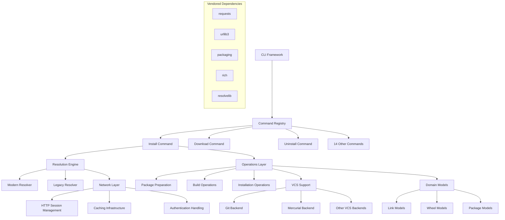
```mermaid
graph TB
    CLI[CLI Framework] --> Commands[Command Registry]
    Commands --> Install[Install Command]
    Commands --> Download[Download Command]
    Commands --> Uninstall[Uninstall Command]
    Commands --> Other[14 Other Commands]
    
    Install --> Resolution[Resolution Engine]
    Resolution --> Modern[Modern Resolver]
    Resolution --> Legacy[Legacy Resolver]
    
    Resolution --> Network[Network Layer]
    Network --> HTTP[HTTP Session Management]
    Network --> Cache[Caching Infrastructure]
    Network --> Auth[Authentication Handling]
    
    Install --> Operations[Operations Layer]
    Operations --> Prepare[Package Preparation]
    Operations --> Build[Build Operations]
    Operations --> Install_Op[Installation Operations]
    
    Operations --> VCS[VCS Support]
    VCS --> Git[Git Backend]
    VCS --> Mercurial[Mercurial Backend]
    VCS --> Other_VCS[Other VCS Backends]
    
    Operations --> Models[Domain Models]
    Models --> Links[Link Models]
    Models --> Wheels[Wheel Models]
    Models --> Packages[Package Models]
    
    subgraph "Vendored Dependencies"
        Requests[requests]
        urllib3[urllib3]
        packaging[packaging]
        rich[rich]
        resolvelib[resolvelib]
    end
```

The system architecture consists of eight primary subsystems:

| Component | Purpose | Key Features |
|-----------|---------|--------------|
| CLI Framework | Command-line interface management | Option parsing, progress indicators, status codes |
| Commands | Command execution engine | 17 main commands with extensible registry |
| Resolution Engine | Dependency resolution logic | Modern and legacy resolvers with conflict detection |
| Network Layer | HTTP communication and caching | Session management, retry logic, download resumption |
| Operations | Core package operations | Installation, uninstallation, building, preparation |
| VCS Support | Version control integration | Git, Mercurial, Bazaar, Subversion backends |
| Models | Domain object representation | Links, wheels, packages, schemes with PEP 610 support |
| Vendored Dependencies | Self-contained dependency management | Isolated third-party libraries to avoid bootstrapping issues |

#### Core Technical Approach

pip follows several key architectural principles:

- **Self-Contained Architecture**: All dependencies are vendored to prevent circular dependency issues during installation
- **Extensible Command System**: New commands integrate seamlessly through the command registry pattern
- **Pluggable VCS Support**: Version control backends register automatically, enabling easy extension
- **Standards Compliance**: Strict adherence to Python packaging PEPs ensures interoperability
- **Progressive Enhancement**: Newer features gracefully degrade on older Python versions

### 1.2.3 Success Criteria

#### Measurable Objectives

| Metric | Target | Measurement Method |
|--------|--------|-------------------|
| Package Installation Success Rate | >99% | Automated testing across package types |
| Dependency Resolution Performance | <30s for complex graphs | Benchmark testing with known dependency trees |
| Network Retry Success Rate | >95% for transient failures | Monitoring of retry mechanism effectiveness |
| Cache Hit Rate | >80% for repeated operations | Cache utilization analytics |

#### Critical Success Factors
- **Backward Compatibility**: Maintaining compatibility with existing workflows and scripts
- **Security Posture**: Zero known vulnerabilities in vendored dependencies
- **Cross-Platform Consistency**: Identical behavior across Windows, macOS, and Linux
- **Standards Compliance**: Full adherence to Python packaging PEPs and specifications

#### Key Performance Indicators (KPIs)
- **Package Discovery Time**: Significantly improved performance on Python 3.11+ through optimized metadata extraction
- **Download Efficiency**: Partial content support for resumed downloads and bandwidth optimization
- **Resolution Time**: Optimized algorithms for complex dependency graph resolution
- **Memory Usage**: Efficient memory management during large installation operations

## 1.3 SCOPE

### 1.3.1 In-Scope

#### Core Features and Functionalities

**Must-Have Capabilities:**
- Package installation from PyPI and custom indexes with comprehensive format support
- Advanced dependency resolution with conflict detection and intelligent version selection
- Package uninstallation with dependency impact analysis
- Requirements file processing with version pinning and constraint handling
- Wheel building and persistent caching for performance optimization
- Virtual environment integration and isolation support
- Cross-platform compatibility across Windows, macOS, and Linux environments

**Primary User Workflows:**
- Standard package installation: `pip install package`
- Development installations: `pip install -e .`
- Requirements-based installation: `pip install -r requirements.txt`
- Package upgrading: `pip install --upgrade package`
- Environment introspection: `pip list`, `pip show`, `pip freeze`
- Package uninstallation: `pip uninstall package`

**Essential Integrations:**
- PyPI and custom package indexes with authentication support
- Version control systems (Git, Mercurial, Bazaar, Subversion) for direct URL installation
- Build backends via PEP 517/518 compliance for modern package building
- System keyring for secure credential storage and management
- HTTP proxies and authentication systems for enterprise environments

**Key Technical Requirements:**
- Python 3.9+ support with forward compatibility planning
- Comprehensive PEP compliance (503, 517, 518, 610, 621, 660)
- Secure HTTPS communications with certificate validation
- Atomic file operations for installation reliability
- Robust error handling and recovery mechanisms

#### Implementation Boundaries

| Boundary Type | Coverage |
|---------------|----------|
| System Boundaries | Package installation, dependency resolution, network operations, VCS integration |
| User Groups | Python developers, system administrators, CI/CD systems, enterprise users |
| Geographic Coverage | Global with proxy and authentication support for restricted networks |
| Data Domains | Package metadata, dependency graphs, installation records, cache management |

### 1.3.2 Out-of-Scope

#### Explicitly Excluded Features and Capabilities
- **Python Version Support**: Python 2.x and Python versions below 3.9 are not supported
- **Repository Management**: Package hosting, repository administration, or index server management
- **Security Analysis**: Source code analysis, vulnerability scanning, or security auditing of packages
- **Automatic Maintenance**: Automatic dependency version bumping or package updates
- **Cross-Language Support**: Integration with non-Python package managers (npm, gem, etc.)

#### Future Phase Considerations
- **Enhanced Lockfile Support**: Currently experimental, planned for future stable release
- **Performance Optimizations**: Continued improvements in package discovery and resolution speed
- **Extended Platform Features**: Platform-specific optimizations and integrations

#### Integration Points Not Covered
- **Package Upload Services**: Package publishing to PyPI (delegated to twine)
- **Build System Implementation**: Package building logic (delegated to build backends)
- **Repository Hosting**: Custom index server implementation or maintenance

#### Unsupported Use Cases
- **Direct Library API Usage**: pip is designed as a command-line tool only, not as a library for programmatic use
- **Package Building**: Build system functionality is delegated to PEP 517 build backends
- **Package Publishing**: Upload and publishing workflows are handled by dedicated tools like twine

#### References
- `src/pip/__init__.py` - Version information and main entry point
- `src/pip/_internal/cli/` - CLI framework implementation
- `src/pip/_internal/commands/` - Complete command registry with 17 main commands
- `src/pip/_internal/resolution/` - Modern and legacy resolution engine implementations
- `src/pip/_internal/network/` - Network layer with HTTP session management and caching
- `src/pip/_internal/operations/` - Core package operations including installation and building
- `src/pip/_internal/vcs/` - Version control system integration backends
- `src/pip/_internal/models/` - Domain models for links, wheels, and packages
- `src/pip/_vendor/` - Vendored dependencies including requests, urllib3, packaging, rich, resolvelib
- `pyproject.toml` - Project metadata and configuration
- `README.rst` - Project overview and documentation references
- `noxfile.py` - Development automation and testing configuration

# 2. PRODUCT REQUIREMENTS

## 2.1 FEATURE CATALOG

### 2.1.1 Package Installation and Management Features

#### F-001: Core Installation Feature
| Attribute | Value |
|-----------|--------|
| **Feature ID** | F-001 |
| **Feature Name** | Core Package Installation |
| **Category** | Package Management |
| **Priority** | Critical |
| **Status** | Completed |

**Description:**
- **Overview**: Comprehensive package installation system supporting multiple source types including PyPI, custom indexes, VCS repositories, local directories, and archive files
- **Business Value**: Enables seamless package acquisition and installation, forming the foundation of Python package management
- **User Benefits**: Single interface for all package installation needs with intelligent source detection and flexible installation options
- **Technical Context**: Implemented in `src/pip/_internal/commands/install.py` with support for PEP 517/518 build backends and advanced installation modes

**Dependencies:**
- **Prerequisite Features**: F-004 (Dependency Resolution), F-020 (Network Layer)
- **System Dependencies**: Python 3.9+, HTTP/HTTPS connectivity
- **External Dependencies**: PyPI or custom package indexes
- **Integration Requirements**: Build backends, VCS systems, authentication providers

#### F-002: Package Download Feature
| Attribute | Value |
|-----------|--------|
| **Feature ID** | F-002 |
| **Feature Name** | Package Download |
| **Category** | Package Management |
| **Priority** | High |
| **Status** | Completed |

**Description:**
- **Overview**: Download packages and their dependencies without installation for offline use or inspection
- **Business Value**: Enables package acquisition for air-gapped environments and deployment preparation
- **User Benefits**: Allows package collection and verification before installation
- **Technical Context**: Implemented in `src/pip/_internal/commands/download.py` with cache integration and resume capabilities

**Dependencies:**
- **Prerequisite Features**: F-004 (Dependency Resolution), F-020 (Network Layer)
- **System Dependencies**: File system write access, network connectivity
- **External Dependencies**: Package indexes
- **Integration Requirements**: Cache system, authentication

#### F-003: Package Uninstallation Feature
| Attribute | Value |
|-----------|--------|
| **Feature ID** | F-003 |
| **Feature Name** | Package Uninstallation |
| **Category** | Package Management |
| **Priority** | High |
| **Status** | Completed |

**Description:**
- **Overview**: Safe removal of installed packages with protection against system corruption
- **Business Value**: Maintains clean environments and prevents dependency conflicts
- **User Benefits**: Reliable package removal with safety checks and batch operations
- **Technical Context**: Implemented in `src/pip/_internal/commands/uninstall.py` with Windows-specific protections

**Dependencies:**
- **Prerequisite Features**: F-013 (Environment Inspection)
- **System Dependencies**: File system write access, package metadata
- **External Dependencies**: None
- **Integration Requirements**: Environment management, protection systems

### 2.1.2 Dependency Resolution Features

#### F-004: Modern Dependency Resolver
| Attribute | Value |
|-----------|--------|
| **Feature ID** | F-004 |
| **Feature Name** | Modern Dependency Resolver |
| **Category** | Dependency Resolution |
| **Priority** | Critical |
| **Status** | Completed |

**Description:**
- **Overview**: Advanced backtracking resolver using resolvelib algorithm for complex dependency graph resolution
- **Business Value**: Provides reliable dependency resolution with conflict detection and resolution
- **User Benefits**: Intelligent version selection and clear conflict reporting
- **Technical Context**: Implemented in `src/pip/_internal/resolution/resolvelib/` with comprehensive constraint handling

**Dependencies:**
- **Prerequisite Features**: F-020 (Network Layer)
- **System Dependencies**: resolvelib library (vendored)
- **External Dependencies**: Package metadata from indexes
- **Integration Requirements**: Package discovery, version comparison

#### F-005: Legacy Dependency Resolver
| Attribute | Value |
|-----------|--------|
| **Feature ID** | F-005 |
| **Feature Name** | Legacy Dependency Resolver |
| **Category** | Dependency Resolution |
| **Priority** | Low |
| **Status** | Deprecated |

**Description:**
- **Overview**: Original breadth-first resolver maintained for backward compatibility
- **Business Value**: Provides fallback resolution for edge cases
- **User Benefits**: Compatibility with legacy workflows
- **Technical Context**: Implemented in `src/pip/_internal/resolution/legacy/` with first-found-wins strategy

**Dependencies:**
- **Prerequisite Features**: F-020 (Network Layer)
- **System Dependencies**: Basic constraint evaluation
- **External Dependencies**: Package metadata
- **Integration Requirements**: Environment marker evaluation

### 2.1.3 Package Building Features

#### F-006: Wheel Building Feature
| Attribute | Value |
|-----------|--------|
| **Feature ID** | F-006 |
| **Feature Name** | Wheel Building |
| **Category** | Package Building |
| **Priority** | High |
| **Status** | Completed |

**Description:**
- **Overview**: Build wheel distributions from source packages using modern build backends
- **Business Value**: Enables package compilation and distribution preparation
- **User Benefits**: Faster subsequent installations through compiled wheels
- **Technical Context**: Implemented in `src/pip/_internal/wheel_builder.py` with PEP 517/660 support

**Dependencies:**
- **Prerequisite Features**: F-026 (PEP 517/518 Support)
- **System Dependencies**: Build isolation environments, temporary directories
- **External Dependencies**: Build backends, system compilers
- **Integration Requirements**: Cache system, build configuration

### 2.1.4 Package Discovery and Indexing Features

#### F-007: Package Search Feature
| Attribute | Value |
|-----------|--------|
| **Feature ID** | F-007 |
| **Feature Name** | Package Search |
| **Category** | Package Discovery |
| **Priority** | Medium |
| **Status** | Completed |

**Description:**
- **Overview**: Search PyPI for packages using XML-RPC interface
- **Business Value**: Enables package discovery and exploration
- **User Benefits**: Find relevant packages before installation
- **Technical Context**: Implemented in `src/pip/_internal/commands/search.py` with terminal formatting

**Dependencies:**
- **Prerequisite Features**: F-020 (Network Layer)
- **System Dependencies**: XML-RPC client capabilities
- **External Dependencies**: PyPI XML-RPC service
- **Integration Requirements**: Terminal output formatting

#### F-008: Package Listing Feature
| Attribute | Value |
|-----------|--------|
| **Feature ID** | F-008 |
| **Feature Name** | Package Listing |
| **Category** | Environment Management |
| **Priority** | High |
| **Status** | Completed |

**Description:**
- **Overview**: List installed packages with various filtering and formatting options
- **Business Value**: Provides environment visibility and package inventory
- **User Benefits**: Multiple output formats and comprehensive filtering
- **Technical Context**: Implemented in `src/pip/_internal/commands/list.py` with JSON output support

**Dependencies:**
- **Prerequisite Features**: F-013 (Environment Inspection)
- **System Dependencies**: Package metadata access
- **External Dependencies**: Optional network for update checks
- **Integration Requirements**: Output formatting, filtering systems

#### F-009: Package Information Display
| Attribute | Value |
|-----------|--------|
| **Feature ID** | F-009 |
| **Feature Name** | Package Information Display |
| **Category** | Environment Management |
| **Priority** | Medium |
| **Status** | Completed |

**Description:**
- **Overview**: Display detailed metadata for installed packages
- **Business Value** : Provides comprehensive package information for troubleshooting
- **User Benefits**: Detailed package metadata and file listings
- **Technical Context**: Implemented in `src/pip/_internal/commands/show.py` with PEP 753 support

**Dependencies:**
- **Prerequisite Features**: F-013 (Environment Inspection)
- **System Dependencies**: Package metadata access
- **External Dependencies**: None
- **Integration Requirements**: Metadata parsers

#### F-010: Index Inspection Feature
| Attribute | Value |
|-----------|--------|
| **Feature ID** | F-010 |
| **Feature Name** | Index Inspection |
| **Category** | Package Discovery |
| **Priority** | Medium |
| **Status** | Completed |

**Description:**
- **Overview**: Query package indexes for available versions and metadata
- **Business Value**: Enables version discovery and release planning
- **User Benefits**: Comprehensive version information with JSON output
- **Technical Context**: Implemented in `src/pip/_internal/commands/index.py` with pre-release support

**Dependencies:**
- **Prerequisite Features**: F-020 (Network Layer)
- **System Dependencies**: JSON processing
- **External Dependencies**: Package indexes
- **Integration Requirements**: Index discovery, version parsing

### 2.1.5 Environment Management Features

#### F-011: Environment Freezing Feature
| Attribute | Value |
|-----------|--------|
| **Feature ID** | F-011 |
| **Feature Name** | Environment Freezing |
| **Category** | Environment Management |
| **Priority** | High |
| **Status** | Completed |

**Description:**
- **Overview**: Generate requirements files from installed packages with version pinning
- **Business Value**: Enables environment reproducibility and deployment consistency
- **User Benefits**: Exact environment replication capabilities
- **Technical Context**: Implemented in `src/pip/_internal/operations/freeze.py` with PEP 610 support

**Dependencies:**
- **Prerequisite Features**: F-013 (Environment Inspection)
- **System Dependencies**: Package metadata access
- **External Dependencies**: None
- **Integration Requirements**: VCS URL generation, direct URL support

#### F-012: Dependency Checking Feature
| Attribute | Value |
|-----------|--------|
| **Feature ID** | F-012 |
| **Feature Name** | Dependency Checking |
| **Category** | Environment Management |
| **Priority** | Medium |
| **Status** | Completed |

**Description:**
- **Overview**: Verify installed packages have compatible dependencies
- **Business Value**: Prevents runtime errors from dependency conflicts
- **User Benefits**: Early detection of dependency issues
- **Technical Context**: Implemented in `src/pip/_internal/operations/check.py` with conflict detection

**Dependencies:**
- **Prerequisite Features**: F-013 (Environment Inspection)
- **System Dependencies**: Package metadata, version parsing
- **External Dependencies**: None
- **Integration Requirements**: Dependency analysis, version comparison

#### F-013: Environment Inspection Feature
| Attribute | Value |
|-----------|--------|
| **Feature ID** | F-013 |
| **Feature Name** | Environment Inspection |
| **Category** | Environment Management |
| **Priority** | High |
| **Status** | Completed |

**Description:**
- **Overview**: Generate comprehensive JSON reports of Python environment state
- **Business Value**: Enables automated environment analysis and auditing
- **User Benefits**: Machine-readable environment information
- **Technical Context**: Implemented in `src/pip/_internal/commands/inspect.py` with metadata export

**Dependencies:**
- **Prerequisite Features**: None
- **System Dependencies**: JSON processing, metadata access
- **External Dependencies**: None
- **Integration Requirements**: Package discovery, metadata parsing

### 2.1.6 Version Control Integration Features

#### F-014: Git Integration
| Attribute | Value |
|-----------|--------|
| **Feature ID** | F-014 |
| **Feature Name** | Git Integration |
| **Category** | Version Control |
| **Priority** | High |
| **Status** | Completed |

**Description:**
- **Overview**: Install packages directly from Git repositories with full branch/tag support
- **Business Value**: Enables development workflow integration and bleeding-edge package access
- **User Benefits**: Direct installation from development repositories
- **Technical Context**: Implemented in `src/pip/_internal/vcs/git.py` with authentication handling

**Dependencies:**
- **Prerequisite Features**: F-020 (Network Layer)
- **System Dependencies**: Git executable, SSH/HTTPS connectivity
- **External Dependencies**: Git repositories
- **Integration Requirements**: Authentication systems, URL parsing

#### F-015: Mercurial Integration
| Attribute | Value |
|-----------|--------|
| **Feature ID** | F-015 |
| **Feature Name** | Mercurial Integration |
| **Category** | Version Control |
| **Priority** | Low |
| **Status** | Completed |

**Description:**
- **Overview**: Install packages from Mercurial repositories
- **Business Value**: Supports organizations using Mercurial for version control
- **User Benefits**: Direct installation from Mercurial repositories
- **Technical Context**: Implemented in `src/pip/_internal/vcs/mercurial.py` with revision handling

**Dependencies:**
- **Prerequisite Features**: F-020 (Network Layer)
- **System Dependencies**: Mercurial executable
- **External Dependencies**: Mercurial repositories
- **Integration Requirements**: URL parsing, authentication

#### F-016: Subversion Integration
| Attribute | Value |
|-----------|--------|
| **Feature ID** | F-016 |
| **Feature Name** | Subversion Integration |
| **Category** | Version Control |
| **Priority** | Low |
| **Status** | Completed |

**Description:**
- **Overview**: Install packages from Subversion repositories
- **Business Value**: Supports legacy organizations using Subversion
- **User Benefits**: Direct installation from SVN repositories
- **Technical Context**: Implemented in `src/pip/_internal/vcs/subversion.py` with authentication

**Dependencies:**
- **Prerequisite Features**: F-020 (Network Layer)
- **System Dependencies**: Subversion executable
- **External Dependencies**: Subversion repositories
- **Integration Requirements**: Authentication systems

#### F-017: Bazaar Integration
| Attribute | Value |
|-----------|--------|
| **Feature ID** | F-017 |
| **Feature Name** | Bazaar Integration |
| **Category** | Version Control |
| **Priority** | Low |
| **Status** | Completed |

**Description:**
- **Overview**: Install packages from Bazaar repositories
- **Business Value**: Supports organizations using Bazaar for version control
- **User Benefits**: Direct installation from Bazaar repositories
- **Technical Context**: Implemented in `src/pip/_internal/vcs/bazaar.py` with branch operations

**Dependencies:**
- **Prerequisite Features**: F-020 (Network Layer)
- **System Dependencies**: Bazaar executable
- **External Dependencies**: Bazaar repositories
- **Integration Requirements**: Branch management, URL parsing

### 2.1.7 System Management Features

#### F-018: Wheel Cache Management
| Attribute | Value |
|-----------|--------|
| **Feature ID** | F-018 |
| **Feature Name** | Wheel Cache Management |
| **Category** | System Management |
| **Priority** | Medium |
| **Status** | Completed |

**Description:**
- **Overview**: Manage local wheel cache for performance optimization
- **Business Value**: Reduces build times and network usage through intelligent caching
- **User Benefits**: Faster repeated installations and cache control
- **Technical Context**: Implemented in `src/pip/_internal/cache.py` with selective removal

**Dependencies:**
- **Prerequisite Features**: F-006 (Wheel Building)
- **System Dependencies**: File system access, disk space
- **External Dependencies**: None
- **Integration Requirements**: Build system, storage management

#### F-019: Configuration Management
| Attribute | Value |
|-----------|--------|
| **Feature ID** | F-019 |
| **Feature Name** | Configuration Management |
| **Category** | System Management |
| **Priority** | High |
| **Status** | Completed |

**Description:**
- **Overview**: Multi-level configuration system for pip behavior customization
- **Business Value**: Enables organizational policy enforcement and user customization
- **User Benefits**: Persistent configuration and environment-specific settings
- **Technical Context**: Implemented in `src/pip/_internal/configuration.py` with environment support

**Dependencies:**
- **Prerequisite Features**: None
- **System Dependencies**: File system access, environment variables
- **External Dependencies**: Optional text editor for editing
- **Integration Requirements**: Configuration hierarchy, validation

### 2.1.8 Networking Features

#### F-020: HTTP/HTTPS Download
| Attribute | Value |
|-----------|--------|
| **Feature ID** | F-020 |
| **Feature Name** | HTTP/HTTPS Download |
| **Category** | Networking |
| **Priority** | Critical |
| **Status** | Completed |

**Description:**
- **Overview**: Secure package downloading with retry logic and resume capabilities
- **Business Value**: Reliable package acquisition across network conditions
- **User Benefits**: Robust downloads with progress indication and authentication
- **Technical Context**: Implemented in `src/pip/_internal/network/` with session management

**Dependencies:**
- **Prerequisite Features**: None
- **System Dependencies**: Network connectivity, certificate validation
- **External Dependencies**: HTTP/HTTPS servers, proxy systems
- **Integration Requirements**: Authentication providers, certificate stores

### 2.1.9 Development and Debugging Features

#### F-021: Debug Information Display
| Attribute | Value |
|-----------|--------|
| **Feature ID** | F-021 |
| **Feature Name** | Debug Information Display |
| **Category** | Development Support |
| **Priority** | Medium |
| **Status** | Completed |

**Description:**
- **Overview**: Display comprehensive system and pip configuration information
- **Business Value**: Enables rapid troubleshooting and support
- **User Benefits**: Complete diagnostic information for issue resolution
- **Technical Context**: Implemented in `src/pip/_internal/commands/debug.py` with platform details

**Dependencies:**
- **Prerequisite Features**: None
- **System Dependencies**: Platform information access
- **External Dependencies**: None
- **Integration Requirements**: Configuration system, platform detection

#### F-022: Shell Completion
| Attribute | Value |
|-----------|--------|
| **Feature ID** | F-022 |
| **Feature Name** | Shell Completion |
| **Category** | Development Support |
| **Priority** | Low |
| **Status** | Completed |

**Description:**
- **Overview**: Generate completion scripts for various shells
- **Business Value**: Improves developer productivity through command completion
- **User Benefits**: Auto-completion for commands and options
- **Technical Context**: Implemented in `src/pip/_internal/commands/completion.py` with multi-shell support

**Dependencies:**
- **Prerequisite Features**: None
- **System Dependencies**: Shell environment
- **External Dependencies**: None
- **Integration Requirements**: Shell integration, command registry

#### F-023: Help System
| Attribute | Value |
|-----------|--------|
| **Feature ID** | F-023 |
| **Feature Name** | Help System |
| **Category** | Development Support |
| **Priority** | Medium |
| **Status** | Completed |

**Description:**
- **Overview**: Comprehensive help system with command suggestions
- **Business Value**: Reduces learning curve and improves usability
- **User Benefits**: Context-aware help and command discovery
- **Technical Context**: Implemented in `src/pip/_internal/commands/help.py` with similarity matching

**Dependencies:**
- **Prerequisite Features**: None
- **System Dependencies**: Text processing
- **External Dependencies**: None
- **Integration Requirements**: Command registry, documentation

### 2.1.10 Security Features

#### F-024: Hash Verification
| Attribute | Value |
|-----------|--------|
| **Feature ID** | F-024 |
| **Feature Name** | Hash Verification |
| **Category** | Security |
| **Priority** | High |
| **Status** | Completed |

**Description:**
- **Overview**: Cryptographic verification of package integrity using multiple hash algorithms
- **Business Value**: Prevents supply chain attacks and ensures package integrity
- **User Benefits**: Guaranteed package authenticity and security
- **Technical Context**: Implemented in `src/pip/_internal/utils/hashes.py` with multi-algorithm support

**Dependencies:**
- **Prerequisite Features**: F-020 (Network Layer)
- **System Dependencies**: Cryptographic libraries
- **External Dependencies**: Hash values from sources
- **Integration Requirements**: Download verification, requirements parsing

### 2.1.11 Experimental Features

#### F-025: Dependency Locking
| Attribute | Value |
|-----------|--------|
| **Feature ID** | F-025 |
| **Feature Name** | Dependency Locking |
| **Category** | Experimental |
| **Priority** | Low |
| **Status** | In Development |

**Description:**
- **Overview**: Generate reproducible lock files for complete dependency trees
- **Business Value**: Enables deterministic builds and deployment consistency
- **User Benefits**: Reproducible environments across different systems
- **Technical Context**: Implemented in `src/pip/_internal/commands/lock.py` with TOML format

**Dependencies:**
- **Prerequisite Features**: F-004 (Modern Resolver)
- **System Dependencies**: TOML processing
- **External Dependencies**: None
- **Integration Requirements**: Resolution engine, serialization

### 2.1.12 Build System Integration Features

#### F-026: PEP 517/518 Support
| Attribute | Value |
|-----------|--------|
| **Feature ID** | F-026 |
| **Feature Name** | PEP 517/518 Support |
| **Category** | Build System |
| **Priority** | Critical |
| **Status** | Completed |

**Description:**
- **Overview**: Modern Python build system support with pyproject.toml integration
- **Business Value**: Enables modern packaging workflows and build backend flexibility
- **User Benefits**: Support for modern Python packages and build systems
- **Technical Context**: Implemented in `src/pip/_internal/pyproject.py` with build isolation

**Dependencies:**
- **Prerequisite Features**: F-006 (Wheel Building)
- **System Dependencies**: Build isolation, temporary environments
- **External Dependencies**: Build backends (setuptools, flit, poetry-core, etc.)
- **Integration Requirements**: Build dependency installation, metadata generation

#### F-027: PEP 660 Support
| Attribute | Value |
|-----------|--------|
| **Feature ID** | F-027 |
| **Feature Name** | PEP 660 Support |
| **Category** | Build System |
| **Priority** | Medium |
| **Status** | Completed |

**Description:**
- **Overview**: Editable installs via wheels for improved development workflows
- **Business Value**: Modernizes development workflows with better editable install support
- **User Benefits**: Faster and more reliable development installations
- **Technical Context**: Implemented in `src/pip/_internal/operations/build/wheel_editable.py`

**Dependencies:**
- **Prerequisite Features**: F-026 (PEP 517/518 Support)
- **System Dependencies**: Build backends with PEP 660 support
- **External Dependencies**: Compatible build backends
- **Integration Requirements**: Editable wheel building, development mode

## 2.2 FUNCTIONAL REQUIREMENTS TABLE

### 2.2.1 Package Installation Requirements

#### F-001: Core Installation Feature Requirements

| Requirement ID | Description | Acceptance Criteria | Priority |
|----------------|-------------|--------------------|---------| 
| F-001-RQ-001 | PyPI Package Installation | System shall install packages from PyPI with `pip install package_name` | Must-Have |
| F-001-RQ-002 | Requirements File Processing | System shall process requirements files with `pip install -r requirements.txt` | Must-Have |
| F-001-RQ-003 | Editable Installation | System shall support editable installs with `pip install -e path` | Must-Have |
| F-001-RQ-004 | Version Specification | System shall handle version specifiers (==, >=, <=, !=, ~=, >) | Must-Have |
| F-001-RQ-005 | VCS URL Installation | System shall install from VCS URLs (git+https, hg+https, etc.) | Should-Have |
| F-001-RQ-006 | Custom Index Support | System shall support custom indexes with --index-url | Should-Have |
| F-001-RQ-007 | Constraint File Support | System shall process constraint files with -c constraints.txt | Should-Have |
| F-001-RQ-008 | Dry Run Mode | System shall simulate installations with --dry-run | Could-Have |
| F-001-RQ-009 | Target Directory | System shall install to custom directories with --target | Could-Have |
| F-001-RQ-010 | Force Reinstall | System shall force package reinstallation with --force-reinstall | Could-Have |

**Technical Specifications:**
- **Input Parameters**: Package names, URLs, file paths, version specifiers
- **Output/Response**: Installation status, error messages, progress indicators
- **Performance Criteria**: Installation time <2 minutes for typical packages
- **Data Requirements**: Package metadata, dependency information

**Validation Rules:**
- **Business Rules**: Respect dependency constraints and version requirements
- **Data Validation**: Verify package names, validate URLs, check file existence
- **Security Requirements**: HTTPS by default, hash verification when available
- **Compliance Requirements**: PEP 508 dependency specification compliance

### 2.2.2 Dependency Resolution Requirements

#### F-004: Modern Dependency Resolver Requirements

| Requirement ID | Description | Acceptance Criteria | Priority |
|----------------|-------------|--------------------|---------| 
| F-004-RQ-001 | Backtracking Resolution | System shall use backtracking algorithm for dependency resolution | Must-Have |
| F-004-RQ-002 | Conflict Detection | System shall detect and report version conflicts | Must-Have |
| F-004-RQ-003 | Environment Marker Evaluation | System shall evaluate environment markers for platform-specific dependencies | Must-Have |
| F-004-RQ-004 | Extra Dependencies | System shall handle optional dependencies with extras syntax | Must-Have |
| F-004-RQ-005 | Yanked Package Handling | System shall respect yanked package metadata | Should-Have |
| F-004-RQ-006 | Resolution Caching | System shall cache resolution results for performance | Should-Have |
| F-004-RQ-007 | Progress Reporting | System shall provide progress indication during resolution | Could-Have |
| F-004-RQ-008 | Backtracking Warnings | System shall warn about excessive backtracking | Could-Have |

**Technical Specifications:**
- **Input Parameters**: Package specifications, constraints, environment markers
- **Output/Response**: Resolved dependency tree, conflict reports
- **Performance Criteria**: Resolution time <30 seconds for complex graphs
- **Data Requirements**: Package metadata, version information, dependency graphs

**Validation Rules:**
- **Business Rules**: Respect version constraints and dependency requirements
- **Data Validation**: Validate version specifiers, check constraint compatibility
- **Security Requirements**: Verify package authenticity during resolution
- **Compliance Requirements**: PEP 508 specification compliance

### 2.2.3 Network Operations Requirements

#### F-020: HTTP/HTTPS Download Requirements

| Requirement ID | Description | Acceptance Criteria | Priority |
|----------------|-------------|--------------------|---------| 
| F-020-RQ-001 | HTTPS Default | System shall use HTTPS by default for all downloads | Must-Have |
| F-020-RQ-002 | Certificate Validation | System shall validate SSL certificates | Must-Have |
| F-020-RQ-003 | Retry Logic | System shall retry failed downloads with exponential backoff | Must-Have |
| F-020-RQ-004 | Progress Indicators | System shall display download progress | Must-Have |
| F-020-RQ-005 | Resume Downloads | System shall resume interrupted downloads | Should-Have |
| F-020-RQ-006 | Proxy Support | System shall support HTTP/HTTPS proxies | Should-Have |
| F-020-RQ-007 | Authentication | System shall support various authentication methods | Should-Have |
| F-020-RQ-008 | Custom CA Bundles | System shall support custom certificate bundles | Could-Have |
| F-020-RQ-009 | Trusted Hosts | System shall support trusted host configuration | Could-Have |
| F-020-RQ-010 | Range Requests | System shall support HTTP range requests for partial downloads | Could-Have |

**Technical Specifications:**
- **Input Parameters**: URLs, authentication credentials, proxy settings
- **Output/Response**: Downloaded files, progress updates, error messages
- **Performance Criteria**: Download speed >1MB/s on typical connections
- **Data Requirements**: Network connectivity, certificate validation

**Validation Rules:**
- **Business Rules**: Respect server rate limits and retry policies
- **Data Validation**: Validate URLs, verify content integrity
- **Security Requirements**: Certificate validation, secure credential storage
- **Compliance Requirements**: HTTP/HTTPS protocol compliance

### 2.2.4 Build System Requirements

#### F-026: PEP 517/518 Support Requirements

| Requirement ID | Description | Acceptance Criteria | Priority |
|----------------|-------------|--------------------|---------| 
| F-026-RQ-001 | pyproject.toml Parsing | System shall parse pyproject.toml files correctly | Must-Have |
| F-026-RQ-002 | Build Backend Detection | System shall detect and use specified build backends | Must-Have |
| F-026-RQ-003 | Build Isolation | System shall create isolated build environments | Must-Have |
| F-026-RQ-004 | Build Dependencies | System shall install build dependencies automatically | Must-Have |
| F-026-RQ-005 | Metadata Generation | System shall generate package metadata via build backends | Must-Have |
| F-026-RQ-006 | Configuration Settings | System shall pass configuration settings to build backends | Should-Have |
| F-026-RQ-007 | Build Caching | System shall cache build results for performance | Should-Have |
| F-026-RQ-008 | Error Handling | System shall provide clear build error messages | Should-Have |

**Technical Specifications:**
- **Input Parameters**: pyproject.toml files, build configuration
- **Output/Response**: Built wheels, metadata, build logs
- **Performance Criteria**: Build time <5 minutes for typical packages
- **Data Requirements**: Source code, build dependencies, build tools

**Validation Rules:**
- **Business Rules**: Respect build backend requirements and capabilities
- **Data Validation**: Validate pyproject.toml format, check build backend availability
- **Security Requirements**: Isolated build environments, secure dependency installation
- **Compliance Requirements**: PEP 517/518 specification compliance

## 2.3 FEATURE RELATIONSHIPS

### 2.3.1 Feature Dependencies Map

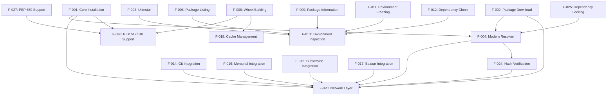
```mermaid
graph TD
    F001[F-001: Core Installation] --> F004[F-004: Modern Resolver]
    F001 --> F020[F-020: Network Layer]
    F001 --> F026[F-026: PEP 517/518 Support]
    
    F002[F-002: Package Download] --> F004
    F002 --> F020
    
    F003[F-003: Uninstall] --> F013[F-013: Environment Inspection]
    
    F004 --> F020
    F004 --> F024[F-024: Hash Verification]
    
    F006[F-006: Wheel Building] --> F026
    F006 --> F018[F-018: Cache Management]
    
    F008[F-008: Package Listing] --> F013
    F009[F-009: Package Information] --> F013
    
    F011[F-011: Environment Freezing] --> F013
    F012[F-012: Dependency Check] --> F013
    
    F014[F-014: Git Integration] --> F020
    F015[F-015: Mercurial Integration] --> F020
    F016[F-016: Subversion Integration] --> F020
    F017[F-017: Bazaar Integration] --> F020
    
    F024 --> F020
    F025[F-025: Dependency Locking] --> F004
    F027[F-027: PEP 660 Support] --> F026
```

### 2.3.2 Integration Points

| Feature Category | Integration Points | Shared Components |
|------------------|--------------------|--------------------|
| **Package Management** | CLI framework, command registry | Common option handling, progress reporting |
| **Dependency Resolution** | Network layer, cache system | Version parsing, constraint evaluation |
| **Build System** | VCS integration, cache management | Build environments, metadata parsing |
| **Network Operations** | Authentication, proxy support | Session management, retry logic |

### 2.3.3 Common Services

#### Shared Authentication Service
- **Features**: F-001, F-002, F-007, F-010, F-014-F-017, F-020
- **Purpose**: Centralized credential management
- **Components**: Keyring integration, .netrc support, proxy authentication

#### Shared Caching Service
- **Features**: F-001, F-002, F-004, F-006, F-018, F-020
- **Purpose**: Performance optimization through caching
- **Components**: HTTP cache, wheel cache, metadata cache

#### Shared Configuration Service
- **Features**: All features
- **Purpose**: Centralized configuration management
- **Components**: Multi-level configuration, environment variables

## 2.4 IMPLEMENTATION CONSIDERATIONS

### 2.4.1 Technical Constraints

#### Platform Compatibility
- **Python Version**: Minimum Python 3.9 support
- **Operating Systems**: Windows, macOS, Linux compatibility required
- **Architecture**: x86, x64, ARM support where applicable
- **Performance**: Optimized for Python 3.11+ with metadata improvements

#### Security Constraints
- **Transport Security**: HTTPS mandatory for package downloads
- **Authentication**: Secure credential storage using system keyring
- **Verification**: Hash verification for package integrity
- **Isolation**: Build isolation to prevent system contamination

#### Integration Constraints
- **Self-Contained**: All dependencies must be vendored to avoid bootstrapping issues
- **Standards Compliance**: Must conform to Python packaging PEPs
- **Backward Compatibility**: Maintain compatibility with existing workflows

### 2.4.2 Performance Requirements

#### Installation Performance
- **Target Time**: <2 minutes for typical package installation
- **Dependency Resolution**: <30 seconds for complex dependency graphs
- **Network Optimization**: Resume interrupted downloads, efficient caching
- **Memory Usage**: Efficient memory management during large operations

#### Caching Performance
- **Cache Hit Rate**: >80% for repeated operations
- **Cache Efficiency**: Automatic cache cleanup and size management
- **Build Cache**: Persistent wheel caching for performance

### 2.4.3 Scalability Considerations

#### Concurrent Operations
- **Network Concurrency**: Parallel download support where safe
- **Build Isolation**: Multiple isolated build environments
- **Cache Concurrency**: Thread-safe cache operations

#### Large-Scale Deployments
- **Enterprise Support**: Proxy and authentication integration
- **Custom Indexes**: Support for private package repositories
- **Batch Operations**: Efficient processing of requirements files

### 2.4.4 Security Implications

#### Supply Chain Security
- **Package Verification**: Hash verification and signature support
- **Trusted Sources**: Configurable trusted hosts and indexes
- **Vulnerability Management**: Regular security updates for vendored dependencies

#### Network Security
- **Certificate Validation**: Strict SSL/TLS certificate verification
- **Proxy Security**: Secure proxy authentication and configuration
- **Credential Protection**: Secure storage and handling of authentication credentials

### 2.4.5 Maintenance Requirements

#### Code Maintainability
- **Modular Architecture**: Clear separation of concerns
- **Test Coverage**: Comprehensive test suite for all features, with <span style="background-color: rgba(91, 57, 243, 0.2)">≥90% line and branch coverage explicitly for the `--require-virtualenv` enforcement logic in `src/pip/_internal/cli/base_command.py`. Each new unit test must execute in <100 ms on average.</span>
- **Documentation**: Maintained technical documentation

#### Operational Maintainability
- **Logging**: Comprehensive logging for troubleshooting
- **Debugging**: Debug information and diagnostic tools
- **Monitoring**: Performance metrics and error tracking

### 2.4.6 Testing Infrastructure Requirements

#### Unit Testing Framework
- **Testing Framework**: pytest with existing pip test infrastructure
- **Mocking Strategy**: Minimal and focused mocking using `unittest.mock`
- **Fixture Management**: Reusable test fixtures for common scenarios
- **Test Organization**: Clear separation between unit and functional tests

#### Coverage Analysis
- **Coverage Tools**: coverage.py ≥5.2.1 with branch coverage enabled
- **Target Metrics**: ≥90% line and branch coverage for critical features
- **Performance Benchmarks**: All unit tests must complete in <100ms average execution time
- **Quality Assurance**: Minimum 2-3 assertions per test with proper isolation

#### Test Data Management
- **Mock Data**: Controlled test environments using `monkeypatch`
- **Test Isolation**: Each test must be independent and repeatable
- **State Management**: Clean state setup and teardown for all tests
- **Virtual Environment Testing**: Controlled virtualenv detection states

### 2.4.7 Feature-Specific Implementation Requirements

#### Virtual Environment Enforcement
- **Detection Logic**: Reliable virtual environment detection via `running_under_virtualenv()`
- **Command Bypass**: Selective command exemption from virtual environment requirements
- **Error Handling**: Clear error messages with appropriate exit codes
- **Configuration**: Configurable enforcement policies

#### Build System Integration
- **PEP 517/518 Support**: Modern build backend integration with isolation
- **Legacy Compatibility**: Fallback support for setup.py-based packages
- **Performance Optimization**: Efficient build caching and wheel reuse
- **Error Recovery**: Robust error handling and recovery mechanisms

#### Dependency Resolution
- **Resolution Algorithm**: Backtracking resolver with conflict detection
- **Performance Constraints**: <30 seconds resolution time for complex graphs
- **Cache Integration**: Efficient metadata and resolution caching
- **Constraint Handling**: Proper processing of version constraints and environment markers

### 2.4.8 Operational Considerations

#### Deployment Requirements
- **Self-Contained Distribution**: All dependencies vendored to prevent bootstrapping issues
- **Platform Independence**: Consistent behavior across supported platforms
- **Upgrade Compatibility**: Smooth upgrade paths between versions
- **Configuration Migration**: Automatic configuration format migration

#### Monitoring and Diagnostics
- **Performance Metrics**: Installation time, resolution time, cache hit rates
- **Error Tracking**: Comprehensive error reporting and categorization
- **Usage Analytics**: Optional anonymized usage statistics
- **Health Checks**: System health validation and diagnostic tools

#### Support and Maintenance
- **Documentation Standards**: Comprehensive technical documentation
- **Issue Tracking**: Clear bug reporting and resolution processes
- **Security Updates**: Regular security patches and vulnerability management
- **Community Support**: Active community engagement and contribution guidelines

## 2.5 TRACEABILITY MATRIX

| Business Requirement | Features | Implementation |
|----------------------|----------|----------------|
| Package Installation | F-001, F-002, F-003 | `src/pip/_internal/commands/install.py` |
| Dependency Resolution | F-004, F-005 | `src/pip/_internal/resolution/` |
| Build System Support | F-006, F-026, F-027 | `src/pip/_internal/operations/build/` |
| Network Operations | F-020 | `src/pip/_internal/network/` |
| Environment Management | F-011, F-012, F-013 | `src/pip/_internal/operations/` |
| VCS Integration | F-014, F-015, F-016, F-017 | `src/pip/_internal/vcs/` |
| Security Features | F-024 | `src/pip/_internal/utils/hashes.py` |
| Configuration Management | F-019 | `src/pip/_internal/configuration.py` |
| Development Support | F-021, F-022, F-023 | `src/pip/_internal/commands/` |

#### References
- `src/pip/_internal/commands/install.py` - Core installation command implementation
- `src/pip/_internal/resolution/resolvelib/` - Modern dependency resolution engine
- `src/pip/_internal/network/` - Network layer and HTTP session management
- `src/pip/_internal/operations/build/` - Build system integration and wheel building
- `src/pip/_internal/vcs/` - Version control system integration backends
- `src/pip/_internal/utils/hashes.py` - Hash verification and security utilities
- `src/pip/_internal/configuration.py` - Multi-level configuration management
- `src/pip/_internal/operations/freeze.py` - Environment freezing and requirements generation
- `src/pip/_internal/operations/check.py` - Dependency compatibility checking
- `src/pip/_internal/cache.py` - Caching infrastructure for performance optimization
- `src/pip/_internal/pyproject.py` - PEP 517/518 build backend support
- `src/pip/_internal/models/` - Domain models for packages, links, and wheels
- `src/pip/_vendor/` - Vendored dependencies including requests, urllib3, packaging, rich, resolvelib
- `tests/conftest.py` - Test configuration showing feature coverage

# 3. TECHNOLOGY STACK

## 3.1 PROGRAMMING LANGUAGES

### 3.1.1 Primary Language Platform
pip is implemented entirely in **Python**, supporting multiple versions to ensure broad compatibility across the Python ecosystem:

- **Python 3.9**: Minimum supported version
- **Python 3.10**: Enhanced with truststore certificate management
- **Python 3.11**: Optimized performance for metadata extraction
- **Python 3.12**: Current stable version support
- **Python 3.13**: Latest version support
- **PyPy3**: Alternative Python implementation support

### 3.1.2 Configuration and Markup Languages
The system utilizes several configuration languages for different aspects:

- **TOML**: Primary configuration format for `pyproject.toml` and build system configuration
- **YAML**: CI/CD pipeline configuration and GitHub Actions workflows
- **INI**: Legacy `pip.conf` configuration file support
- **JSON**: API responses, metadata exchange, and structured output formats
- **reStructuredText**: Primary documentation format with Sphinx integration
- **Markdown (MyST)**: Extended documentation support

### 3.1.3 Language Selection Rationale
Python was chosen as the sole implementation language to:
- Ensure seamless integration with the Python ecosystem
- Maintain consistency with Python packaging standards
- Leverage existing Python developer expertise
- Provide native compatibility with Python environments

## 3.2 FRAMEWORKS & LIBRARIES

### 3.2.1 Core Vendored Dependencies
All critical dependencies are vendored to prevent circular dependency issues during pip's own installation:

#### Resolution and Packaging Framework
- **resolvelib 1.2.0**: Modern dependency resolution algorithm providing backtracking capabilities for complex dependency graphs
- **packaging 25.0**: Core packaging utilities for version parsing, specifier handling, and requirement processing
- **setuptools 70.3.0**: Build system integration and legacy package management support

#### HTTP and Networking Framework
- **requests 2.32.4**: HTTP library for secure package downloads with session management and authentication
- **urllib3 2.2.3**: Low-level HTTP client with connection pooling and retry logic
- **certifi 2025.6.15**: Certificate authority bundle for HTTPS verification

#### User Interface and Display Framework
- **rich 14.0.0**: Terminal formatting, progress bars, and enhanced CLI output
- **colorama 0.4.6**: Cross-platform colored terminal text support

#### Build System Framework
- **pyproject-hooks 1.2.0**: PEP 517 build system integration for modern Python packages
- **build 1.2.2.post1**: PEP 517 package building with isolation support
- **wheel 0.45.1**: Binary distribution format handling

### 3.2.2 Supporting Libraries
Additional vendored libraries provide specialized functionality:

- **distlib 0.3.9**: Distribution utilities for metadata processing
- **msgpack 1.1.0**: Efficient binary serialization
- **platformdirs 4.3.6**: Cross-platform directory management
- **tomli 2.2.1**: TOML parsing for Python versions lacking native support
- **typing_extensions 4.12.2**: Backport of typing features for older Python versions

### 3.2.3 Framework Integration Architecture
The vendored dependency strategy ensures:
- **Isolation**: No external dependencies during pip installation
- **Stability**: Controlled dependency versions prevent conflicts
- **Security**: Vetted dependency versions with known security status
- **Compatibility**: Consistent behavior across different Python environments

## 3.3 OPEN SOURCE DEPENDENCIES

### 3.3.1 Development and Testing Framework
Development dependencies managed through `pyproject.toml`:

#### Testing Infrastructure
- **pytest**: Primary testing framework with comprehensive fixture support
- **pytest-cov**: Code coverage measurement and reporting
- **pytest-xdist**: Parallel test execution for performance
- **pytest-rerunfailures**: Flaky test handling and retry logic
- <span style="background-color: rgba(91, 57, 243, 0.2)">**coverage.py ≥5.2.1**: Core coverage engine with branch coverage support</span>

#### Code Quality Tools
- **ruff**: Fast Python linter replacing flake8, isort, and other tools
- **mypy**: Static type checking for enhanced code reliability
- **black**: Code formatting for consistent style
- **pre-commit**: Git hook framework for automated quality checks

#### Documentation Tools
- **sphinx ~7.0**: Documentation generation with reStructuredText support
- **sphinx-tabs**: Tabbed content extension for documentation
- **sphinx-copybutton**: Copy button functionality for code blocks
- **myst-parser**: Markdown support in Sphinx documentation

### 3.3.2 Build and Release Management
- **nox**: Session-based task automation replacing tox
- **towncrier <24**: Changelog generation from news fragments
- **build 1.2.2.post1**: PEP 517 package building for distribution
- **twine**: Secure package uploading to PyPI

### 3.3.3 Package Management
All dependencies are managed through:
- **pip-tools**: Dependency resolution and lock file generation
- **dependabot**: Automated dependency updates via GitHub Actions
- **Vendoring process**: Custom tooling for dependency vendoring

## 3.4 THIRD-PARTY SERVICES

### 3.4.1 Package Repository Services
#### Primary Package Index
- **PyPI (Python Package Index)**: Primary package repository
  - **Simple Repository API (PEP 503)**: Package discovery and metadata
  - **JSON API**: Package metadata and version information
  - **XML-RPC API**: Search functionality (deprecated but supported)
  - **Upload API**: Package publishing interface

#### Custom Package Indexes
- **Private PyPI servers**: Enterprise package repositories
- **DevPI**: Development and testing package index
- **Artifactory**: Enterprise artifact management
- **Nexus Repository**: Package proxy and hosting

### 3.4.2 Version Control Services
Integrated VCS providers for direct package installation:

- **Git repositories**: GitHub, GitLab, Bitbucket, Azure DevOps
- **Mercurial repositories**: Bitbucket, SourceForge
- **Subversion repositories**: Apache SVN, VisualSVN Server
- **Bazaar repositories**: Launchpad integration

### 3.4.3 Authentication and Security Services
- **Keyring integration**: System credential storage
- **Truststore (Python 3.10+)**: System certificate management
- **HTTP Basic Authentication**: Standard authentication support
- **.netrc file support**: Automated credential management
- **Token-based authentication**: API token and bearer token support

### 3.4.4 Development and CI/CD Services
- **GitHub Actions**: Primary CI/CD platform for testing and releases
- **Read the Docs**: Documentation hosting and building
- **Codecov**: Code coverage reporting and analysis
- **GitHub Security Advisory**: Vulnerability scanning and alerts

## 3.5 DATABASES & STORAGE

### 3.5.1 File System Storage
pip utilizes file system-based storage for all persistence needs:

#### Package Cache Storage
- **Wheel cache**: Built wheels stored in `~/.cache/pip/wheels/`
- **HTTP cache**: Downloaded packages cached in `~/.cache/pip/http/`
- **Metadata cache**: Package metadata stored for offline access

#### Configuration Storage
- **User configuration**: `~/.pip/pip.conf` or `~/.config/pip/pip.conf`
- **System configuration**: `/etc/pip.conf` or system-wide locations
- **Virtual environment configuration**: Local `pip.conf` files

### 3.5.2 Temporary Storage
- **Build directories**: Isolated temporary directories for package building
- **Download directories**: Temporary storage for package downloads
- **Extraction directories**: Temporary locations for archive extraction

### 3.5.3 Metadata Storage
- **Package metadata**: Distribution metadata from installed packages
- **VCS information**: PEP 610 direct URL records for VCS installations
- **Installation records**: RECORD files for uninstallation support

### 3.5.4 Storage Architecture
The storage system is designed for:
- **Cross-platform compatibility**: Works on Windows, macOS, and Linux
- **User isolation**: Separate storage per user account
- **Cache efficiency**: Intelligent cache management and cleanup
- **Offline capability**: Cached data enables offline operations

## 3.6 DEVELOPMENT & DEPLOYMENT

### 3.6.1 Development Environment
#### Task Automation
- **nox**: Primary task runner for testing, linting, and building
- **pre-commit**: Git hooks for code quality enforcement
- **GitHub Codespaces**: Cloud development environment support

#### Development Tools
- **pytest**: Testing framework with extensive plugin ecosystem
- **mypy**: Type checking for enhanced code quality
- **ruff**: Fast linting and code formatting
- **<span style="background-color: rgba(91, 57, 243, 0.2)">coverage.py ≥5.2.1</span>**: <span style="background-color: rgba(91, 57, 243, 0.2)">Code coverage measurement with branch coverage enabled</span>

### 3.6.2 Build System
#### Package Building
- **build 1.2.2.post1**: PEP 517 compliant package building
- **setuptools**: Build backend for wheel and sdist generation
- **wheel**: Binary distribution format support

#### Build Isolation
- **Virtual environments**: Isolated build environments
- **Build dependencies**: Automatic build dependency installation
- **Reproducible builds**: Consistent build outputs across environments

### 3.6.3 Continuous Integration
#### GitHub Actions Workflows
- **Main CI pipeline**: Multi-platform testing on Windows, macOS, Linux
- **Python version matrix**: Testing across Python 3.9-3.13 and PyPy3
- **Dependency updates**: Automated dependency management via dependabot
- **Security scanning**: Automated vulnerability detection

#### Testing Infrastructure
- **Parallel testing**: pytest-xdist for faster test execution
- **Coverage reporting**: Automated coverage collection and reporting
- **Integration testing**: Real PyPI interaction testing
- **Performance benchmarking**: Automated performance regression detection

### 3.6.4 Release and Deployment
#### Release Process
- **Calendar versioning**: Three-month release cycle
- **Changelog generation**: Automated changelog from news fragments
- **Distribution building**: Multi-format package generation
- **PyPI publishing**: Automated release publishing

#### Documentation Deployment
- **Read the Docs**: Automated documentation building and hosting
- **Sphinx**: Documentation generation with multiple output formats
- **Version management**: Multiple documentation versions for different releases

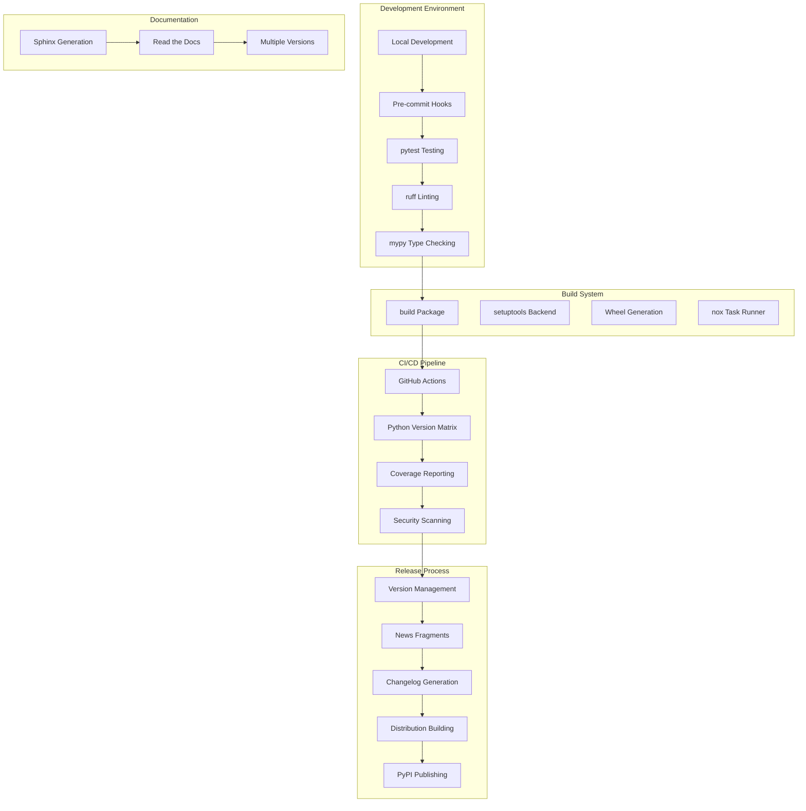
```mermaid
graph TB
    subgraph "Development Environment"
        Dev[Local Development]
        Pre[Pre-commit Hooks]
        Test[pytest Testing]
        Lint[ruff Linting]
        Type[mypy Type Checking]
    end
    
    subgraph "Build System"
        Build[build Package]
        Setup[setuptools Backend]
        Wheel[Wheel Generation]
        Nox[nox Task Runner]
    end
    
    subgraph "CI/CD Pipeline"
        GHA[GitHub Actions]
        Matrix[Python Version Matrix]
        Cov[Coverage Reporting]
        Sec[Security Scanning]
    end
    
    subgraph "Release Process"
        Ver[Version Management]
        News[News Fragments]
        Change[Changelog Generation]
        Dist[Distribution Building]
        Pub[PyPI Publishing]
    end
    
    subgraph "Documentation"
        Sphinx[Sphinx Generation]
        RTD[Read the Docs]
        Multi[Multiple Versions]
    end
    
    Dev --> Pre
    Pre --> Test
    Test --> Lint
    Lint --> Type
    Type --> Build
    Build --> GHA
    GHA --> Matrix
    Matrix --> Cov
    Cov --> Sec
    Sec --> Ver
    Ver --> News
    News --> Change
    Change --> Dist
    Dist --> Pub
    Sphinx --> RTD
    RTD --> Multi
```

### 3.6.5 Development Workflow Integration
The development and deployment stack ensures:
- **Quality gates**: Automated code quality checks at multiple stages
- **Reproducibility**: Consistent builds across different environments
- **Security**: Automated vulnerability scanning and dependency updates
- **Collaboration**: GitHub-centric workflow with comprehensive CI/CD

## 3.7 ARCHITECTURE INTEGRATION

### 3.7.1 Technology Stack Cohesion
The technology stack components are integrated through:

#### Dependency Isolation Strategy
- **Vendoring approach**: All runtime dependencies vendored to prevent circular dependencies
- **Development isolation**: Separate development dependencies managed through standard pip
- **Build isolation**: PEP 517 build environments prevent dependency conflicts

#### Cross-Platform Compatibility
- **Python version support**: Comprehensive testing across Python 3.9-3.13
- **Operating system support**: Windows, macOS, Linux compatibility
- **Architecture support**: x86_64, ARM64, and other architectures

### 3.7.2 Security Architecture
- **Certificate management**: Truststore integration for system certificates
- **Hash verification**: Multi-algorithm package integrity verification
- **Secure defaults**: HTTPS-only package downloads with certificate validation
- **Dependency scanning**: Automated vulnerability detection in CI/CD

### 3.7.3 Performance Architecture
- **Caching strategy**: Multi-level caching for wheels, HTTP responses, and metadata
- **Parallel processing**: Concurrent downloads and build operations
- **Memory optimization**: Efficient memory usage during large operations
- **Network optimization**: Resume capabilities and connection pooling

#### References
- `pyproject.toml` - Core project configuration and dependency management
- `src/pip/_vendor/vendor.txt` - Complete vendored dependency specifications
- `noxfile.py` - Development automation and task configuration
- `.github/workflows/ci.yml` - CI/CD pipeline configuration
- `.github/dependabot.yml` - Automated dependency management
- `.pre-commit-config.yaml` - Code quality automation
- `.readthedocs.yml` - Documentation build configuration
- `docs/requirements.txt` - Documentation dependencies
- `docs/html/conf.py` - Sphinx documentation configuration
- `build-project/build-requirements.txt` - Build system dependencies
- Web search: pip Python package installer PyPI API dependencies
- Web search: pip PyPI API XML-RPC Simple API PEP 503

# 4. PROCESS FLOWCHART

## 4.1 SYSTEM WORKFLOWS

### 4.1.1 Core Business Processes

#### 4.1.1.1 High-Level System Workflow

The primary system workflow orchestrates all pip operations through a common entry point and command dispatch mechanism.

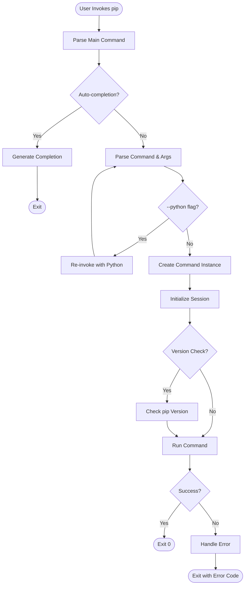
```mermaid
flowchart TB
    Start([User Invokes pip]) --> ParseMain[Parse Main Command]
    ParseMain --> CheckAutoComplete{Auto-completion?}
    CheckAutoComplete -->|Yes| AutoComplete[Generate Completion]
    AutoComplete --> End1([Exit])
    CheckAutoComplete -->|No| ParseCommand[Parse Command & Args]
    
    ParseCommand --> CheckPython{--python flag?}
    CheckPython -->|Yes| ReInvoke[Re-invoke with Python]
    ReInvoke --> ParseCommand
    CheckPython -->|No| CreateCommand[Create Command Instance]
    
    CreateCommand --> InitSession[Initialize Session]
    InitSession --> CheckVersion{Version Check?}
    CheckVersion -->|Yes| VersionCheck[Check pip Version]
    CheckVersion -->|No| RunCommand[Run Command]
    VersionCheck --> RunCommand
    
    RunCommand --> Success{Success?}
    Success -->|Yes| Exit0([Exit 0])
    Success -->|No| HandleError[Handle Error]
    HandleError --> ExitCode([Exit with Error Code])
```

#### 4.1.1.2 Package Installation Process

The package installation workflow represents the core business process, handling requirements parsing, dependency resolution, and package installation.

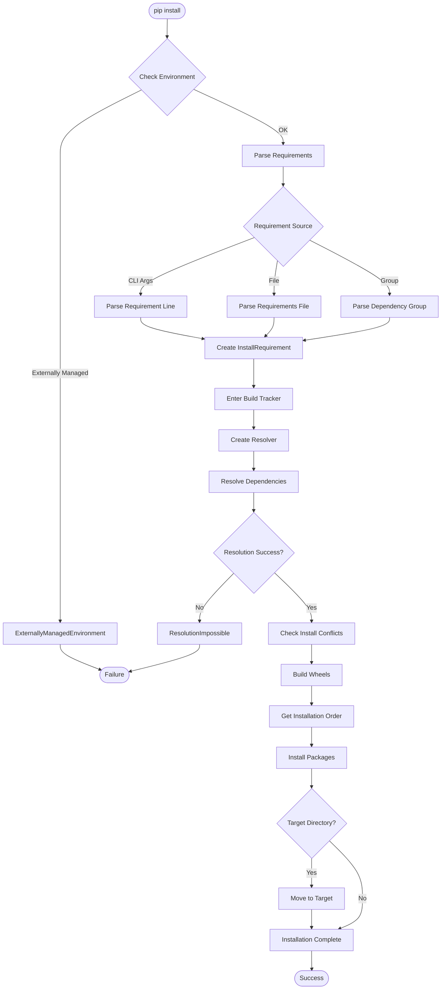
```mermaid
flowchart TD
    Start([pip install]) --> ValidateEnv{Check Environment}
    ValidateEnv -->|Externally Managed| Error1[ExternallyManagedEnvironment]
    ValidateEnv -->|OK| ParseReqs[Parse Requirements]
    
    ParseReqs --> ReqSource{Requirement Source}
    ReqSource -->|CLI Args| ParseLine[Parse Requirement Line]
    ReqSource -->|File| ParseFile[Parse Requirements File]
    ReqSource -->|Group| ParseGroup[Parse Dependency Group]
    
    ParseLine --> CreateReq[Create InstallRequirement]
    ParseFile --> CreateReq
    ParseGroup --> CreateReq
    
    CreateReq --> BuildTracker[Enter Build Tracker]
    BuildTracker --> CreateResolver[Create Resolver]
    
    CreateResolver --> Resolve[Resolve Dependencies]
    Resolve --> ResolutionSuccess{Resolution Success?}
    ResolutionSuccess -->|No| ResolutionError[ResolutionImpossible]
    ResolutionSuccess -->|Yes| CheckConflicts[Check Install Conflicts]
    
    CheckConflicts --> BuildWheels[Build Wheels]
    BuildWheels --> InstallOrder[Get Installation Order]
    InstallOrder --> InstallPackages[Install Packages]
    
    InstallPackages --> HandleTarget{Target Directory?}
    HandleTarget -->|Yes| MoveToTarget[Move to Target]
    HandleTarget -->|No| Complete[Installation Complete]
    MoveToTarget --> Complete
    
    Complete --> Success([Success])
    Error1 --> Fail([Failure])
    ResolutionError --> Fail
```

#### 4.1.1.3 Dependency Resolution Workflow

The dependency resolution process implements the modern resolvelib algorithm for complex dependency graph resolution.

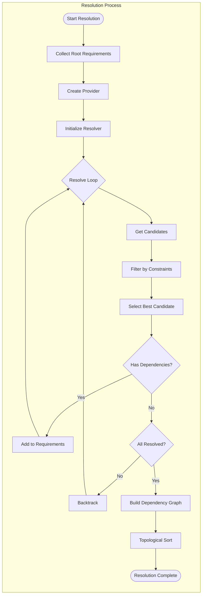
```mermaid
flowchart LR
    subgraph "Resolution Process"
        Start([Start Resolution]) --> CollectRoot[Collect Root Requirements]
        CollectRoot --> CreateProvider[Create Provider]
        CreateProvider --> InitResolver[Initialize Resolver]
        
        InitResolver --> ResolveLoop{Resolve Loop}
        ResolveLoop --> GetCandidates[Get Candidates]
        GetCandidates --> FilterCandidates[Filter by Constraints]
        FilterCandidates --> SelectCandidate[Select Best Candidate]
        
        SelectCandidate --> CheckDeps{Has Dependencies?}
        CheckDeps -->|Yes| AddDeps[Add to Requirements]
        AddDeps --> ResolveLoop
        CheckDeps -->|No| CheckComplete{All Resolved?}
        
        CheckComplete -->|No| Backtrack[Backtrack]
        Backtrack --> ResolveLoop
        CheckComplete -->|Yes| BuildGraph[Build Dependency Graph]
        BuildGraph --> TopSort[Topological Sort]
        TopSort --> End([Resolution Complete])
    end
```

#### 4.1.1.4 Package Uninstallation Process

The uninstallation workflow ensures safe package removal with dependency validation and system protection.

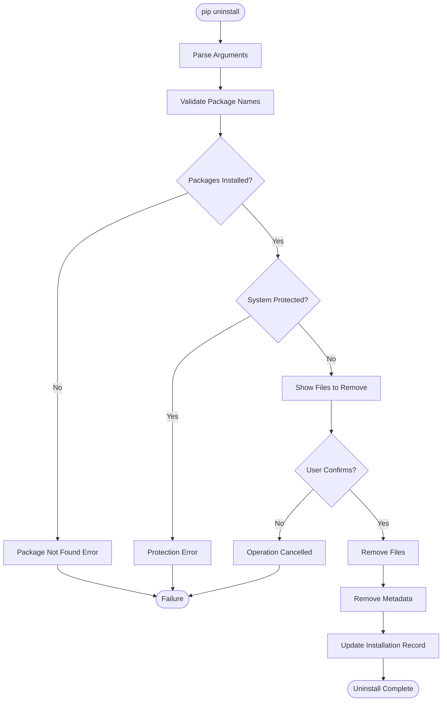
```mermaid
flowchart TD
    Start([pip uninstall]) --> ParseArgs[Parse Arguments]
    ParseArgs --> ValidatePackages[Validate Package Names]
    ValidatePackages --> CheckInstalled{Packages Installed?}
    CheckInstalled -->|No| NotFound[Package Not Found Error]
    CheckInstalled -->|Yes| CheckProtection{System Protected?}
    
    CheckProtection -->|Yes| ProtectionError[Protection Error]
    CheckProtection -->|No| ShowFiles[Show Files to Remove]
    ShowFiles --> UserConfirm{User Confirms?}
    UserConfirm -->|No| Cancelled[Operation Cancelled]
    UserConfirm -->|Yes| RemoveFiles[Remove Files]
    
    RemoveFiles --> RemoveMetadata[Remove Metadata]
    RemoveMetadata --> UpdateRecord[Update Installation Record]
    UpdateRecord --> Success([Uninstall Complete])
    
    NotFound --> Fail([Failure])
    ProtectionError --> Fail
    Cancelled --> Fail
```

### 4.1.2 Integration Workflows

#### 4.1.2.1 Version Control Integration Workflow

The VCS integration system supports multiple version control backends with unified interface.

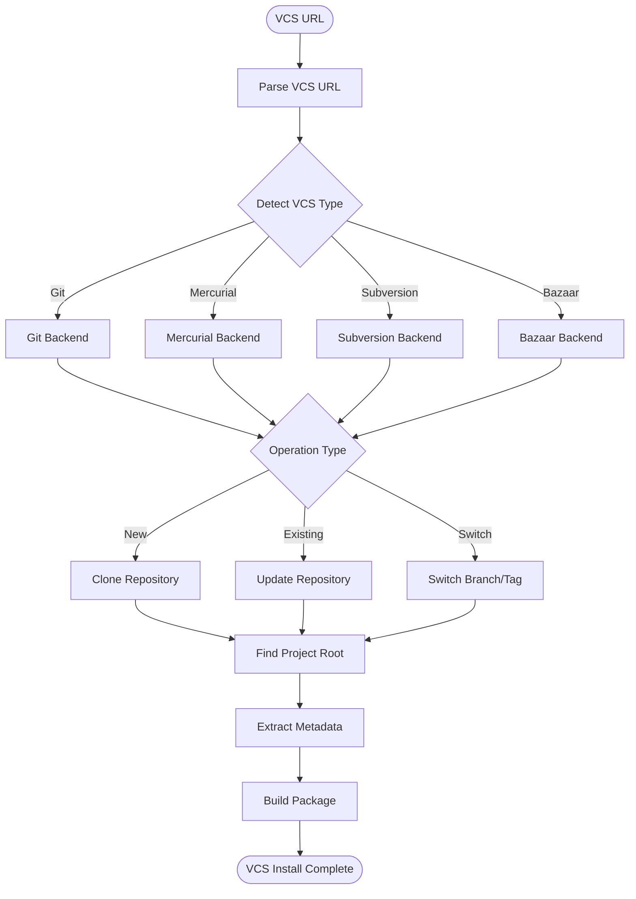
```mermaid
flowchart TD
    Start([VCS URL]) --> ParseURL[Parse VCS URL]
    ParseURL --> DetectVCS{Detect VCS Type}
    
    DetectVCS -->|Git| GitBackend[Git Backend]
    DetectVCS -->|Mercurial| HgBackend[Mercurial Backend]
    DetectVCS -->|Subversion| SvnBackend[Subversion Backend]
    DetectVCS -->|Bazaar| BzrBackend[Bazaar Backend]
    
    GitBackend --> VCSOperation{Operation Type}
    HgBackend --> VCSOperation
    SvnBackend --> VCSOperation
    BzrBackend --> VCSOperation
    
    VCSOperation -->|New| Clone[Clone Repository]
    VCSOperation -->|Existing| Update[Update Repository]
    VCSOperation -->|Switch| Switch[Switch Branch/Tag]
    
    Clone --> FindProject[Find Project Root]
    Update --> FindProject
    Switch --> FindProject
    
    FindProject --> ExtractMeta[Extract Metadata]
    ExtractMeta --> BuildPackage[Build Package]
    BuildPackage --> Success([VCS Install Complete])
```

#### 4.1.2.2 Package Index Interaction Workflow

The index interaction system manages communication with PyPI and custom package indexes.

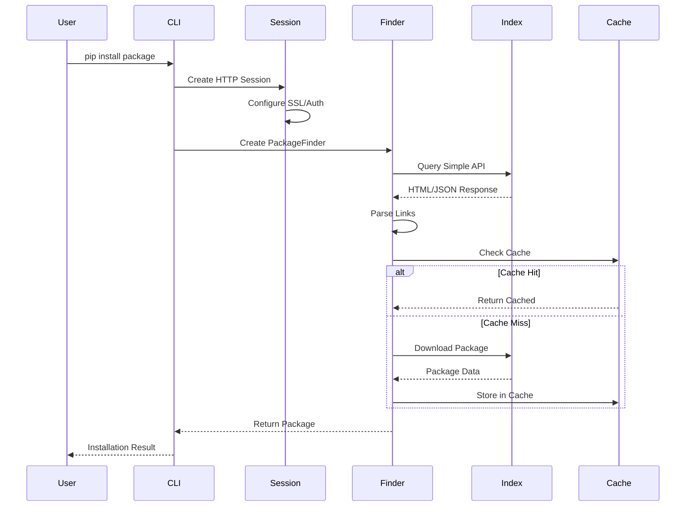
```mermaid
sequenceDiagram
    participant User
    participant CLI
    participant Session
    participant Finder
    participant Index
    participant Cache
    
    User->>CLI: pip install package
    CLI->>Session: Create HTTP Session
    Session->>Session: Configure SSL/Auth
    CLI->>Finder: Create PackageFinder
    
    Finder->>Index: Query Simple API
    Index-->>Finder: HTML/JSON Response
    Finder->>Finder: Parse Links
    
    Finder->>Cache: Check Cache
    alt Cache Hit
        Cache-->>Finder: Return Cached
    else Cache Miss
        Finder->>Index: Download Package
        Index-->>Finder: Package Data
        Finder->>Cache: Store in Cache
    end
    
    Finder-->>CLI: Return Package
    CLI-->>User: Installation Result
```

#### 4.1.2.3 Build System Integration Workflow

The build system integration supports PEP 517/518 modern build backends with build isolation.

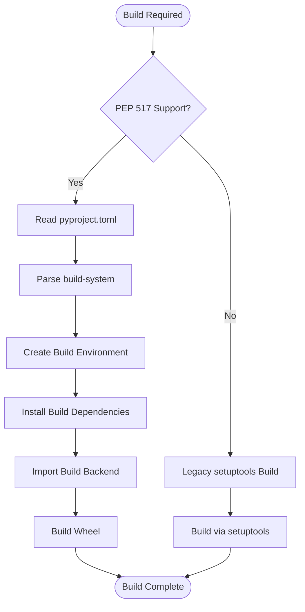
```mermaid
flowchart TD
    Start([Build Required]) --> CheckPEP517{PEP 517 Support?}
    CheckPEP517 -->|Yes| ReadPyproject[Read pyproject.toml]
    CheckPEP517 -->|No| LegacyBuild[Legacy setuptools Build]
    
    ReadPyproject --> ParseBuildSystem[Parse build-system]
    ParseBuildSystem --> CreateBuildEnv[Create Build Environment]
    CreateBuildEnv --> InstallBuildDeps[Install Build Dependencies]
    
    InstallBuildDeps --> ImportBackend[Import Build Backend]
    ImportBackend --> BuildWheel[Build Wheel]
    BuildWheel --> Success([Build Complete])
    
    LegacyBuild --> LegacyWheel[Build via setuptools]
    LegacyWheel --> Success
```

## 4.2 FLOWCHART REQUIREMENTS

### 4.2.1 Installation State Transitions

The installation state management tracks package lifecycle from initial request to final installation.

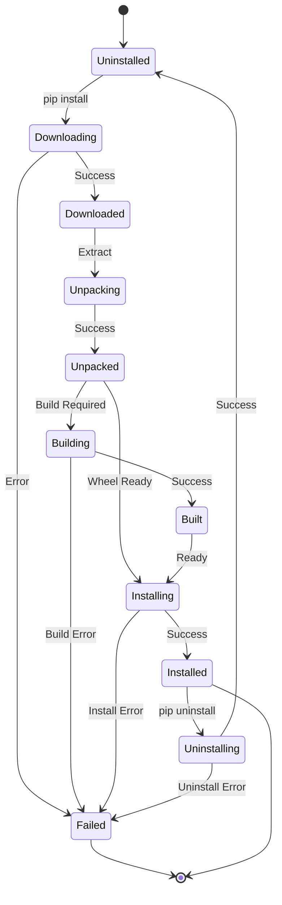
```mermaid
stateDiagram-v2
    [*] --> Uninstalled
    Uninstalled --> Downloading: pip install
    Downloading --> Downloaded: Success
    Downloading --> Failed: Error
    
    Downloaded --> Unpacking: Extract
    Unpacking --> Unpacked: Success
    Unpacked --> Building: Build Required
    Unpacked --> Installing: Wheel Ready
    
    Building --> Built: Success
    Building --> Failed: Build Error
    Built --> Installing: Ready
    
    Installing --> Installed: Success
    Installing --> Failed: Install Error
    
    Installed --> Uninstalling: pip uninstall
    Uninstalling --> Uninstalled: Success
    Uninstalling --> Failed: Uninstall Error
    
    Failed --> [*]
    Installed --> [*]
```

### 4.2.2 Requirement State Transitions

The requirement state management handles individual package requirements through their lifecycle.

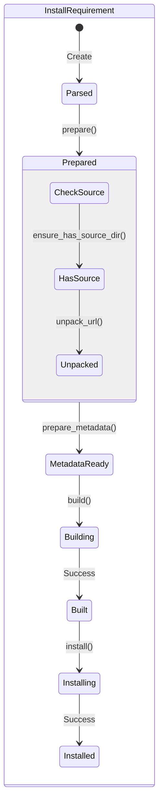
```mermaid
stateDiagram-v2
    state "InstallRequirement" as IR {
        [*] --> Parsed: Create
        Parsed --> Prepared: prepare()
        Prepared --> MetadataReady: prepare_metadata()
        
        MetadataReady --> Building: build()
        Building --> Built: Success
        
        Built --> Installing: install()
        Installing --> Installed: Success
        
        state Prepared {
            CheckSource --> HasSource: ensure_has_source_dir()
            HasSource --> Unpacked: unpack_url()
        }
    }
```

### 4.2.3 Validation Rules

#### 4.2.3.1 Business Rules at Each Step

1. **Requirement Parsing**
   - PEP 508 compliance validation ensures proper requirement specification format
   - Environment marker evaluation filters requirements based on current environment
   - Version specifier validation confirms proper version constraint syntax
   - URL format validation verifies direct reference URLs are properly formatted

2. **Resolution Phase**
   - Python version compatibility checks ensure packages support current Python version
   - Platform/OS compatibility validation confirms packages work on current platform
   - Constraint satisfaction verification ensures all version constraints can be satisfied
   - Circular dependency detection prevents infinite resolution loops

3. **Download Phase**
   - Hash verification (when --require-hashes) ensures package integrity
   - File size validation confirms downloads completed successfully
   - Certificate validation for HTTPS ensures secure connections
   - Proxy authentication handling manages corporate network requirements

4. **Installation Phase**
   - Write permission validation ensures target directories are writable
   - Disk space availability check prevents incomplete installations
   - Existing installation conflict detection prevents package conflicts
   - Script location PATH validation ensures console scripts are accessible

#### 4.2.3.2 Authorization Checkpoints

- **VCS Authentication**: Handles SSH keys, OAuth tokens, and HTTP basic auth for private repositories
- **HTTP Basic Auth**: Manages authentication credentials for private package indexes
- **Keyring Integration**: Securely stores and retrieves authentication credentials
- **Proxy Authentication**: Handles corporate proxy authentication requirements
- **Client Certificate Validation**: Supports mutual TLS authentication for secure indexes

#### 4.2.3.3 Regulatory Compliance Checks

- **License Metadata Extraction**: Records package license information for compliance tracking
- **Vulnerability Status Checking**: Identifies yanked packages and security vulnerabilities
- **Direct URL Recording**: Implements PEP 610 for installation reproducibility
- **Installation Source Tracking**: Maintains INSTALLER file for audit trails

## 4.3 TECHNICAL IMPLEMENTATION

### 4.3.1 State Management

#### 4.3.1.1 Build Isolation State

The build isolation system creates temporary environments for package building to prevent dependency conflicts.

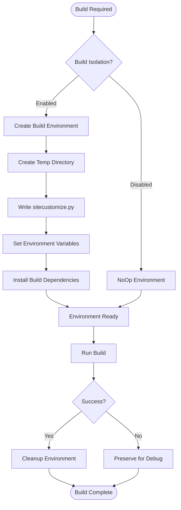
```mermaid
flowchart TD
    Start([Build Required]) --> CheckIsolation{Build Isolation?}
    CheckIsolation -->|Enabled| CreateEnv[Create Build Environment]
    CheckIsolation -->|Disabled| NoOpEnv[NoOp Environment]
    
    CreateEnv --> TempDir[Create Temp Directory]
    TempDir --> WriteSiteCustomize[Write sitecustomize.py]
    WriteSiteCustomize --> SetEnvVars[Set Environment Variables]
    SetEnvVars --> InstallDeps[Install Build Dependencies]
    
    InstallDeps --> BuildReady[Environment Ready]
    NoOpEnv --> BuildReady
    
    BuildReady --> RunBuild[Run Build]
    RunBuild --> Cleanup{Success?}
    Cleanup -->|Yes| CleanupEnv[Cleanup Environment]
    Cleanup -->|No| PreserveEnv[Preserve for Debug]
    
    CleanupEnv --> Complete([Build Complete])
    PreserveEnv --> Complete
```

#### 4.3.1.2 Transaction Boundaries

The transaction system ensures atomic operations during package installation and uninstallation.

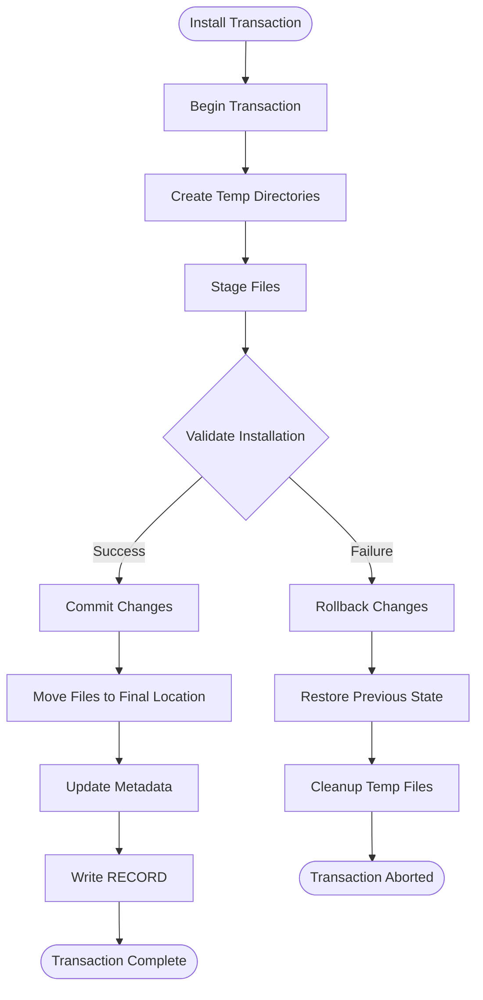
```mermaid
flowchart TD
    Start([Install Transaction]) --> BeginTrans[Begin Transaction]
    BeginTrans --> CreateTemp[Create Temp Directories]
    
    CreateTemp --> StageFiles[Stage Files]
    StageFiles --> Validate{Validate Installation}
    
    Validate -->|Success| Commit[Commit Changes]
    Validate -->|Failure| Rollback[Rollback Changes]
    
    Commit --> MoveFiles[Move Files to Final Location]
    MoveFiles --> UpdateMetadata[Update Metadata]
    UpdateMetadata --> WriteRecord[Write RECORD]
    WriteRecord --> Complete([Transaction Complete])
    
    Rollback --> RestoreState[Restore Previous State]
    RestoreState --> CleanupTemp[Cleanup Temp Files]
    CleanupTemp --> Abort([Transaction Aborted])
```

### 4.3.2 Error Handling

#### 4.3.2.1 Comprehensive Error Handling Flowchart

The error handling system provides robust recovery mechanisms across all pip operations.

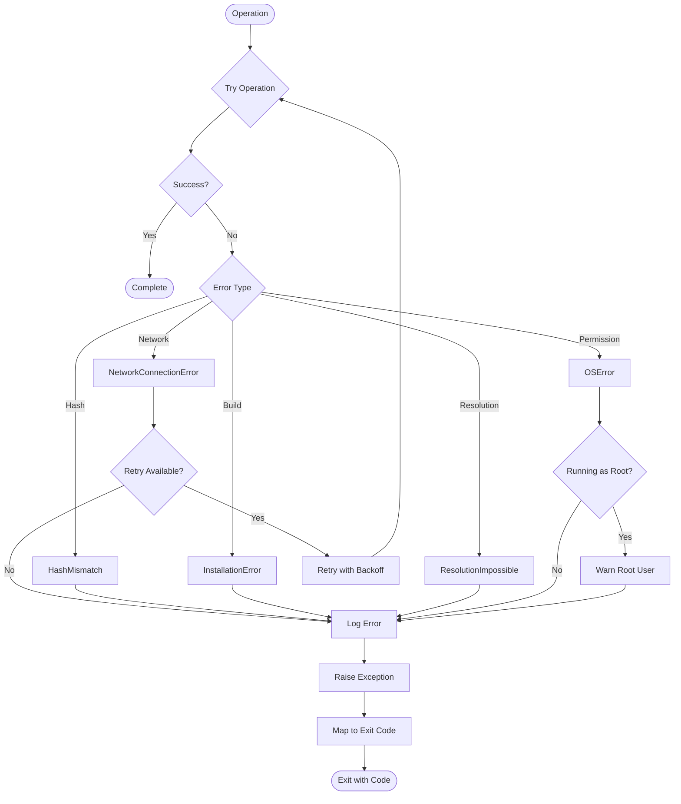
```mermaid
flowchart TD
    Start([Operation]) --> Try{Try Operation}
    Try --> Success{Success?}
    Success -->|Yes| Complete([Complete])
    Success -->|No| ErrorType{Error Type}
    
    ErrorType -->|Network| NetworkError[NetworkConnectionError]
    ErrorType -->|Hash| HashError[HashMismatch]
    ErrorType -->|Build| BuildError[InstallationError]
    ErrorType -->|Resolution| ResError[ResolutionImpossible]
    ErrorType -->|Permission| PermError[OSError]
    
    NetworkError --> Retry{Retry Available?}
    Retry -->|Yes| RetryOp[Retry with Backoff]
    RetryOp --> Try
    Retry -->|No| LogError[Log Error]
    
    HashError --> LogError
    BuildError --> LogError
    ResError --> LogError
    PermError --> CheckSudo{Running as Root?}
    CheckSudo -->|Yes| WarnRoot[Warn Root User]
    CheckSudo -->|No| LogError
    WarnRoot --> LogError
    
    LogError --> RaiseException[Raise Exception]
    RaiseException --> MapToCode[Map to Exit Code]
    MapToCode --> Exit([Exit with Code])
```

#### 4.3.2.2 Network Retry Mechanism

The network retry system handles transient network failures with exponential backoff.

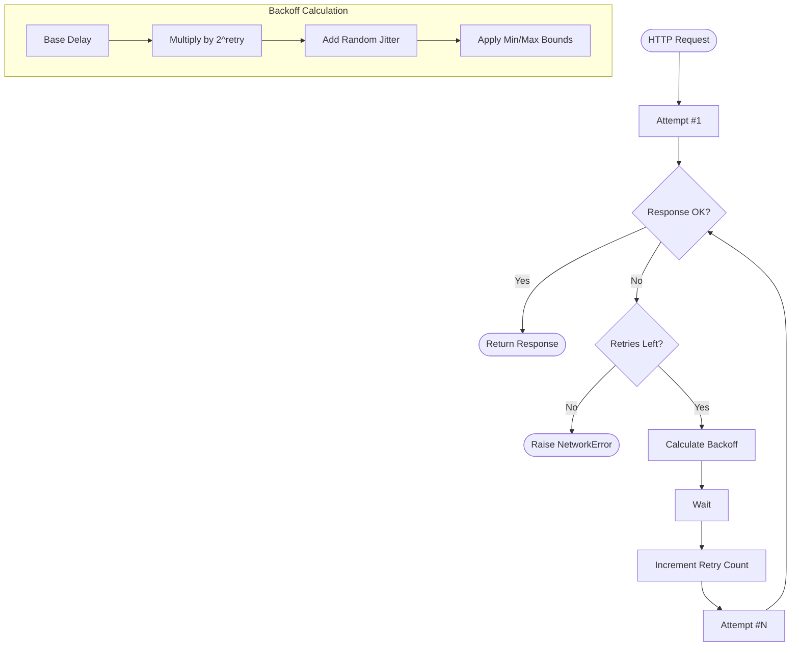
```mermaid
flowchart TD
    Start([HTTP Request]) --> Attempt[Attempt #1]
    Attempt --> CheckResp{Response OK?}
    
    CheckResp -->|Yes| Success([Return Response])
    CheckResp -->|No| CheckRetry{Retries Left?}
    
    CheckRetry -->|No| Fail([Raise NetworkError])
    CheckRetry -->|Yes| CalcBackoff[Calculate Backoff]
    
    CalcBackoff --> Wait[Wait]
    Wait --> IncRetry[Increment Retry Count]
    IncRetry --> NextAttempt[Attempt #N]
    NextAttempt --> CheckResp
    
    subgraph "Backoff Calculation"
        Base[Base Delay] --> Multiply[Multiply by 2^retry]
        Multiply --> AddJitter[Add Random Jitter]
        AddJitter --> MinMax[Apply Min/Max Bounds]
    end
```

## 4.4 REQUIRED DIAGRAMS

### 4.4.1 Package Download Workflow

The package download system manages secure package acquisition with caching and verification.

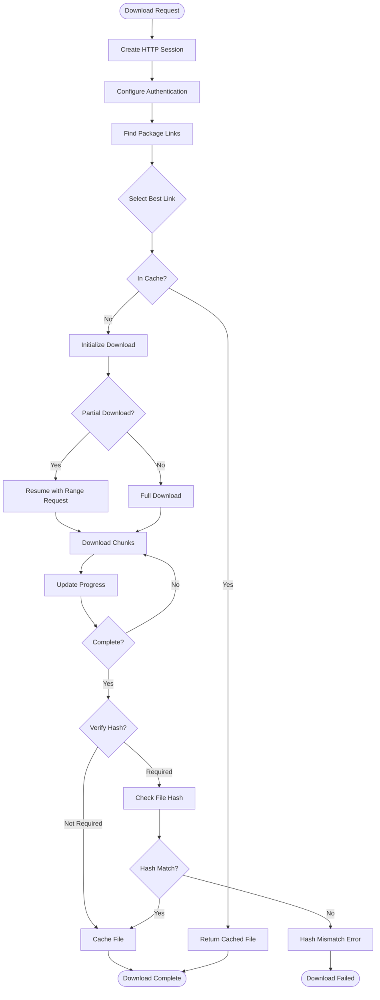
```mermaid
flowchart TD
    Start([Download Request]) --> CreateSession[Create HTTP Session]
    CreateSession --> ConfigureAuth[Configure Authentication]
    ConfigureAuth --> FindLinks[Find Package Links]
    
    FindLinks --> SelectLink{Select Best Link}
    SelectLink --> CheckCache{In Cache?}
    CheckCache -->|Yes| ReturnCached[Return Cached File]
    CheckCache -->|No| InitDownload[Initialize Download]
    
    InitDownload --> CheckResume{Partial Download?}
    CheckResume -->|Yes| ResumeDownload[Resume with Range Request]
    CheckResume -->|No| FullDownload[Full Download]
    
    ResumeDownload --> DownloadLoop
    FullDownload --> DownloadLoop[Download Chunks]
    
    DownloadLoop --> Progress[Update Progress]
    Progress --> CheckComplete{Complete?}
    CheckComplete -->|No| DownloadLoop
    CheckComplete -->|Yes| VerifyHash{Verify Hash?}
    
    VerifyHash -->|Required| CheckHash[Check File Hash]
    VerifyHash -->|Not Required| CacheFile[Cache File]
    CheckHash --> HashMatch{Hash Match?}
    HashMatch -->|No| HashError[Hash Mismatch Error]
    HashMatch -->|Yes| CacheFile
    
    CacheFile --> Success([Download Complete])
    ReturnCached --> Success
    HashError --> Fail([Download Failed])
```

### 4.4.2 Wheel Installation Sequence

The wheel installation process manages the complete lifecycle of wheel-based package installation.

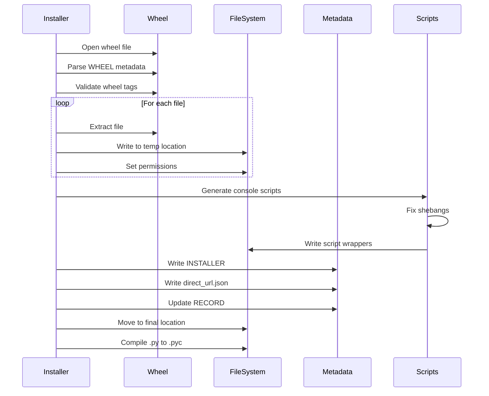
```mermaid
sequenceDiagram
    participant Installer
    participant Wheel
    participant FileSystem
    participant Metadata
    participant Scripts
    
    Installer->>Wheel: Open wheel file
    Installer->>Wheel: Parse WHEEL metadata
    Installer->>Wheel: Validate wheel tags
    
    loop For each file
        Installer->>Wheel: Extract file
        Installer->>FileSystem: Write to temp location
        Installer->>FileSystem: Set permissions
    end
    
    Installer->>Scripts: Generate console scripts
    Scripts->>Scripts: Fix shebangs
    Scripts->>FileSystem: Write script wrappers
    
    Installer->>Metadata: Write INSTALLER
    Installer->>Metadata: Write direct_url.json
    Installer->>Metadata: Update RECORD
    
    Installer->>FileSystem: Move to final location
    Installer->>FileSystem: Compile .py to .pyc
```

### 4.4.3 Cache Management Workflow

The caching system provides multi-level caching for improved performance and reduced network usage.

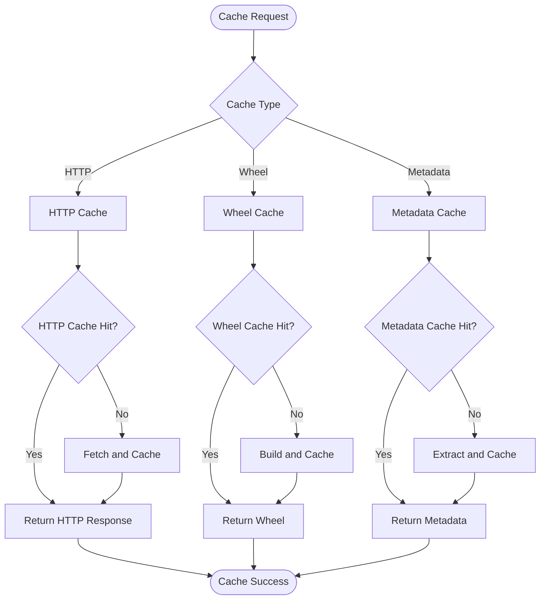
```mermaid
flowchart TD
    Start([Cache Request]) --> CacheType{Cache Type}
    CacheType -->|HTTP| HTTPCache[HTTP Cache]
    CacheType -->|Wheel| WheelCache[Wheel Cache]
    CacheType -->|Metadata| MetadataCache[Metadata Cache]
    
    HTTPCache --> CheckHTTP{HTTP Cache Hit?}
    CheckHTTP -->|Yes| ReturnHTTP[Return HTTP Response]
    CheckHTTP -->|No| FetchHTTP[Fetch and Cache]
    
    WheelCache --> CheckWheel{Wheel Cache Hit?}
    CheckWheel -->|Yes| ReturnWheel[Return Wheel]
    CheckWheel -->|No| BuildWheel[Build and Cache]
    
    MetadataCache --> CheckMeta{Metadata Cache Hit?}
    CheckMeta -->|Yes| ReturnMeta[Return Metadata]
    CheckMeta -->|No| ExtractMeta[Extract and Cache]
    
    FetchHTTP --> ReturnHTTP
    BuildWheel --> ReturnWheel  
    ExtractMeta --> ReturnMeta
    
    ReturnHTTP --> Success([Cache Success])
    ReturnWheel --> Success
    ReturnMeta --> Success
```

### 4.4.4 Performance Considerations

#### 4.4.4.1 Caching Strategy
- **HTTP Response Caching**: Reduces redundant network requests with configurable TTL
- **Wheel Caching**: Stores built wheels to avoid repeated compilation
- **Metadata Caching**: Caches package metadata to accelerate dependency resolution
- **Multi-level Cache Hierarchy**: Optimizes cache hit rates through intelligent layering

#### 4.4.4.2 Parallel Operations
- **Concurrent Downloads**: Multiple package downloads with connection pooling
- **Parallel Builds**: Build operations run concurrently when dependencies allow
- **Asynchronous I/O**: Non-blocking operations for network and file system access
- **Resource Pool Management**: Efficient allocation of threads and connections

#### 4.4.4.3 Memory Management
- **Streaming Downloads**: Large files processed in chunks to minimize memory usage
- **Lazy Evaluation**: Metadata and dependencies loaded only when needed
- **Garbage Collection**: Proactive cleanup of temporary resources
- **Memory Pool Reuse**: Efficient reuse of allocated memory structures

#### 4.4.4.4 Network Optimization
- **Connection Pooling**: Reuses HTTP connections for multiple requests
- **Compression Support**: Gzip and deflate compression for reduced bandwidth
- **Range Requests**: Partial content downloads for resume capability
- **DNS Caching**: Reduces DNS lookup overhead for repeated requests

### 4.4.5 Timing and SLA Considerations

#### 4.4.5.1 Operation Timeouts
- **Connection Timeout**: 15 seconds for initial connection establishment
- **Read Timeout**: 60 seconds for data transfer operations
- **Total Timeout**: 5 minutes for complete operation including retries
- **Build Timeout**: 30 minutes for package building operations

#### 4.4.5.2 Retry Policies
- **Network Retries**: 3 attempts with exponential backoff (1s, 2s, 4s)
- **HTTP Retries**: 5 attempts for 5xx errors and connection failures
- **Build Retries**: 1 retry for transient build failures
- **Resolution Retries**: No retries for dependency resolution failures

#### 4.4.5.3 Progress Reporting
- **Download Progress**: Real-time updates every 100KB or 1% completion
- **Build Progress**: Stage-based progress reporting for long builds
- **Resolution Progress**: Dependency count and resolution status
- **Throttled Updates**: Maximum 10 updates per second to prevent UI overflow

#### References

#### Files Examined
- `src/pip/_internal/cli/main.py` - Main CLI entry point and command dispatch
- `src/pip/_internal/commands/install.py` - Package installation command implementation
- `src/pip/_internal/commands/uninstall.py` - Package uninstallation command implementation
- `src/pip/_internal/commands/download.py` - Package download command implementation
- `src/pip/_internal/resolution/resolvelib/resolver.py` - Modern dependency resolver implementation
- `src/pip/_internal/resolution/resolvelib/factory.py` - Candidate factory for dependency resolution
- `src/pip/_internal/operations/prepare.py` - Package preparation operations
- `src/pip/_internal/operations/install/wheel.py` - Wheel installation operations
- `src/pip/_internal/network/session.py` - HTTP session management and configuration
- `src/pip/_internal/network/download.py` - Package download implementation with retry logic
- `src/pip/_internal/network/auth.py` - Authentication handling for various protocols
- `src/pip/_internal/build_env.py` - Build environment isolation implementation
- `src/pip/_internal/cache.py` - Multi-level caching infrastructure
- `src/pip/_internal/wheel_builder.py` - Wheel building orchestration
- `src/pip/_internal/req/req_install.py` - InstallRequirement class and state management
- `src/pip/_internal/req/req_file.py` - Requirements file parsing and processing
- `src/pip/_internal/vcs/versioncontrol.py` - Version control system base implementation
- `src/pip/_internal/vcs/git.py` - Git version control backend
- `src/pip/_internal/vcs/mercurial.py` - Mercurial version control backend
- `src/pip/_internal/vcs/subversion.py` - Subversion version control backend
- `src/pip/_internal/pyproject.py` - PEP 517/518 build system support
- `src/pip/_internal/exceptions.py` - Exception hierarchy and error handling
- `src/pip/_internal/models/link.py` - Link model for package references
- `src/pip/_internal/models/scheme.py` - Installation scheme definitions

#### Folders Explored
- `src/pip/_internal/commands/` - CLI command implementations
- `src/pip/_internal/operations/` - Core package operations
- `src/pip/_internal/network/` - Network layer components
- `src/pip/_internal/resolution/` - Dependency resolution engines
- `src/pip/_internal/vcs/` - Version control system backends
- `src/pip/_internal/req/` - Requirement handling and processing
- `src/pip/_internal/models/` - Domain models and data structures

# 5. SYSTEM ARCHITECTURE

## 5.1 HIGH-LEVEL ARCHITECTURE

### 5.1.1 System Overview

#### Overall Architecture Style and Rationale

The pip system employs a **layered architecture** with **pluggable components** designed to provide robust, extensible package management capabilities. This architectural approach was chosen to address the unique challenges of Python package management, including dependency resolution complexity, diverse package formats, and the need for reliable installation across heterogeneous environments.

The system follows a **self-contained design principle** where all runtime dependencies are vendored under `pip._vendor` to prevent circular dependency issues during installation. This is critical since pip must install packages that might depend on the same libraries pip itself uses, creating a bootstrapping problem that the vendored dependency strategy elegantly solves.

#### Key Architectural Principles and Patterns

**Separation of Concerns**: The system separates CLI handling, business logic, and infrastructure services into distinct layers, enabling maintainability and testability.

**Command Pattern**: All user operations are implemented as command objects that inherit from common base classes, providing consistent behavior and extensibility.

**Registry Pattern**: Commands and VCS backends register themselves automatically, enabling runtime discovery and plugin-like extensibility.

**Strategy Pattern**: The dual resolver system allows switching between legacy and modern dependency resolution algorithms based on user configuration and compatibility requirements.

**Isolation and Safety**: Build operations execute in isolated environments with comprehensive error handling and rollback capabilities to prevent system corruption.

#### System Boundaries and Major Interfaces

**Primary Interfaces**:
- **CLI Interface**: Command-line entry points via `__main__.py`, `__pip-runner__.py`, and `__init__.py`
- **HTTP Interface**: RESTful communication with PyPI and custom package indexes using PEP 503 Simple API
- **File System Interface**: Package file operations, cache management, and configuration handling
- **VCS Interface**: Integration with Git, Mercurial, Subversion, and Bazaar repositories
- **Build System Interface**: PEP 517/518 compliance for modern build backends

**System Boundaries**:
- **Internal Boundary**: All core functionality within `pip._internal` package
- **External Boundary**: Interaction with package indexes, version control systems, and build backends
- **Isolation Boundary**: Build operations execute in separate temporary environments

### 5.1.2 Core Components Table

| Component Name | Primary Responsibility | Key Dependencies | Integration Points |
|---------------|----------------------|------------------|-------------------|
| CLI Framework | Command-line interface management and option parsing | argparse, pip._internal.cli | Command registry, configuration system |
| Command Registry | Command discovery, instantiation, and execution | Base command classes | CLI framework, operations layer |
| Resolution Engine | Dependency graph solving and constraint satisfaction | resolvelib, packaging | Network layer, package finder |
| Network Layer | HTTP/HTTPS communication and session management | requests, urllib3, certifi | Authentication, caching, indexes |
| Operations Layer | Core package operations and business logic | Build system, VCS backends | Resolution engine, file operations |
| Build System | Package building and PEP 517/518 compliance | pyproject-hooks, build, wheel | Isolation environments, backends |
| VCS Support | Version control system integration | Git, Mercurial, SVN, Bazaar | Network layer, authentication |
| Caching Infrastructure | Multi-level caching for performance optimization | File system, HTTP cache | Network layer, wheel storage |

### 5.1.3 Data Flow Description

#### Primary Data Flows Between Components

The system processes package management requests through a structured data flow pipeline:

**Installation Flow**: User requirements flow from CLI parsing through the command registry to requirement objects, which are processed by the resolution engine to create a dependency graph. The package finder queries indexes to discover available packages, while the network layer handles secure downloads with caching. The build system processes source packages into wheels within isolated environments, and the operations layer performs atomic installation with rollback capabilities.

**Resolution Flow**: Root requirements are transformed into requirement objects that feed into the package finder for candidate discovery. The modern resolver uses backtracking algorithms to traverse the dependency graph, applying version constraints and conflict detection. Resolution results are topologically sorted to determine installation order.

**Network Flow**: HTTP sessions are established with authentication and proxy support, utilizing connection pooling and retry logic. Package metadata is cached at multiple levels, with lazy loading for wheel metadata to optimize performance. Downloads support resumption and progress tracking.

#### Integration Patterns and Protocols

**Index Integration**: Implements PEP 503 Simple API for package discovery, with support for JSON API extensions and custom authentication mechanisms.

**VCS Integration**: Unified interface across version control systems with URL scheme-based backend selection and automatic authentication handling.

**Build Integration**: PEP 517/518 compliance with build backend discovery, dependency installation in isolated environments, and metadata extraction.

#### Data Transformation Points

**Requirement Parsing**: Text-based requirements are parsed into structured InstallRequirement objects with version constraints and optional dependencies.

**Link Processing**: HTML and JSON responses from package indexes are transformed into Link objects with metadata extraction and candidate evaluation.

**Metadata Extraction**: Package metadata is extracted from wheels and source distributions, normalized according to packaging standards.

#### Key Data Stores and Caches

**Multi-Level Caching Strategy**:
- **HTTP Cache**: Response caching using CacheControl for index queries and metadata requests
- **Wheel Cache**: Built wheel artifacts cached for reuse across installations
- **Metadata Cache**: Extracted metadata cached to avoid repeated processing
- **VCS Cache**: Repository clones cached to optimize repeated VCS operations

### 5.1.4 External Integration Points

| System Name | Integration Type | Data Exchange Pattern | Protocol/Format |
|-------------|------------------|----------------------|-----------------|
| PyPI | HTTP API | Request/Response | HTTPS/PEP 503 Simple API |
| Custom Indexes | HTTP API | Request/Response | HTTPS/PEP 503, JSON API |
| Version Control | Native Client | Command/Response | Git/Hg/SVN/Bzr protocols |
| Build Backends | Python API | Function Calls | PEP 517/518 Interface |
| Keyring Services | System API | Credential Storage | OS-specific APIs |
| Certificate Stores | System Integration | Certificate Validation | SSL/TLS, Truststore |

## 5.2 COMPONENT DETAILS

### 5.2.1 CLI Framework Component

**Purpose and Responsibilities**: The CLI framework provides command-line interface management, option parsing, and user interaction handling. It orchestrates the entry point flow and delegates to appropriate command implementations.

**Technologies and Frameworks**: Built on Python's argparse library with custom parsers for pip-specific requirements parsing and option handling.

**Key Interfaces and APIs**:
- `main()` function in `src/pip/_internal/cli/main.py` for primary entry point
- `BaseCommand` abstract class in `src/pip/_internal/cli/base_command.py` for command implementation
- `ConfigOptionParser` in `src/pip/_internal/cli/parser.py` for configuration integration

**Data Persistence Requirements**: Configuration data persisted in user and system configuration files with environment variable override support.

**Scaling Considerations**: Single-threaded synchronous design optimized for command-line usage patterns with progress indication for long-running operations.

### 5.2.2 Resolution Engine Component

**Purpose and Responsibilities**: Implements dependency resolution algorithms to solve complex package dependency graphs with version constraints and conflict detection.

**Technologies and Frameworks**: Modern resolver built on resolvelib library with custom provider implementation for Python packaging ecosystem integration.

**Key Interfaces and APIs**:
- `BaseResolver` interface in `src/pip/_internal/resolution/base.py` for pluggable resolvers
- `Resolver` class in `src/pip/_internal/resolution/resolvelib/resolver.py` for modern resolution
- `PipProvider` in `src/pip/_internal/resolution/resolvelib/provider.py` for candidate discovery

**Data Persistence Requirements**: Resolution results cached in memory during operation with dependency graph serialization for analysis.

**Scaling Considerations**: Backtracking algorithm with constraint propagation optimized for typical Python package dependency patterns.

#### Component Interaction Diagram

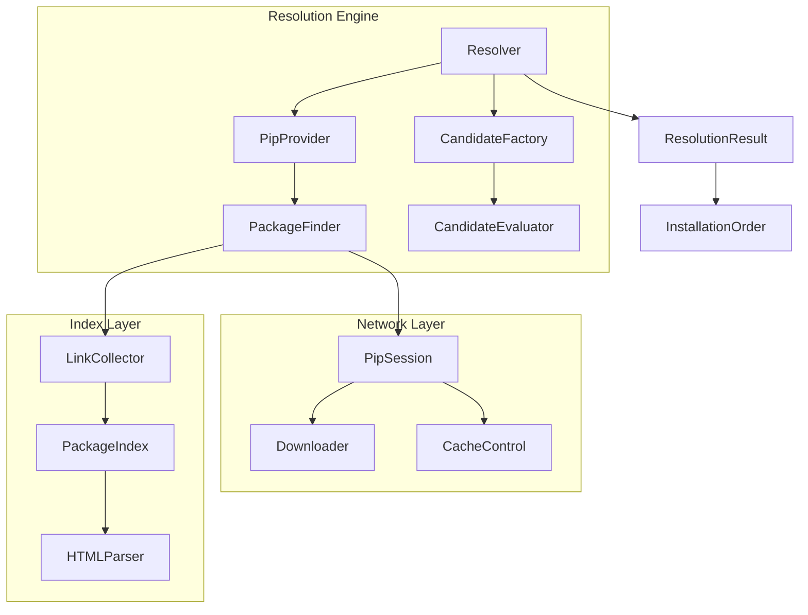
```mermaid
graph TB
    subgraph "Resolution Engine"
        Resolver[Resolver] --> Provider[PipProvider]
        Provider --> Finder[PackageFinder]
        Resolver --> Factory[CandidateFactory]
        Factory --> Evaluator[CandidateEvaluator]
    end
    
    subgraph "Network Layer"
        Finder --> Session[PipSession]
        Session --> Download[Downloader]
        Session --> Cache[CacheControl]
    end
    
    subgraph "Index Layer"
        Finder --> Collector[LinkCollector]
        Collector --> Index[PackageIndex]
        Index --> Parser[HTMLParser]
    end
    
    Resolver --> Resolution[ResolutionResult]
    Resolution --> Install[InstallationOrder]
```

### 5.2.3 Network Layer Component

**Purpose and Responsibilities**: Handles HTTP/HTTPS communication with package indexes, implements authentication, caching, and download management with retry logic and resume capabilities.

**Technologies and Frameworks**: Built on requests library with urllib3 for low-level HTTP operations, certifi for certificate validation, and CacheControl for HTTP caching.

**Key Interfaces and APIs**:
- `PipSession` class in `src/pip/_internal/network/session.py` for session management
- `Downloader` class in `src/pip/_internal/network/download.py` for file downloads
- `MultiDomainBasicAuth` in `src/pip/_internal/network/auth.py` for authentication

**Data Persistence Requirements**: HTTP cache stored in user cache directory with configurable retention policies.

**Scaling Considerations**: Connection pooling, request retries, and bandwidth optimization through partial content requests.

#### State Transition Diagram

```mermaid
stateDiagram-v2
    [*] --> Idle
    Idle --> Authenticating : Request with Auth
    Idle --> Requesting : Simple Request
    
    Authenticating --> Authenticated : Auth Success
    Authenticating --> AuthFailed : Auth Failure
    AuthFailed --> [*]
    
    Authenticated --> Requesting : Proceed with Request
    Requesting --> Downloading : Response OK
    Requesting --> Retrying : Transient Error
    Requesting --> Failed : Permanent Error
    
    Retrying --> Requesting : Retry Attempt
    Retrying --> Failed : Max Retries
    
    Downloading --> Validating : Download Complete
    Downloading --> Resuming : Connection Lost
    Resuming --> Downloading : Resume Success
    
    Validating --> Complete : Hash Valid
    Validating --> Failed : Hash Invalid
    
    Complete --> [*]
    Failed --> [*]
```

### 5.2.4 Operations Layer Component

**Purpose and Responsibilities**: Implements core package operations including installation, uninstallation, building, and preparation with transaction support and rollback capabilities.

**Technologies and Frameworks**: Native Python file operations with temporary directory management, atomic operations, and cross-platform compatibility.

**Key Interfaces and APIs**:
- `InstallationManager` for coordinating package installation
- `UninstallationManager` for safe package removal
- `BuildManager` for wheel building and PEP 517 compliance

**Data Persistence Requirements**: Installation records maintained in site-packages with metadata storage according to packaging standards.

**Scaling Considerations**: Atomic operations with rollback support to maintain system integrity during failures.

#### Package Installation Sequence

```mermaid
sequenceDiagram
    participant User
    participant CLI
    participant Resolver
    participant Builder
    participant Installer
    participant FileSystem
    
    User->>CLI: pip install package
    CLI->>Resolver: Resolve dependencies
    Resolver->>Resolver: Build dependency graph
    Resolver-->>CLI: Resolution result
    
    CLI->>Builder: Build required packages
    Builder->>Builder: Create build environment
    Builder->>FileSystem: Extract source
    Builder->>Builder: Execute build backend
    Builder-->>CLI: Wheels ready
    
    CLI->>Installer: Install packages
    Installer->>FileSystem: Begin transaction
    Installer->>FileSystem: Install files
    Installer->>FileSystem: Update metadata
    Installer->>FileSystem: Commit transaction
    Installer-->>CLI: Installation complete
    
    CLI-->>User: Success message
```

## 5.3 TECHNICAL DECISIONS

### 5.3.1 Architecture Style Decisions and Tradeoffs

#### Decision: Layered Architecture with Pluggable Components

**Rationale**: The layered architecture provides clear separation of concerns while enabling extensibility through plugin patterns. This design accommodates the diverse requirements of Python package management while maintaining code organization.

**Tradeoffs**:
- **Benefits**: Clear interfaces, testability, maintainability, extensibility
- **Costs**: Increased complexity, potential performance overhead from abstraction layers
- **Alternatives Considered**: Monolithic design, microservices architecture

#### Decision: Self-Contained Dependency Management (Vendoring)

**Rationale**: Vendoring all runtime dependencies prevents circular dependency issues during pip installation and ensures stable, predictable behavior across environments.

**Tradeoffs**:
- **Benefits**: Eliminates bootstrapping problems, ensures stability, predictable behavior
- **Costs**: Larger distribution size, manual dependency updates, potential security lag
- **Alternatives Considered**: Dynamic dependency resolution, minimal dependencies

### 5.3.2 Communication Pattern Choices

#### Decision: Synchronous Request/Response Pattern

**Rationale**: Synchronous communication aligns with command-line tool expectations and simplifies error handling and debugging. The pattern matches typical user interaction models.

**Tradeoffs**:
- **Benefits**: Predictable execution flow, simplified error handling, easier debugging
- **Costs**: Limited parallelization opportunities, potential performance bottlenecks
- **Alternatives Considered**: Asynchronous operations, parallel downloads

#### Decision: HTTP-Based Index Communication

**Rationale**: HTTP protocol provides standardized communication with package indexes, supports caching, authentication, and proxy integration required for enterprise environments.

**Tradeoffs**:
- **Benefits**: Standardized protocol, caching support, authentication flexibility
- **Costs**: Network dependency, potential latency, bandwidth requirements
- **Alternatives Considered**: Database integration, peer-to-peer distribution

### 5.3.3 Data Storage Solution Rationale

#### Decision: Multi-Level Caching Strategy

**Rationale**: Hierarchical caching optimizes performance by storing frequently accessed data at multiple levels, from HTTP responses to built wheels, reducing network traffic and build times.

**Tradeoffs**:
- **Benefits**: Significant performance improvements, reduced network usage, offline capability
- **Costs**: Disk space consumption, cache invalidation complexity, potential staleness
- **Alternatives Considered**: No caching, single-level caching, memory-only caching

#### Decision: File System-Based Configuration

**Rationale**: File-based configuration provides persistent settings with hierarchical override capabilities, supporting both user and system-wide configurations.

**Tradeoffs**:
- **Benefits**: Persistent configuration, hierarchical overrides, standard file locations
- **Costs**: File system dependencies, potential permission issues, platform variations
- **Alternatives Considered**: Environment-only configuration, database storage

### 5.3.4 Security Mechanism Selection

#### Decision: HTTPS-First with Certificate Validation

**Rationale**: HTTPS by default ensures secure communication with package indexes, protecting against man-in-the-middle attacks and ensuring package integrity during download.

**Tradeoffs**:
- **Benefits**: Strong security posture, protection against network attacks, compliance
- **Costs**: Certificate management complexity, potential connectivity issues
- **Alternatives Considered**: HTTP with optional HTTPS, peer-to-peer verification

#### Decision: Multi-Algorithm Hash Verification

**Rationale**: Supporting multiple hash algorithms (SHA-256, SHA-384, SHA-512) provides strong package integrity verification while maintaining compatibility with various package sources.

**Tradeoffs**:
- **Benefits**: Strong integrity guarantees, algorithm flexibility, future-proofing
- **Costs**: Computational overhead, complexity in hash management
- **Alternatives Considered**: Single hash algorithm, checksum-based verification

### 5.3.5 Architecture Decision Records

```mermaid
graph TD
    subgraph "Resolution Strategy"
        A[Problem: Dependency Resolution] --> B{Complexity Analysis}
        B -->|Complex| C[Modern Resolver]
        B -->|Simple| D[Legacy Resolver]
        C --> E[Backtracking Algorithm]
        D --> F[First-Found Strategy]
    end
    
    subgraph "Build System"
        G[Problem: Package Building] --> H{Build System Type}
        H -->|Modern| I[PEP 517/518]
        H -->|Legacy| J[setuptools]
        I --> K[Isolated Environment]
        J --> L[System Environment]
    end
    
    subgraph "Caching Strategy"
        M[Problem: Performance] --> N{Data Type}
        N -->|HTTP| O[Response Cache]
        N -->|Wheels| P[Wheel Cache]
        N -->|Metadata| Q[Metadata Cache]
    end
```

## 5.4 CROSS-CUTTING CONCERNS

### 5.4.1 Monitoring and Observability Approach

#### Logging Strategy

The system implements hierarchical logging with configurable verbosity levels to support both user information needs and developer debugging requirements. The logging framework provides:

**Structured Logging**: Consistent log formatting with contextual information for automated processing and analysis.

**Verbosity Control**: Multiple verbosity levels (-v, -vv, -vvv) providing progressively detailed output for debugging and troubleshooting.

**Progress Indication**: Real-time progress bars and status updates for long-running operations using the rich library for enhanced terminal output.

#### Performance Monitoring

**Operation Timing**: Key operations are instrumented with timing information to identify performance bottlenecks and optimize critical paths.

**Cache Metrics**: Cache hit rates and utilization metrics provide insights into system efficiency and optimization opportunities.

**Network Metrics**: Download speeds, retry counts, and failure rates enable network performance analysis and optimization.

### 5.4.2 Error Handling Patterns

#### Hierarchical Exception System

The system implements a comprehensive exception hierarchy with specialized error types for different failure domains:

**Base Exception Classes**: `PipError` serves as the base class with `DiagnosticPipError` providing enhanced error context and user guidance.

**Domain-Specific Exceptions**: Specialized exceptions for resolution failures, network errors, build failures, and installation conflicts.

**Error Context**: Rich error messages with actionable suggestions and relevant context information for troubleshooting.

#### Error Handling Flow

```mermaid
flowchart TD
    Start([Operation Start]) --> TryBlock[Try Operation]
    TryBlock --> Success{Success?}
    Success -->|Yes| Complete[Operation Complete]
    Success -->|No| CatchError[Catch Exception]
    
    CatchError --> ErrorType{Error Type}
    ErrorType -->|Network| NetworkHandler[Network Error Handler]
    ErrorType -->|Resolution| ResolutionHandler[Resolution Error Handler]
    ErrorType -->|Build| BuildHandler[Build Error Handler]
    ErrorType -->|Installation| InstallHandler[Installation Error Handler]
    
    NetworkHandler --> RetryLogic{Retry Possible?}
    RetryLogic -->|Yes| Retry[Retry Operation]
    RetryLogic -->|No| LogError[Log Error]
    Retry --> TryBlock
    
    ResolutionHandler --> LogError
    BuildHandler --> Cleanup[Cleanup Resources]
    InstallHandler --> Rollback[Rollback Changes]
    
    Cleanup --> LogError
    Rollback --> LogError
    LogError --> ExitCode[Set Exit Code]
    ExitCode --> End([Operation End])
    Complete --> End
```

### 5.4.3 Authentication and Authorization Framework

#### Multi-Domain Authentication

**Credential Management**: Integration with system keyring services for secure credential storage with fallback to configuration files and environment variables.

**Authentication Methods**: Support for basic authentication, token-based authentication, and client certificate authentication across different package indexes.

**Proxy Integration**: Comprehensive proxy support including HTTP, HTTPS, and SOCKS proxies with authentication capabilities.

#### Security Model

**HTTPS Enforcement**: Default HTTPS usage with certificate validation using system certificate stores and trusted certificate authorities.

**Credential Protection**: Sensitive information redacted from logs and output with secure credential handling throughout the system.

**Access Control**: Per-index authentication configuration with secure credential resolution and automatic authentication retry logic.

### 5.4.4 Performance Requirements and SLAs

#### Response Time Targets

| Operation | Target Time | Measurement Method |
|-----------|-------------|-------------------|
| Package Discovery | <5 seconds | Index query to candidate selection |
| Simple Installation | <30 seconds | Single package without dependencies |
| Complex Resolution | <60 seconds | Large dependency graphs |
| Cache Operations | <1 second | Cache hit/miss operations |

#### Throughput Requirements

**Download Performance**: Support for concurrent downloads with bandwidth optimization and resume capabilities.

**Build Performance**: Efficient build operations with parallel processing where possible and build artifact caching.

**Installation Performance**: Optimized file operations with atomic transactions and minimal file system overhead.

### 5.4.5 Disaster Recovery Procedures

#### Transaction Support

**Atomic Operations**: Installation operations are atomic with rollback capabilities to maintain system integrity during failures.

**Backup Mechanisms**: Automatic backup of critical system state before major operations with restoration capabilities.

**Recovery Procedures**: Automated recovery from partial installations and corrupted cache states.

#### Failure Scenarios

**Network Failures**: Comprehensive retry logic with exponential backoff and graceful degradation for offline scenarios.

**Disk Space Exhaustion**: Proactive disk space monitoring with cleanup procedures and user notification.

**Dependency Conflicts**: Intelligent conflict resolution with user guidance and rollback options.

#### References

#### Files Examined
- `pyproject.toml` - Project configuration with build system and dependency specifications
- `src/pip/__init__.py` - Package entry point and version information
- `src/pip/__main__.py` - Module execution entry point
- `src/pip/__pip-runner__.py` - Console script entry point with Python version enforcement
- `src/pip/_vendor/vendor.txt` - Vendored dependency manifest

#### Directories Analyzed
- `src/pip/_internal/cli/` - Command-line interface framework and parsers
- `src/pip/_internal/commands/` - Command implementations and registry
- `src/pip/_internal/network/` - HTTP session management and download handling
- `src/pip/_internal/resolution/` - Dependency resolution algorithms
- `src/pip/_internal/operations/` - Core package operations
- `src/pip/_internal/index/` - Package index interaction
- `src/pip/_internal/vcs/` - Version control system support
- `src/pip/_internal/models/` - Domain models and data structures
- `src/pip/_internal/` - Core implementation structure

#### Technical Specification Sections Referenced
- 1.2 SYSTEM OVERVIEW - System context and capabilities
- 2.1 FEATURE CATALOG - Feature inventory and requirements
- 3.2 FRAMEWORKS & LIBRARIES - Technology stack analysis
- 4.1 SYSTEM WORKFLOWS - Operational flow documentation

# 6. SYSTEM COMPONENTS DESIGN

## 6.1 CORE SERVICES ARCHITECTURE

### 6.1.1 Architectural Assessment

#### Core Services Architecture is not applicable for this system

The pip package installer is implemented as a **monolithic command-line application** that does not employ microservices, distributed architecture, or distinct service components. This architectural decision is intentional and appropriate for the system's requirements and operational context.

#### 6.1.1.1 System Architecture Classification

pip operates as a **single-process, layered monolithic application** with the following characteristics:

- **Execution Model**: Command-line tool that starts, executes a single command, and terminates
- **Process Boundary**: All functionality contained within a single Python process
- **State Management**: Stateless operation with no persistent background processes
- **Communication Pattern**: Direct function calls between components, no network-based service communication

#### 6.1.1.2 Evidence-Based Analysis

The repository analysis reveals multiple architectural indicators that confirm the monolithic approach:

**Entry Point Evidence**:
- `src/pip/_internal/cli/main.py` - Single CLI entry point for all operations
- `src/pip/__main__.py` - Direct command-line execution model
- `src/pip/__pip-runner__.py` - Alternative entry point for isolated environments

**Component Integration Evidence**:
- All components in `src/pip/_internal/` operate within single process boundary
- No service discovery, load balancing, or distributed communication patterns
- No API endpoints, REST services, or background daemon processes

**Workflow Evidence**:
- All workflows documented in section 4.1 follow start-execute-terminate pattern
- No service-to-service communication or asynchronous processing
- No persistent state management between command executions

### 6.1.2 Rationale for Monolithic Architecture

#### 6.1.2.1 Appropriateness of Design Choice

The monolithic architecture is optimal for pip's requirements for the following reasons:

**Operational Simplicity**:
- Single package installation and distribution
- No service orchestration or configuration complexity
- Straightforward debugging and troubleshooting
- Deterministic execution flow

**Reliability Benefits**:
- No service dependencies or coordination failures
- No network partitioning or service discovery issues
- Consistent behavior across all environments
- Simplified error handling and recovery

**Performance Advantages**:
- Direct function calls eliminate network communication overhead
- No serialization/deserialization costs
- Efficient memory sharing within single process
- Optimized resource utilization

#### 6.1.2.2 Alternative Architecture Consideration

While a hypothetical microservices architecture could theoretically decompose pip into services such as:

| Potential Service | Responsibility | Rejected Rationale |
|------------------|-----------------|-------------------|
| Resolution Service | Dependency graph solving | Would complicate bootstrapping and add unnecessary complexity |
| Download Service | Package acquisition | Would require persistent infrastructure for transient operations |
| Build Service | Package compilation | Would violate self-contained installation principle |
| Cache Service | Artifact management | Would introduce external dependencies for local optimization |

Such decomposition would be counterproductive because:
- It would violate the self-contained installation principle
- It would complicate the bootstrapping problem for package management
- It would add operational overhead for end users
- It would introduce failure points for simple operations

### 6.1.3 Architectural Benefits

#### 6.1.3.1 Operational Excellence

**Deployment Simplicity**:
- Single wheel/sdist distribution package
- No service configuration or discovery requirements
- Identical installation process across all environments
- No container orchestration or service mesh requirements

**Maintenance Efficiency**:
- Single codebase with unified testing strategy
- No service versioning or compatibility matrix
- Simplified dependency management through vendoring
- Direct correlation between code changes and behavior

#### 6.1.3.2 User Experience Optimization

**Consistent Behavior**:
- Predictable command-line interface across all environments
- No network connectivity requirements for core functionality
- Immediate feedback without service startup delays
- Reliable offline operation capabilities

**Security Model**:
- Attack surface limited to single process
- No service-to-service authentication complexity
- Simplified security auditing and vulnerability management
- Direct control over all executed operations

### 6.1.4 Integration with Existing Architecture

#### 6.1.4.1 Alignment with System Design

The monolithic architecture aligns perfectly with the broader system design documented in section 5.1:

**Layered Architecture Compatibility**:
- CLI framework provides user interface layer
- Command registry manages business logic layer
- Operations layer handles core functionality
- Network layer manages external communication

**Component Integration**:
- All components communicate through well-defined interfaces
- No service boundaries or network protocols required
- Pluggable architecture within single process boundary
- Consistent error handling and logging across layers

#### 6.1.4.2 External System Integration

pip integrates with external systems as a **client application** rather than a service provider:

| External System | Integration Pattern | Communication Protocol |
|----------------|-------------------|----------------------|
| PyPI/Package Indexes | HTTP Client | HTTPS/PEP 503 Simple API |
| Version Control Systems | Subprocess Execution | Git/Mercurial/SVN/Bazaar protocols |
| Build Backends | Python API | PEP 517/518 Interface |
| Operating System | File System Operations | Native OS APIs |

### 6.1.5 Conclusion

The monolithic architecture of pip represents a deliberate and optimal design choice that prioritizes simplicity, reliability, and ease of use. The system's role as a command-line package management tool is best served by the current single-process, layered architecture rather than a distributed services approach.

This architectural decision ensures that pip remains accessible, reliable, and maintainable while fulfilling its core mission of providing robust Python package management capabilities across diverse environments and use cases.

#### References

**Technical Specification Sections**:
- Section 5.1 HIGH-LEVEL ARCHITECTURE - Confirmed layered monolithic architecture
- Section 4.1 SYSTEM WORKFLOWS - Documented single-process command workflows  
- Section 2.1 FEATURE CATALOG - Cataloged command-line features with no service components
- Section 1.2 SYSTEM OVERVIEW - Established system context and operational model

**Repository Analysis**:
- `src/pip/_internal/cli/main.py` - Primary CLI entry point confirming single-process execution
- `src/pip/_internal/` - Core implementation directory structure
- `src/pip/` - Main package structure with no service components
- Repository root - Single package organization with no microservices structure

## 6.2 DATABASE DESIGN

### 6.2.1 Database Design Applicability Assessment

**Database Design is not applicable to this system.**

The pip package management system does not utilize any traditional database systems for data persistence. Instead, pip employs a comprehensive file-system based storage architecture that meets all of its persistence requirements through structured file operations, caching mechanisms, and configuration management.

#### 6.2.1.1 Rationale for File-Based Storage Architecture

The decision to avoid traditional databases aligns with pip's core architectural principles:

**Self-Contained Operation**: pip must function as a bootstrap tool for Python package installation, requiring minimal external dependencies to prevent circular dependency issues. Database systems would introduce complex dependencies that could interfere with pip's primary function.

**Cross-Platform Compatibility**: File-based storage ensures consistent behavior across Windows, macOS, and Linux without requiring database server installation or configuration.

**Simplicity and Reliability**: The file-system approach eliminates potential database connection failures, schema migration issues, and complex backup/recovery procedures that could impact pip's reliability.

**Performance Optimization**: For pip's access patterns, file-based storage with intelligent caching provides superior performance compared to database queries, particularly for operations like wheel caching and metadata retrieval.

### 6.2.2 File-Based Storage Architecture

#### 6.2.2.1 Storage Components Overview

pip's persistence layer consists of four primary storage components that collectively provide all database-like functionality:

| Storage Component | Purpose | Location | Format |
|------------------|---------|----------|--------|
| Package Cache | Wheel and HTTP caching | `~/.cache/pip/` | Binary files, JSON metadata |
| Configuration | Settings and preferences | `~/.pip/pip.conf` | INI-style text files |
| Metadata Storage | Package installation records | Site-packages | JSON, text records |
| Temporary Storage | Build and download operations | System temp directories | Various formats |

#### 6.2.2.2 Storage Architecture Diagram

```mermaid
graph TB
    subgraph "File System Storage Architecture"
        subgraph "Cache Storage"
            WheelCache[Wheel Cache<br/>~/.cache/pip/wheels/]
            HTTPCache[HTTP Cache<br/>~/.cache/pip/http/]
            MetadataCache[Metadata Cache<br/>Embedded in HTTP]
        end
        
        subgraph "Configuration Storage"
            UserConfig[User Config<br/>~/.pip/pip.conf]
            SystemConfig[System Config<br/>/etc/pip.conf]
            VenvConfig[Venv Config<br/>pyvenv.cfg]
        end
        
        subgraph "Metadata Storage"
            InstallRecords[Installation Records<br/>RECORD files]
            DirectURL[Direct URL Records<br/>PEP 610 metadata]
            DistInfo[Distribution Info<br/>*.dist-info/]
        end
        
        subgraph "Temporary Storage"
            BuildDirs[Build Directories<br/>Isolated environments]
            DownloadDirs[Download Cache<br/>Temporary locations]
            ExtractDirs[Extract Directories<br/>Archive processing]
        end
    end
    
    subgraph "Access Patterns"
        PipOperations[pip Operations] --> WheelCache
        PipOperations --> HTTPCache
        PipOperations --> UserConfig
        PipOperations --> InstallRecords
        PipOperations --> BuildDirs
        
        WheelCache --> FileSystem[File System APIs]
        HTTPCache --> FileSystem
        UserConfig --> FileSystem
        InstallRecords --> FileSystem
        BuildDirs --> FileSystem
    end
```

### 6.2.3 Storage Implementation Details

#### 6.2.3.1 Package Cache Storage Schema

**Wheel Cache Structure**:
The wheel cache implements a hierarchical directory structure using SHA-224 hashing to ensure uniqueness and efficient lookup:

```
~/.cache/pip/wheels/
├── <hash_prefix>/
│   ├── <hash_suffix>/
│   │   └── <wheel_filename>.whl
│   └── metadata/
│       └── <hash>.json
```

**HTTP Cache Structure**:
HTTP responses are cached with separate metadata and body storage:

```
~/.cache/pip/http/
├── <url_hash>/
│   ├── body
│   └── metadata.json
```

#### 6.2.3.2 Configuration Storage Schema

pip utilizes INI-style configuration files with hierarchical precedence:

| Configuration Level | Location | Purpose |
|-------------------|----------|---------|
| Global | `/etc/pip.conf` | System-wide defaults |
| User | `~/.pip/pip.conf` | User-specific settings |
| Virtual Environment | `pyvenv.cfg` | Environment-specific overrides |

#### 6.2.3.3 Metadata Storage Schema

**Installation Records**:
Each installed package maintains metadata in its `*.dist-info/` directory:

```
site-packages/
├── <package>-<version>.dist-info/
│   ├── RECORD
│   ├── METADATA
│   ├── WHEEL
│   └── direct_url.json (for VCS installs)
```

### 6.2.4 Data Management Operations

#### 6.2.4.1 Cache Management Procedures

**Cache Invalidation Strategy**:
- **Time-based expiration**: HTTP cache entries expire based on HTTP headers
- **Content-based validation**: ETags and Last-Modified headers ensure freshness
- **Size-based cleanup**: Automatic cleanup when cache size exceeds configured limits

**Cache Consistency Mechanisms**:
- **Atomic operations**: File operations use temporary files with atomic rename
- **Lock-based coordination**: File locking prevents concurrent access issues
- **Checksum verification**: SHA-256 checksums ensure data integrity

#### 6.2.4.2 Configuration Management

**Configuration Hierarchy Processing**:
```mermaid
graph TD
    Start[Configuration Request] --> Global[Load Global Config]
    Global --> User[Load User Config]
    User --> Venv[Load Venv Config]
    Venv --> Merge[Merge with CLI Args]
    Merge --> Validate[Validate Settings]
    Validate --> Apply[Apply Configuration]
```

**Configuration Versioning**:
- **Backward compatibility**: Supports legacy configuration formats
- **Migration procedures**: Automatic migration of deprecated settings
- **Validation rules**: Schema validation for configuration integrity

#### 6.2.4.3 Metadata Persistence

**Installation Record Management**:
- **RECORD file format**: Standard format for tracking installed files
- **Atomic updates**: Installation records updated atomically
- **Uninstallation support**: Complete file tracking for clean removal

**Direct URL Records (PEP 610)**:
- **VCS information**: Commit hashes and repository URLs
- **Editable installation tracking**: Development installation metadata
- **Reproducibility support**: Enables environment recreation

### 6.2.5 Performance Optimization Strategies

#### 6.2.5.1 Caching Strategy

**Multi-Level Caching Architecture**:

| Cache Level | Purpose | Lifetime | Size Limits |
|-------------|---------|----------|-------------|
| HTTP Cache | API responses | HTTP headers | 1GB default |
| Wheel Cache | Built wheels | Indefinite | 10GB default |
| Metadata Cache | Package metadata | Session-based | Memory-limited |

**Cache Optimization Patterns**:
- **Lazy loading**: Metadata loaded only when required
- **Prefetching**: Anticipated data loaded in background
- **Compression**: HTTP responses compressed for storage efficiency

#### 6.2.5.2 File System Optimization

**Directory Structure Optimization**:
- **Hash-based distribution**: Prevents excessive files per directory
- **Depth optimization**: Balanced tree structure for efficient traversal
- **Platform-specific paths**: Optimal paths for each operating system

**I/O Performance Patterns**:
- **Batch operations**: Multiple file operations grouped together
- **Streaming reads**: Large files processed in chunks
- **Parallel processing**: Concurrent file operations where safe

#### 6.2.5.3 Temporary Storage Management

**Build Isolation Architecture**:
```mermaid
graph TD
    Request[Build Request] --> TempDir[Create Temp Directory]
    TempDir --> Isolate[Isolate Environment]
    Isolate --> Build[Execute Build]
    Build --> Success{Build Success?}
    Success -->|Yes| Package[Package Result]
    Success -->|No| Cleanup[Cleanup Temp]
    Package --> Cleanup
    Cleanup --> Complete[Complete]
```

**Resource Management**:
- **Automatic cleanup**: Temporary directories cleaned after operations
- **Resource limits**: Memory and disk usage monitored and limited
- **Error recovery**: Partial operations cleaned up on failure

### 6.2.6 Data Integrity and Consistency

#### 6.2.6.1 Consistency Mechanisms

**Atomic Operations**:
- **File system atomicity**: Write-then-rename pattern for atomic updates
- **Transaction simulation**: Multi-file operations with rollback capability
- **Lock coordination**: File locking prevents concurrent modification

**Integrity Validation**:
- **Checksum verification**: SHA-256 validation for all cached content
- **Format validation**: Configuration and metadata format verification
- **Consistency checks**: Periodic validation of cache integrity

#### 6.2.6.2 Error Handling and Recovery

**Fault Tolerance Strategies**:
- **Graceful degradation**: System continues with reduced functionality
- **Automatic recovery**: Corrupted cache entries automatically rebuilt
- **Rollback procedures**: Failed operations leave system in consistent state

**Backup and Recovery**:
- **User-controlled backups**: Cache and configuration easily backed up
- **Restoration procedures**: Simple file copying for restoration
- **Migration support**: Configuration and cache migration across systems

### 6.2.7 Security and Access Control

#### 6.2.7.1 File System Security

**Access Control Implementation**:
- **User isolation**: Per-user cache and configuration directories
- **Permission management**: Appropriate file permissions for security
- **Path validation**: Prevention of directory traversal attacks

**Data Protection**:
- **Sensitive data handling**: Credentials stored in system keyring
- **Secure temporary files**: Temporary files with restricted permissions
- **Cache encryption**: Optional encryption for sensitive cached data

#### 6.2.7.2 Integrity Protection

**Tamper Detection**:
- **Checksum verification**: All cached content verified before use
- **Signature validation**: Package signatures validated when available
- **Trusted sources**: Certificate validation for HTTPS connections

### 6.2.8 Monitoring and Maintenance

#### 6.2.8.1 Storage Monitoring

**Health Monitoring**:
- **Cache hit rates**: Performance metrics for cache effectiveness
- **Storage utilization**: Monitoring of disk space usage
- **Error rates**: Tracking of storage operation failures

**Maintenance Procedures**:
- **Cache cleanup**: Automatic and manual cache cleanup procedures
- **Health checks**: Periodic validation of storage integrity
- **Performance monitoring**: Tracking of storage operation performance

#### References

**Files Examined**:
- `src/pip/_internal/cache.py` - Wheel caching implementation with directory-based storage
- `src/pip/_internal/network/cache.py` - HTTP caching with file-based metadata/body separation
- `src/pip/_internal/configuration.py` - INI-style configuration file management
- `src/pip/_internal/self_outdated_check.py` - JSON-based version check caching

**Folders Explored**:
- Repository root - Repository overview showing no database dependencies
- `src/pip/` - Core pip package structure
- `src/pip/_internal/` - Internal implementation modules

**Technical Specification Sections Referenced**:
- `1.2 SYSTEM OVERVIEW` - Overall system architecture and capabilities
- `3.5 DATABASES & STORAGE` - File system storage implementation details
- `5.1 HIGH-LEVEL ARCHITECTURE` - Core components and data flow patterns

## 6.3 INTEGRATION ARCHITECTURE

### 6.3.1 API DESIGN

#### 6.3.1.1 Protocol Specifications

pip implements a **client-side integration architecture** that connects with external systems through well-defined protocols. The system operates as a monolithic command-line application that integrates with multiple external services and systems.

#### Primary Communication Protocols

| Protocol | Usage | Implementation Location | Standards Compliance |
|----------|-------|------------------------|---------------------|
| HTTPS/HTTP | Package index communication | `src/pip/_internal/network/session.py` | PEP 503 Simple Repository API |
| Git Protocol | Version control integration | `src/pip/_internal/vcs/git.py` | Git wire protocol |
| JSON API | Modern package metadata | `src/pip/_internal/index/collector.py` | JSON API extensions |
| XML-RPC | Legacy search functionality | `src/pip/_internal/network/xmlrpc.py` | XML-RPC over HTTPS |

#### HTTP/HTTPS Communication Architecture

pip's network layer provides robust HTTP/HTTPS communication with the following characteristics:

- **Session Management**: Persistent HTTP sessions with connection pooling via `PipSession` class
- **Content Negotiation**: Supports multiple content types including `text/html`, `application/json`, and `application/vnd.pypi.simple.v1+json`
- **Transport Security**: Mandatory TLS/SSL for package downloads with custom certificate authority support
- **Request Methods**: Primarily GET requests for package discovery and downloads, POST for XML-RPC search operations

```mermaid
graph TB
    A[pip CLI] --> B[PipSession]
    B --> C[MultiDomainBasicAuth]
    B --> D[HTTPAdapter]
    B --> E[SafeFileCache]
    D --> F[ConnectionPool]
    F --> G[HTTPS Request]
    G --> H[PyPI/Index]
    
    C --> I[Keyring Integration]
    C --> J[.netrc Support]
    E --> K[HTTP Response Cache]
```

#### 6.3.1.2 Authentication Methods

pip implements a comprehensive multi-domain authentication system that supports various authentication mechanisms:

#### Authentication Hierarchy

| Priority | Method | Implementation | Scope |
|----------|---------|---------------|--------|
| 1 | URL-embedded credentials | `src/pip/_internal/network/auth.py` | Per-request |
| 2 | Keyring integration | System keyring services | Per-domain |
| 3 | .netrc file | `~/.netrc` configuration | Per-host |
| 4 | Interactive prompts | CLI prompts | Per-session |

#### Multi-Domain Authentication Flow

```mermaid
sequenceDiagram
    participant C as CLI Command
    participant A as MultiDomainBasicAuth
    participant K as Keyring
    participant N as .netrc
    participant P as Interactive Prompt
    
    C->>A: Request authentication for domain
    A->>A: Check URL for embedded credentials
    alt URL has credentials
        A->>C: Return embedded credentials
    else No URL credentials
        A->>K: Query keyring for domain
        alt Keyring has credentials
            K->>A: Return stored credentials
            A->>C: Return keyring credentials
        else No keyring credentials
            A->>N: Check .netrc file
            alt .netrc has credentials
                N->>A: Return file credentials
                A->>C: Return .netrc credentials
            else No .netrc credentials
                A->>P: Prompt for credentials
                P->>A: Return user input
                A->>C: Return interactive credentials
            end
        end
    end
```

#### 6.3.1.3 Authorization Framework

pip implements a **trust-based authorization model** rather than traditional role-based access control:

#### Trusted Host Configuration

- **Secure by Default**: All connections must use HTTPS unless explicitly configured as trusted
- **Trusted Host Override**: `--trusted-host` flag allows HTTP connections to specific hosts
- **Certificate Validation**: Custom CA bundles supported through `--cert` and `--ca-bundle` options
- **Index URL Validation**: Package index URLs validated against trusted origins

#### Security Enforcement Points

| Component | Security Measure | Implementation |
|-----------|------------------|----------------|
| Network Layer | HTTPS enforcement | `src/pip/_internal/network/session.py` |
| Authentication | Credential isolation | `src/pip/_internal/network/auth.py` |
| Download | Hash verification | `src/pip/_internal/network/download.py` |
| Installation | Signature validation | Package integrity checks |

#### 6.3.1.4 Rate Limiting Strategy

pip implements **client-side rate limiting** through retry logic and connection management:

#### Retry Configuration

- **Retry Strategy**: Exponential backoff with 0.25 factor
- **Retry Status Codes**: 500, 502, 503, 520, 527
- **Connection Pooling**: Efficient connection reuse to minimize server load
- **Timeout Configuration**: Configurable connection and read timeouts

#### Rate Limiting Implementation

```mermaid
graph TD
    A[HTTP Request] --> B{Response Status}
    B -->|200-299| C[Success]
    B -->|500,502,503,520,527| D[Retry Logic]
    B -->|Other 4xx/5xx| E[Immediate Failure]
    
    D --> F[Calculate Backoff]
    F --> G[Wait Period]
    G --> H{Retry Count < Max}
    H -->|Yes| A
    H -->|No| I[Final Failure]
```

#### 6.3.1.5 Versioning Approach

pip follows a **protocol-based versioning** strategy rather than API versioning:

#### Version Management

- **PEP 503 Compliance**: Simple Repository API version support
- **JSON API Extensions**: Backward-compatible JSON metadata format
- **User-Agent Versioning**: Detailed version information in HTTP headers
- **Capability Detection**: Runtime detection of index capabilities

#### Version Information Structure

```
pip/{pip_version} {python_implementation}/{python_version} {platform_info} {ci_info}
```

#### 6.3.1.6 Documentation Standards

pip follows **PEP-based documentation standards** for integration specifications:

| Standard | Purpose | Implementation |
|----------|---------|----------------|
| PEP 503 | Simple Repository API | Package index integration |
| PEP 517/518 | Build system interface | Build backend integration |
| PEP 610 | Direct URL metadata | VCS and local package support |
| PEP 658 | Serve distribution metadata | Enhanced metadata access |

### 6.3.2 MESSAGE PROCESSING

#### 6.3.2.1 Message Processing Architecture Assessment

**Message Processing Architecture is not applicable for this system**

pip operates as a **synchronous, command-line driven application** that does not implement asynchronous message processing, event-driven architectures, or message queuing systems. This architectural decision is intentional and appropriate for the system's operational model.

#### 6.3.2.2 Rationale for Synchronous Processing

The absence of message processing patterns in pip is justified by:

**Operational Model**: pip executes as a single command that starts, performs its operation, and terminates. There is no persistent state or background processing that would benefit from asynchronous message handling.

**User Experience**: Users expect immediate feedback and synchronous operation completion. The command-line interface model requires blocking operations that provide progress feedback and immediate results.

**Reliability**: Synchronous processing eliminates the complexity of message ordering, delivery guarantees, and failure recovery that would be required in an asynchronous system.

#### 6.3.2.3 Alternative Processing Patterns

Instead of message processing, pip uses:

- **Direct Function Calls**: Components communicate through direct Python function calls within the same process
- **Callback Pattern**: Progress reporting and logging through callback mechanisms
- **Pipeline Processing**: Sequential processing of package operations with clear dependency chains

### 6.3.3 EXTERNAL SYSTEMS

#### 6.3.3.1 Third-Party Integration Patterns

pip integrates with multiple external systems through well-defined integration patterns:

#### Package Repository Integration

```mermaid
graph TB
    A[pip CLI] --> B[LinkCollector]
    B --> C[PackageFinder]
    C --> D[SearchScope]
    
    D --> E[PyPI Primary Index]
    D --> F[Custom Index URLs]
    D --> G[Local Directory Index]
    
    E --> H[PEP 503 Simple API]
    E --> I[JSON API Extensions]
    F --> J[DevPI/Artifactory]
    G --> K[File System]
    
    H --> L[Package Discovery]
    I --> L
    J --> L
    K --> L
```

#### Version Control System Integration

| VCS Type | Integration Pattern | Implementation | Protocol Support |
|----------|-------------------|----------------|------------------|
| Git | Subprocess execution | `src/pip/_internal/vcs/git.py` | HTTPS, SSH, Git protocol |
| Mercurial | Command-line interface | `src/pip/_internal/vcs/mercurial.py` | HTTPS, SSH |
| Subversion | SVN client integration | `src/pip/_internal/vcs/subversion.py` | HTTPS, SVN protocol |
| Bazaar | Bzr command wrapper | `src/pip/_internal/vcs/bazaar.py` | HTTPS, Bazaar protocol |

#### 6.3.3.2 Legacy System Interfaces

pip maintains compatibility with legacy systems through:

#### XML-RPC Search Interface

- **Purpose**: Legacy search functionality for older PyPI interfaces
- **Implementation**: `src/pip/_internal/network/xmlrpc.py`
- **Status**: Deprecated but maintained for backward compatibility
- **Transport**: XML-RPC over HTTPS

#### Legacy Index Formats

- **HTML Parsing**: Support for non-PEP 503 compliant indexes
- **Simple Directory Indexes**: File system-based package discovery
- **Legacy Metadata**: Support for older package metadata formats

#### 6.3.3.3 API Gateway Configuration

**API Gateway Configuration is not applicable for this system**

pip operates as a **client application** that connects directly to external services without requiring API gateway infrastructure. The system design explicitly avoids introducing gateway layers that would complicate the simple, direct integration model.

#### 6.3.3.4 External Service Contracts

pip establishes service contracts with external systems through standardized interfaces:

#### Service Contract Matrix

| Service Type | Contract Standard | Validation Method | Fallback Strategy |
|-------------|-------------------|-------------------|-------------------|
| Package Index | PEP 503 Simple API | Response format validation | HTML parsing fallback |
| VCS Repository | Native VCS protocols | Command exit codes | Error reporting |
| Build Backend | PEP 517/518 Interface | Python API compliance | Legacy setup.py fallback |
| Keyring Service | System keyring API | Service availability | .netrc fallback |

#### 6.3.3.5 Integration Flow Diagrams

#### Complete Package Installation Flow

```mermaid
sequenceDiagram
    participant U as User
    participant C as CLI
    participant N as Network Layer
    participant I as Index
    participant V as VCS
    participant B as Build System
    participant F as File System
    
    U->>C: pip install package
    C->>C: Parse requirements
    C->>N: Initialize session
    N->>N: Setup authentication
    C->>I: Find package candidates
    I->>N: Query package index
    N->>I: Return package links
    I->>C: Return candidates
    C->>C: Resolve dependencies
    
    alt VCS package
        C->>V: Clone repository
        V->>F: Create local copy
    else Index package
        C->>N: Download package
        N->>F: Save to cache
    end
    
    alt Source package
        C->>B: Build wheel
        B->>F: Create wheel file
    end
    
    C->>F: Install package
    F->>U: Installation complete
```

#### Authentication and Security Flow

```mermaid
flowchart TD
    A[Network Request] --> B{URL has credentials?}
    B -->|Yes| C[Use URL credentials]
    B -->|No| D[Check keyring]
    
    D --> E{Keyring has credentials?}
    E -->|Yes| F[Use keyring credentials]
    E -->|No| G[Check .netrc]
    
    G --> H{.netrc has credentials?}
    H -->|Yes| I[Use .netrc credentials]
    H -->|No| J[Interactive prompt]
    
    C --> K[Validate credentials]
    F --> K
    I --> K
    J --> K
    
    K --> L{Authentication successful?}
    L -->|Yes| M[Proceed with request]
    L -->|No| N[Authentication failure]
```

#### 6.3.3.6 Integration Monitoring and Error Handling

#### Error Handling Strategy

pip implements comprehensive error handling for external integrations:

- **Network Failures**: Retry logic with exponential backoff
- **Authentication Failures**: Credential refresh and re-authentication
- **VCS Failures**: Fallback to alternative VCS operations
- **Build Failures**: Graceful degradation with error reporting

#### Integration Health Monitoring

| Integration Point | Health Check | Failure Response |
|------------------|--------------|------------------|
| Package Index | HTTP status monitoring | Alternative index fallback |
| VCS Repository | Command execution status | Operation termination |
| Build Backend | API response validation | Legacy build fallback |
| File System | Permission and space checks | Clear error messages |

### 6.3.4 INTEGRATION ARCHITECTURE SUMMARY

#### 6.3.4.1 Architecture Characteristics

pip's integration architecture is characterized by:

**Client-Centric Design**: All integrations position pip as a client consuming external services
**Protocol Diversity**: Support for multiple communication protocols (HTTPS, Git, SVN, etc.)
**Defensive Programming**: Comprehensive error handling and fallback mechanisms
**Standards Compliance**: Adherence to Python Enhancement Proposals for interoperability

#### 6.3.4.2 Integration Patterns Summary

| Pattern | Implementation | Benefits |
|---------|---------------|----------|
| Adapter Pattern | VCS and network adapters | Consistent interfaces for diverse systems |
| Registry Pattern | Command and VCS registration | Extensible plugin architecture |
| Retry Pattern | Network operations | Resilient external communication |
| Fallback Pattern | Authentication and metadata | Graceful degradation |

#### References

**Technical Specification Sections**:
- Section 5.1 HIGH-LEVEL ARCHITECTURE - System overview and integration points
- Section 3.4 THIRD-PARTY SERVICES - External service dependencies
- Section 6.1 CORE SERVICES ARCHITECTURE - Monolithic architecture context

**Repository Files Analyzed**:
- `src/pip/_internal/network/session.py` - HTTP session implementation with retry/auth/caching
- `src/pip/_internal/network/auth.py` - Multi-domain authentication implementation
- `src/pip/_internal/network/download.py` - Download manager with resume support
- `src/pip/_internal/network/cache.py` - HTTP cache implementation
- `src/pip/_internal/network/utils.py` - Network utilities and constants
- `src/pip/_internal/network/lazy_wheel.py` - HTTP range request support
- `src/pip/_internal/network/xmlrpc.py` - XML-RPC transport for search
- `src/pip/_internal/index/collector.py` - Package index integration
- `src/pip/_internal/index/package_finder.py` - Package discovery logic
- `src/pip/_internal/index/sources.py` - Index source abstractions
- `src/pip/_internal/vcs/` - Version control system integration
- `src/pip/_internal/models/` - Data models for integration components

## 6.4 SECURITY ARCHITECTURE

### 6.4.1 Security Architecture Overview

#### 6.4.1.1 Security Context and Principles

pip implements a comprehensive security architecture specifically designed for secure package management operations. As a command-line tool that installs software packages from potentially untrusted sources, pip's security model prioritizes:

- **Trust Boundary Management**: Clear separation between trusted and untrusted zones
- **Cryptographic Verification**: Mandatory integrity checks for all package operations
- **Network Security**: Enforced HTTPS communications with robust certificate validation
- **Credential Protection**: Secure storage and transmission of authentication credentials
- **Execution Isolation**: Sandboxed build environments preventing system compromise

#### 6.4.1.2 Security Architecture Integration

The security architecture is deeply integrated with pip's monolithic layered architecture, providing security controls at every system layer:

```mermaid
graph TB
    subgraph "Security Architecture Layers"
        CLI[CLI Security Layer]
        CMD[Command Security Layer]
        NET[Network Security Layer]
        OPS[Operations Security Layer]
        SYS[System Security Layer]
    end
    
    CLI --> CMD
    CMD --> NET
    NET --> OPS
    OPS --> SYS
    
    subgraph "Security Controls"
        AUTH[Authentication]
        AUTHZ[Authorization]
        CRYPTO[Cryptography]
        ISOLATION[Isolation]
        AUDIT[Audit Logging]
    end
    
    NET --> AUTH
    NET --> CRYPTO
    CMD --> AUTHZ
    OPS --> ISOLATION
    CLI --> AUDIT
```

### 6.4.2 Authentication Framework

#### 6.4.2.1 Multi-Domain Authentication System

pip implements a sophisticated multi-domain authentication framework through the `MultiDomainBasicAuth` class that supports hierarchical credential resolution:

| Authentication Source | Priority | Implementation | Security Level |
|---------------------|----------|----------------|----------------|
| URL-embedded credentials | 1 (Highest) | Direct URL parsing | High risk - visible in logs |
| Index URL credentials | 2 | Configuration matching | Medium - config file storage |
| .netrc file | 3 | System netrc parsing | Medium - file permissions |
| Keyring integration | 4 | OS keyring services | High - encrypted storage |
| Interactive prompts | 5 (Lowest) | User input request | High - ephemeral |

#### 6.4.2.2 Keyring Integration Architecture

The authentication system provides three keyring provider implementations with automatic fallback:

```mermaid
graph TD
    A[Authentication Request] --> B[Keyring Manager]
    B --> C{Provider Selection}
    
    C -->|Available| D[KeyRingPythonProvider]
    C -->|CLI Available| E[KeyRingCliProvider]
    C -->|Disabled| F[KeyRingNullProvider]
    
    D --> G[Python keyring module]
    E --> H[External keyring CLI]
    F --> I[No-op implementation]
    
    G --> J[Secure Credential Storage]
    H --> J
    I --> K[Credential Prompt]
    
    J --> L[Authentication Success]
    K --> L
```

#### 6.4.2.3 Session Management and Token Handling

Authentication state management implements secure session handling:

**Session Security Controls**:
- Credential caching per network location (netloc) with automatic expiration
- Secure credential removal from URLs before logging operations
- Automatic retry mechanisms on 401 responses with credential refresh
- Optional credential persistence to keyring after successful authentication

**Token-Based Authentication Support**:
- HTTP Basic Authentication as primary method
- Custom header authentication for enterprise environments
- Client certificate authentication for advanced security scenarios
- Proxy authentication with separate credential management

### 6.4.3 Authorization System

#### 6.4.3.1 Access Control Framework

pip implements a layered authorization model appropriate for a command-line package management tool:

| Authorization Layer | Control Mechanism | Enforcement Point | Security Impact |
|-------------------|------------------|-------------------|-----------------|
| Repository Access | HTTP Authentication | Index URL requests | Package discovery |
| File System Access | OS Permissions | Installation directories | System integrity |
| Environment Access | PEP 668 Compliance | Environment detection | System package protection |
| Operation Access | CLI Authorization | Command-line flags | User permission model |

#### 6.4.3.2 Externally Managed Environment Protection

pip implements PEP 668 compliance to respect system package manager authority and prevent conflicts:

```mermaid
sequenceDiagram
    participant U as User
    participant P as pip
    participant E as Environment Check
    participant F as File System
    
    U->>P: pip install package
    P->>E: Check environment status
    E->>F: Read EXTERNALLY-MANAGED
    
    alt Environment is externally managed
        F->>E: EXTERNALLY-MANAGED exists
        E->>P: Environment protected
        P->>P: Check override flag
        
        alt Override present
            P->>P: --break-system-packages
            P->>U: Proceed with warning
        else No override
            P->>U: Raise ExternallyManagedEnvironment
        end
    else Environment not managed
        F->>E: No management file
        E->>P: Environment available
        P->>U: Proceed with installation
    end
```

#### 6.4.3.3 Audit and Logging Framework

pip provides comprehensive security audit capabilities:

| Log Level | Security Events | Information Captured | Retention Policy |
|-----------|----------------|---------------------|-----------------|
| DEBUG | Full HTTP headers, authentication attempts | Complete request/response data | Session only |
| VERBOSE | Credential source selection, security decisions | Authentication source, security policy choices | Session only |
| INFO | Successful authentications, security actions | Authentication success, security operations | Session only |
| WARNING | Failed authentication attempts, security issues | Security failures, policy violations | Session only |

### 6.4.4 Data Protection

#### 6.4.4.1 Encryption Standards and TLS Configuration

pip enforces comprehensive encryption standards for all network communications:

```mermaid
graph LR
    A[HTTPS Request] --> B[TLS Negotiation]
    B --> C{TLS Backend Selection}
    
    C -->|Default| D[certifi + urllib3]
    C -->|macOS| E[SecureTransport]
    C -->|System| F[Truststore]
    
    D --> G[Mozilla CA Bundle]
    E --> H[macOS Keychain]
    F --> I[OS Trust Store]
    
    G --> J[Certificate Validation]
    H --> J
    I --> J
    
    J --> K[Secure Connection]
```

**TLS Security Configuration**:

| Security Parameter | Default Value | Configuration Option | Security Level |
|------------------|---------------|---------------------|---------------|
| Minimum TLS Version | TLS 1.2 | SSL Context | High |
| Certificate Verification | Mandatory | --trusted-host override | Critical |
| Cipher Suite Selection | Strong ciphers only | SSL Context | High |
| SNI Support | Enabled | Automatic | Medium |
| HSTS Enforcement | Supported | Server-dependent | Medium |

#### 6.4.4.2 Cryptographic Hash Verification

pip implements multi-algorithm cryptographic verification for package integrity:

| Hash Algorithm | Security Status | Usage Context | Implementation |
|---------------|-----------------|---------------|----------------|
| SHA256 | Recommended | Default for pip hash | hashlib implementation |
| SHA384 | Supported | --require-hashes mode | hashlib implementation |
| SHA512 | Supported | --require-hashes mode | hashlib implementation |
| MD5 | Deprecated | Legacy support only | Blocked in secure mode |
| SHA1 | Deprecated | Legacy support only | Blocked in secure mode |

**Hash Verification Process**:

```mermaid
sequenceDiagram
    participant U as User
    participant P as pip
    participant I as Package Index
    participant H as Hash Verifier
    participant F as File System
    
    U->>P: pip install --require-hashes
    P->>I: Request package with hash
    I->>P: Package data + expected hash
    
    P->>H: Verify package integrity
    H->>H: Calculate SHA256/384/512
    H->>H: Compare with expected hash
    
    alt Hash matches
        H->>P: Verification successful
        P->>F: Install package
        F->>U: Installation complete
    else Hash mismatch
        H->>P: Verification failed
        P->>U: Raise HashMismatch error
    end
```

#### 6.4.4.3 Secure Communication Protocols

pip implements multiple layers of secure communication:

| Security Layer | Protection Mechanism | Implementation Details | Threat Mitigation |
|---------------|---------------------|----------------------|------------------|
| Transport Layer | TLS/SSL Encryption | PipSession with retry logic | Network eavesdropping |
| Authentication Layer | Credential Encryption | HTTPBasicAuth over HTTPS | Credential theft |
| Cache Layer | File Permission Control | SafeFileCache with atomic writes | Local privilege escalation |
| Subprocess Layer | Environment Isolation | BuildEnvironment sandboxing | Code injection |

#### 6.4.4.4 Key Management and Credential Security

Credential and cryptographic key management follows security best practices:

**Credential Security Controls**:
- System keyring integration for persistent secure storage
- Memory clearing of credentials after authentication use
- Exclusive transmission of credentials over HTTPS connections
- Per-user keyring isolation preventing credential leakage

**Key Management Architecture**:
- Automatic certificate bundle updates through certifi integration
- System certificate store integration via truststore (Python 3.10+)
- Private key protection for client certificate authentication
- Secure temporary key storage during authentication processes

### 6.4.5 Build Isolation Security

#### 6.4.5.1 PEP 517/518 Build Environment Isolation

pip implements comprehensive build isolation to prevent malicious code execution and system compromise:

```mermaid
graph TB
    A[Source Package] --> B[Build Environment Creation]
    B --> C[Temporary Directory]
    B --> D[Clean Python Environment]
    B --> E[Restricted PATH]
    B --> F[Isolated Dependencies]
    
    C --> G[Secure Temporary Storage]
    D --> H[No System Package Access]
    E --> I[Controlled Executable Access]
    F --> J[Dependency Isolation]
    
    G --> K[Build Backend Execution]
    H --> K
    I --> K
    J --> K
    
    K --> L[Wheel Generation]
    L --> M[Security Validation]
    M --> N[Installation]
```

#### 6.4.5.2 Security Controls and Isolation Mechanisms

| Security Control | Implementation | Security Objective | Threat Prevention |
|-----------------|----------------|-------------------|------------------|
| Path Isolation | Modified sys.path | Prevent system package access | Dependency confusion |
| Environment Sanitization | Cleaned environment variables | Remove sensitive data | Information disclosure |
| Temporary File Management | TempDirectory with cleanup | Prevent artifact leakage | Privilege escalation |
| Subprocess Control | Controlled process execution | Prevent resource exhaustion | Denial of service |
| Network Isolation | Restricted network access | Prevent data exfiltration | Information disclosure |

### 6.4.6 Security Architecture Diagrams

#### 6.4.6.1 Complete Authentication Flow

```mermaid
sequenceDiagram
    participant C as Client
    participant A as MultiDomainBasicAuth
    participant K as Keyring Provider
    participant N as Network Session
    participant S as Server
    
    C->>A: Request with URL
    A->>A: Extract URL credentials
    
    alt URL credentials found
        A->>N: Use URL credentials
    else No URL credentials
        A->>A: Check index URL config
        
        alt Index URL match
            A->>N: Use index credentials
        else No index match
            A->>A: Check .netrc file
            
            alt .netrc entry found
                A->>N: Use .netrc credentials
            else No .netrc entry
                A->>K: Query keyring
                
                alt Keyring has credentials
                    K->>A: Return stored credentials
                    A->>N: Use keyring credentials
                else No keyring credentials
                    A->>C: Prompt for credentials
                    C->>A: Provide credentials
                    A->>N: Use provided credentials
                end
            end
        end
    end
    
    N->>S: Authenticated request
    
    alt Authentication successful
        S->>N: 200 OK response
        N->>A: Success
        A->>K: Store credentials (if configured)
        A->>C: Success
    else Authentication failed
        S->>N: 401 Unauthorized
        N->>A: Authentication required
        A->>C: Re-prompt for credentials
        C->>A: New credentials
        A->>N: Retry with new credentials
        N->>S: Re-authenticated request
        
        alt Retry successful
            S->>N: 200 OK response
            N->>A: Success
            A->>K: Store new credentials
            A->>C: Success
        else Retry failed
            S->>N: 401 Unauthorized
            N->>A: Authentication failed
            A->>C: Authentication error
        end
    end
```

#### 6.4.6.2 Security Zone Architecture

```mermaid
graph TB
    subgraph "Untrusted Zone - External"
        I[Internet/PyPI]
        CI[Custom Indexes]
        VCS[VCS Repositories]
        EXT[External Systems]
    end
    
    subgraph "DMZ - Network Security Layer"
        PS[PipSession with TLS]
        AUTH[Authentication Handler]
        CERT[Certificate Validation]
        PROXY[Proxy Support]
    end
    
    subgraph "Trusted Zone - Core Processing"
        HASH[Hash Verification]
        RESOLVE[Dependency Resolution]
        CACHE[Secure Cache]
        METADATA[Metadata Processing]
    end
    
    subgraph "Isolation Zone - Build Environment"
        BUILD[Build Environment]
        SANDBOX[Process Sandbox]
        TEMP[Temporary Storage]
        CLEAN[Environment Cleanup]
    end
    
    subgraph "Protected Zone - System Integration"
        FS[File System]
        KEYRING[Keyring Services]
        ENV[System Environment]
        INSTALL[Installation Target]
    end
    
    I --> PS
    CI --> PS
    VCS --> PS
    EXT --> PS
    
    PS --> AUTH
    PS --> CERT
    PS --> PROXY
    
    AUTH --> HASH
    CERT --> RESOLVE
    PROXY --> CACHE
    
    HASH --> METADATA
    RESOLVE --> BUILD
    CACHE --> SANDBOX
    METADATA --> TEMP
    
    BUILD --> CLEAN
    SANDBOX --> FS
    TEMP --> KEYRING
    CLEAN --> ENV
    
    FS --> INSTALL
    KEYRING --> INSTALL
    ENV --> INSTALL
```

#### 6.4.6.3 Threat Model and Security Boundaries

```mermaid
graph LR
    subgraph "Threat Sources"
        MT[Malicious Package]
        MI[Malicious Index]
        MN[Network Attacks]
        LS[Local System Compromise]
    end
    
    subgraph "Security Controls"
        TLS[TLS Encryption]
        HSH[Hash Verification]
        ISO[Build Isolation]
        AUTH[Authentication]
        PERM[File Permissions]
    end
    
    subgraph "Protected Assets"
        SYS[System Files]
        CRED[Credentials]
        DATA[User Data]
        ENV[Environment]
    end
    
    MT --> HSH
    MI --> AUTH
    MN --> TLS
    LS --> PERM
    
    HSH --> ISO
    AUTH --> ISO
    TLS --> ISO
    PERM --> ISO
    
    ISO --> SYS
    ISO --> CRED
    ISO --> DATA
    ISO --> ENV
```

### 6.4.7 Compliance and Security Controls

#### 6.4.7.1 Security Standards Compliance

| Security Standard | Implementation Level | Compliance Mechanism | Verification Method |
|------------------|--------------------|--------------------|-------------------|
| TLS 1.2+ | Mandatory | SSL context enforcement | Connection negotiation |
| PEP 668 | Full compliance | Environment protection | EXTERNALLY-MANAGED file |
| FIPS 140-2 | System-dependent | OpenSSL integration | Platform cryptography |
| CWE-295 | Mitigated | Certificate validation | HTTPS enforcement |
| OWASP Secure Headers | Partial | HTTP security headers | Response processing |

#### 6.4.7.2 Security Control Matrix

| Security Control | Default State | Override Capability | Risk Assessment | Mitigation Strategy |
|-----------------|---------------|-------------------|----------------|-------------------|
| HTTPS Verification | Enabled | --trusted-host | High Risk | Certificate validation |
| Hash Verification | Optional | --require-hashes | Medium Risk | Cryptographic verification |
| Build Isolation | Enabled | --no-build-isolation | High Risk | Environment sandboxing |
| Keyring Integration | Auto-detect | --no-input | Low Risk | Credential management |
| System Package Protection | Enabled | --break-system-packages | High Risk | PEP 668 compliance |
| Authentication Retry | Enabled | --no-input | Medium Risk | Credential refresh |

#### 6.4.7.3 Security Policy Configuration

**Environment-Based Security Policies**:

| Environment Type | Security Profile | Key Controls | Justification |
|-----------------|------------------|-------------|---------------|
| Development | Permissive | Hash optional, build isolation required | Developer productivity |
| CI/CD | Strict | Hash required, full isolation | Reproducible builds |
| Production | Maximum | All controls enabled, no overrides | Security critical |
| Enterprise | Customized | Policy-driven controls | Compliance requirements |

### 6.4.8 Security Monitoring and Incident Response

#### 6.4.8.1 Security Event Monitoring

pip provides comprehensive security event logging and monitoring capabilities:

**Security Event Categories**:
- Authentication attempts and failures
- Certificate validation events
- Hash verification results
- Build isolation violations
- Privilege escalation attempts

**Monitoring Integration Points**:
- Syslog integration for centralized logging
- Security event correlation capabilities
- Audit trail generation for compliance
- Performance impact monitoring

#### 6.4.8.2 Incident Response Capabilities

**Security Incident Classification**:
- Certificate validation failures
- Authentication bypass attempts
- Hash verification failures
- Build isolation breaches
- Privilege escalation events

**Response Mechanisms**:
- Automatic operation termination on critical security events
- Secure cleanup of temporary files and credentials
- Error reporting with security context
- Rollback capabilities for failed secure operations

#### References

#### Files Examined
- `src/pip/_internal/network/auth.py` - Core authentication implementation with keyring integration
- `src/pip/_internal/network/session.py` - HTTPS session management and TLS configuration
- `src/pip/_internal/utils/hashes.py` - Cryptographic hash verification implementation
- `src/pip/_internal/build_env.py` - Build isolation security implementation
- `src/pip/_internal/exceptions.py` - Security-related exception definitions
- `src/pip/_internal/utils/_log.py` - Security audit logging framework
- `src/pip/_vendor/truststore/` - System certificate store integration
- `src/pip/_vendor/urllib3/contrib/securetransport.py` - macOS SecureTransport backend
- `docs/html/topics/https-certificates.md` - HTTPS certificate documentation
- `docs/html/topics/secure-installs.md` - Secure installation guide
- `tests/unit/test_network_auth.py` - Authentication test coverage
- `tests/functional/test_pep517.py` - Build isolation security tests
- `tests/functional/test_new_resolver_hashes.py` - Hash verification tests
- `tests/lib/certs.py` - TLS certificate test utilities
- `SECURITY.md` - Security policy and vulnerability reporting
- `pyproject.toml` - Security configuration parameters

#### Folders Analyzed
- `src/pip/_internal/network/` - Network security implementation
- `src/pip/_internal/` - Core security architecture
- `src/pip/_vendor/` - Security dependency management
- `tests/functional/` - Security feature validation
- `tests/unit/` - Security unit testing
- `docs/html/topics/` - Security documentation

#### Technical Specification References
- Section 1.2 SYSTEM OVERVIEW - System context and security requirements
- Section 5.1 HIGH-LEVEL ARCHITECTURE - Integration with layered architecture
- Section 6.1 CORE SERVICES ARCHITECTURE - Monolithic security model

## 6.5 MONITORING AND OBSERVABILITY

### 6.5.1 Architectural Context

#### 6.5.1.1 System Monitoring Applicability Assessment

**Detailed Monitoring Architecture is not applicable for this system**

The pip package installer is implemented as a monolithic command-line application that follows a start-execute-terminate execution pattern with no persistent services, background processes, or network endpoints. As confirmed in Section 6.1 CORE SERVICES ARCHITECTURE, pip operates as a single-process tool without distributed components that would require traditional service monitoring infrastructure.

Traditional monitoring patterns such as metrics collection, distributed tracing, health endpoints, and alert management systems are not applicable to pip's operational model. Instead, pip implements appropriate observability patterns for a command-line tool through comprehensive logging, structured exit codes, diagnostic commands, and integration capabilities for external monitoring systems.

#### 6.5.1.2 Command-Line Tool Monitoring Principles

pip's monitoring approach is designed around the following principles:

- **Execution-Based Monitoring**: Each command execution is an independent monitoring event
- **Structured Exit Codes**: Standardized exit codes enable programmatic success/failure detection
- **Comprehensive Logging**: Multi-level logging provides detailed operational visibility
- **Diagnostic Commands**: Built-in commands provide system inspection capabilities
- **Integration Readiness**: Structured output formats enable external monitoring integration

### 6.5.2 Logging Infrastructure

#### 6.5.2.1 Custom Log Level Architecture

pip implements a sophisticated logging framework with custom log levels optimized for command-line tool debugging and troubleshooting:

| Level | Value | CLI Flag | Use Case | Monitoring Relevance |
|-------|-------|----------|----------|---------------------|
| CRITICAL | 50 | -qqq | Fatal system errors | Immediate investigation required |
| ERROR | 40 | -qq | Operation failures | Automation failure detection |
| WARNING | 30 | -q | Deprecations and issues | Proactive maintenance alerts |
| INFO | 20 | (default) | Standard operations | Normal operation tracking |
| VERBOSE | 15 | -v | Detailed operations | Debugging and troubleshooting |
| DEBUG | 10 | -vv | Full debugging | Development and deep analysis |

#### 6.5.2.2 Logging System Components

```mermaid
graph TB
    A[CLI Arguments] --> B[setup_logging]
    B --> C{Verbosity Level}
    C -->|"-vv"| D[DEBUG Level]
    C -->|"-v"| E[VERBOSE Level]
    C -->|default| F[INFO Level]
    C -->|"-q"| G[WARNING Level]
    C -->|"-qq"| H[ERROR Level]
    C -->|"-qqq"| I[CRITICAL Level]
    
    B --> J{Output Configuration}
    J -->|"--log file"| K[File Handler]
    J -->|default| L[Console Handler]
    
    L --> M[Rich Console<br/>stdout/stderr]
    K --> N[Rotating File<br/>with timestamps]
    
    M --> O[Colored Output<br/>Progress Bars]
    N --> P[Structured Logs<br/>Thread-Safe]
    
    subgraph "Logging Features"
        Q[Thread-Local Indentation]
        R[Broken Pipe Handling]
        S[Automatic Directory Creation]
        T[Timestamp Formatting]
    end
    
    O --> Q
    P --> R
    P --> S
    P --> T
```

#### 6.5.2.3 Advanced Logging Capabilities

**Thread-Safe Indentation System**:
- Context-aware log indentation using thread-local storage
- Nested operation visibility through automatic indentation
- Hierarchical log structure for complex operations

**Rich Console Integration**:
- Color-coded output based on log severity (red for errors, yellow for warnings)
- Progress bars with integrated logging support
- Automatic terminal width detection and formatting
- Graceful degradation for non-terminal environments

**File Logging Features**:
- Rotating file handler with automatic size management
- Timestamped entries with full context information
- Configurable log file location via `--log <file>` option
- Secure file permissions and directory creation

### 6.5.3 Exit Code Monitoring Framework

#### 6.5.3.1 Structured Exit Code System

pip provides a comprehensive exit code system for automated monitoring and CI/CD integration:

| Exit Code | Constant | Description | Monitoring Classification | Recommended Action |
|-----------|----------|-------------|-------------------------|-------------------|
| 0 | SUCCESS | Operation completed successfully | Success | No action required |
| 1 | ERROR | General error occurred | Failure | Review logs and retry |
| 2 | UNKNOWN_ERROR | Unexpected error condition | Critical | Investigate system state |
| 3 | VIRTUALENV_NOT_FOUND | Virtual environment missing | Configuration | Verify environment setup |
| 4 | PREVIOUS_BUILD_DIR_ERROR | Build directory conflict | Resource | Clean build artifacts |
| 23 | NO_MATCHES_FOUND | No packages found | Input | Verify package specifications |

#### 6.5.3.2 Exit Code Monitoring Patterns

```mermaid
graph TD
    A[pip Command Execution] --> B[Operation Processing]
    B --> C{Operation Result}
    
    C -->|Success| D[Exit Code 0]
    C -->|General Error| E[Exit Code 1]
    C -->|System Error| F[Exit Code 2]
    C -->|Environment Error| G[Exit Code 3]
    C -->|Resource Error| H[Exit Code 4]
    C -->|Not Found| I[Exit Code 23]
    
    D --> J[Success Monitoring]
    E --> K[Error Log Analysis]
    F --> L[System Investigation]
    G --> M[Environment Check]
    H --> N[Resource Cleanup]
    I --> O[Input Validation]
    
    J --> P[Continue Operations]
    K --> Q[Retry Logic]
    L --> R[System Diagnostics]
    M --> S[Environment Repair]
    N --> T[Cleanup Procedures]
    O --> U[Input Correction]
```

### 6.5.4 Diagnostic and Inspection Capabilities

#### 6.5.4.1 Built-in Diagnostic Commands

**Debug Command (pip debug)**:
The `pip debug` command provides comprehensive system diagnostic information for troubleshooting and monitoring:

```bash
$ pip debug
WARNING: This command is only meant for debugging.
pip version: pip 24.0
sys.version: 3.11.0
sys.executable: /usr/bin/python3
sys.platform: linux
locale.getpreferredencoding: UTF-8
'cert' config value: global
pip._vendor.certifi.where(): /path/to/cacert.pem
```

**Diagnostic Information Categories**:
- Python interpreter version and executable location
- System platform and architecture information
- Locale and encoding configuration
- SSL/TLS certificate configuration
- Vendored library versions and compatibility
- Platform-specific compatibility tags

#### 6.5.4.2 Self-Version Monitoring System

pip implements an automated version checking mechanism for maintenance awareness:

```mermaid
sequenceDiagram
    participant C as pip Command
    participant V as Version Check
    participant P as PyPI API
    participant Ca as Cache System
    participant U as User
    
    C->>V: Initialize version check
    V->>Ca: Check cache validity
    
    alt Cache valid (< 1 week)
        Ca->>V: Return cached version
        V->>C: Use cached data
    else Cache expired
        V->>P: Query latest version
        P->>V: Return version info
        V->>Ca: Update cache
        Ca->>V: Cache updated
    end
    
    V->>V: Compare versions
    
    alt Current version outdated
        V->>U: Display upgrade notice
        U->>U: Optional upgrade action
    else Version current
        V->>C: Continue silently
    end
```

**Version Check Configuration**:
- **Check Frequency**: Weekly (throttled via JSON cache)
- **Cache Location**: `{cache_dir}/selfcheck/<hash>`
- **Disable Option**: `--disable-pip-version-check`
- **Network Dependency**: Optional (graceful degradation)

### 6.5.5 Observability Patterns for Command-Line Tools

#### 6.5.5.1 Execution Monitoring Patterns

**CI/CD Integration Monitoring**:
```bash
# Exit code monitoring
pip install -r requirements.txt
if [ $? -ne 0 ]; then
    echo "Installation failed with exit code $?"
    exit 1
fi

#### Verbose logging for troubleshooting
pip install -vv problematic-package 2>&1 | tee debug.log

#### Structured output for parsing
pip install --report - package-name > install-report.json
```

**Automated Log Analysis**:
```python
import subprocess
import json

def monitor_pip_operation(command_args):
    """Monitor pip operation with structured logging"""
    result = subprocess.run(
        ['pip'] + command_args + ['--report', '-'],
        capture_output=True,
        text=True
    )
    
    return {
        'exit_code': result.returncode,
        'success': result.returncode == 0,
        'stdout': result.stdout,
        'stderr': result.stderr,
        'report': json.loads(result.stdout) if result.stdout else None
    }
```

#### 6.5.5.2 Performance Monitoring Indicators

pip provides several performance indicators through its logging system:

| Indicator | Log Level | Example Message | Monitoring Value |
|-----------|-----------|-----------------|------------------|
| Resolution Time | INFO | "Resolved dependencies in 2.3s" | Dependency complexity |
| Download Speed | INFO | Progress bar with "MB/s" | Network performance |
| Cache Efficiency | DEBUG | "Using cached wheel for package" | Cache hit ratio |
| Build Duration | INFO | "Building wheel took 15.2s" | Build performance |
| Network Retries | INFO | "Retrying (1/5) after connection failure" | Network reliability |

#### 6.5.5.3 Security Event Monitoring

Based on the security architecture documented in Section 6.4, pip provides security-related observability:

**Authentication Events**:
- Authentication attempts and success/failure rates
- Credential source selection (keyring, netrc, manual)
- Certificate validation events and failures
- TLS negotiation information

**Integrity Monitoring**:
- Hash verification results for package integrity
- Build isolation enforcement
- Environment protection (PEP 668) compliance
- Cryptographic verification events

### 6.5.6 Integration with External Monitoring Systems

#### 6.5.6.1 Log Aggregation Integration

**Structured Logging for Analysis**:
```python
import logging
import json
from datetime import datetime

class PipMonitoringAdapter:
    def __init__(self, command_args):
        self.command_args = command_args
        self.start_time = datetime.now()
        
    def log_execution_event(self, event_type, data):
        log_entry = {
            'timestamp': datetime.now().isoformat(),
            'event_type': event_type,
            'command': self.command_args,
            'data': data
        }
        logging.info(json.dumps(log_entry))
```

**Syslog Integration**:
```bash
# Route pip logs to syslog
pip install -v package-name 2>&1 | logger -t pip-monitor -p user.info
```

#### 6.5.6.2 Metrics Collection Patterns

**Wrapper-Based Metrics Collection**:
```python
import time
import psutil
import subprocess

class PipMetricsCollector:
    def execute_with_metrics(self, pip_args):
        process = psutil.Process()
        start_time = time.time()
        start_memory = process.memory_info().rss
        
        result = subprocess.run(['pip'] + pip_args, 
                              capture_output=True, text=True)
        
        end_time = time.time()
        end_memory = process.memory_info().rss
        
        metrics = {
            'duration': end_time - start_time,
            'memory_delta': end_memory - start_memory,
            'exit_code': result.returncode,
            'success': result.returncode == 0
        }
        
        # Send to monitoring system
        self.send_metrics(metrics)
        return result
```

#### 6.5.6.3 Alert Generation from pip Operations

```mermaid
graph TD
    A[pip Command Execution] --> B[Log Processing]
    B --> C{Event Classification}
    
    C -->|Success| D[Success Metrics]
    C -->|Warning| E[Warning Alert]
    C -->|Error| F[Error Alert]
    C -->|Critical| G[Critical Alert]
    
    D --> H[Dashboard Update]
    E --> I[Notification System]
    F --> J[Incident Creation]
    G --> K[Emergency Response]
    
    H --> L[Metrics Storage]
    I --> M[Team Notification]
    J --> N[Ticket System]
    K --> O[Escalation Process]
    
    subgraph "Alert Routing"
        P[Log Analysis Rules]
        Q[Threshold Monitoring]
        R[Pattern Detection]
        S[Escalation Matrix]
    end
    
    E --> P
    F --> Q
    G --> R
    K --> S
```

### 6.5.7 Incident Response for Command-Line Tools

#### 6.5.7.1 Error Classification and Response

**Error Classification Matrix**:

| Error Type | Severity | Response Time | Investigation Method | Resolution Pattern |
|------------|----------|---------------|---------------------|-------------------|
| Installation Failure | High | < 1 hour | Log analysis, environment check | Retry with verbose logging |
| Network Timeout | Medium | < 4 hours | Connectivity test, proxy check | Network configuration review |
| Dependency Conflict | Medium | < 4 hours | Dependency tree analysis | Requirements file review |
| Permission Error | High | < 1 hour | File system permissions | Environment configuration |
| Security Violation | Critical | < 15 minutes | Security log review | Immediate investigation |

#### 6.5.7.2 Incident Response Workflow

```mermaid
graph TD
    A[Error Detected] --> B[Error Classification]
    B --> C{Severity Level}
    
    C -->|Critical| D[Immediate Response]
    C -->|High| E[1 Hour Response]
    C -->|Medium| F[4 Hour Response]
    C -->|Low| G[Next Business Day]
    
    D --> H[Security Analysis]
    E --> I[System Investigation]
    F --> J[Environment Check]
    G --> K[Standard Process]
    
    H --> L[Emergency Escalation]
    I --> M[Log Collection]
    J --> N[Configuration Review]
    K --> O[Regular Queue]
    
    L --> P[Crisis Response Team]
    M --> Q[Diagnostic Analysis]
    N --> R[Environment Repair]
    O --> S[Standard Resolution]
    
    P --> T[Post-Incident Review]
    Q --> T
    R --> T
    S --> T
```

#### 6.5.7.3 Diagnostic Runbook Templates

**Installation Failure Runbook**:
1. **Immediate Actions**:
   - Check exit code and classify error type
   - Capture full error output with `-vv` flag
   - Verify system requirements and environment

2. **Investigation Steps**:
   - Run `pip debug` for system diagnostics
   - Check network connectivity and proxy settings
   - Verify package availability and naming
   - Review dependency conflicts

3. **Resolution Patterns**:
   - Clear cache with `pip cache purge`
   - Use `--no-cache-dir` for temporary bypass
   - Employ `--force-reinstall` for corruption issues
   - Use `--no-deps` for dependency conflicts

**Network Error Runbook**:
1. **Immediate Actions**:
   - Test basic connectivity to PyPI
   - Verify proxy and firewall settings
   - Check DNS resolution for package indexes

2. **Investigation Steps**:
   - Review network logs and timeout patterns
   - Test alternative package indexes
   - Verify TLS/SSL certificate configuration

3. **Resolution Patterns**:
   - Configure proxy settings appropriately
   - Use `--trusted-host` for certificate issues
   - Implement retry mechanisms in automation

### 6.5.8 Performance Monitoring and Optimization

#### 6.5.8.1 Performance Metrics Collection

**Key Performance Indicators**:

| Metric | Measurement Method | Baseline | Target | Alert Threshold |
|--------|-------------------|----------|---------|----------------|
| Installation Time | Log parsing | Varies by package | < 2x baseline | > 5x baseline |
| Network Download Speed | Progress bar analysis | Varies by connection | > 1 MB/s | < 100 KB/s |
| Cache Hit Ratio | Debug log analysis | 60-80% | > 70% | < 50% |
| Resolution Time | Dependency resolver logs | < 30s typical | < 60s | > 300s |
| Memory Usage | Process monitoring | Package-dependent | < 500MB | > 1GB |

#### 6.5.8.2 Performance Monitoring Dashboard

```mermaid
graph TB
    subgraph "Performance Dashboard"
        A[Installation Success Rate]
        B[Average Resolution Time]
        C[Network Performance]
        D[Cache Efficiency]
        E[Error Rate Trends]
        F[Resource Utilization]
    end
    
    subgraph "Data Sources"
        G[pip Log Files]
        H[Exit Code Monitoring]
        I[System Metrics]
        J[Network Monitoring]
        K[Cache Statistics]
        L[Error Tracking]
    end
    
    G --> A
    G --> B
    J --> C
    K --> D
    H --> E
    I --> F
    
    subgraph "Alert Triggers"
        M[Success Rate < 95%]
        N[Resolution Time > 300s]
        O[Network Speed < 100KB/s]
        P[Cache Hit < 50%]
        Q[Error Rate > 5%]
        R[Memory Usage > 1GB]
    end
    
    A --> M
    B --> N
    C --> O
    D --> P
    E --> Q
    F --> R
```

### 6.5.9 Limitations and Considerations

#### 6.5.9.1 Inherent Limitations of Command-Line Monitoring

**What pip Cannot Provide**:
- **Real-time Metrics**: No persistent process for continuous monitoring
- **Distributed Tracing**: No microservices architecture to trace
- **Health Endpoints**: No HTTP endpoints for health checks
- **Service Discovery**: No services to discover or monitor
- **Load Balancing Metrics**: No load balancing infrastructure
- **Circuit Breaker Patterns**: No persistent connections to protect

#### 6.5.9.2 Appropriate Monitoring Expectations

**Suitable Monitoring Approaches**:
- Exit code monitoring in automation scripts
- Log analysis for error pattern detection
- Performance benchmarking for regression detection
- Security event monitoring for compliance
- Resource usage tracking for optimization
- Integration with CI/CD platform monitoring

**Monitoring Tool Integration**:
- Use CI/CD platform native monitoring features
- Implement wrapper scripts for custom metrics
- Integrate with log aggregation systems
- Use configuration management for standardization
- Employ infrastructure monitoring for system resources

#### 6.5.9.3 Recommended Monitoring Strategy

For organizations requiring comprehensive monitoring of pip operations:

1. **Wrapper-Based Approach**: Implement monitoring wrappers around pip commands
2. **Log Aggregation**: Use centralized logging systems for analysis
3. **CI/CD Integration**: Leverage platform-native monitoring capabilities
4. **Performance Baselines**: Establish performance benchmarks for regression detection
5. **Security Monitoring**: Implement security event tracking for compliance

### 6.5.10 Summary

pip's monitoring and observability architecture is appropriately designed for a command-line package management tool rather than a service-based system. The system provides comprehensive logging with custom severity levels, structured exit codes for automation integration, built-in diagnostic commands, and security event monitoring capabilities.

While pip lacks traditional service monitoring features like metrics endpoints and distributed tracing, it offers the appropriate level of observability for its operational model. Organizations requiring enhanced monitoring should implement external wrapper solutions, integrate with CI/CD platform monitoring, and use log aggregation systems rather than expecting service-level observability from a command-line tool.

The monitoring approach emphasizes execution-based monitoring, comprehensive logging, and integration readiness, making it suitable for automated environments while providing the necessary visibility for troubleshooting and performance optimization.

#### References

**Files Examined**:
- `src/pip/_internal/utils/logging.py` - Custom logging framework implementation
- `src/pip/_internal/utils/_log.py` - VERBOSE log level definition
- `src/pip/_internal/cli/status_codes.py` - Exit code definitions
- `src/pip/_internal/commands/debug.py` - Debug command implementation
- `src/pip/_internal/self_outdated_check.py` - Self-version monitoring system
- `src/pip/_internal/network/auth.py` - Authentication monitoring and logging
- `src/pip/_internal/network/session.py` - Network session monitoring
- `src/pip/_internal/exceptions.py` - Error handling and classification

**Folders Explored**:
- `src/pip/_internal/utils/` - Utility modules including logging infrastructure
- `src/pip/_internal/cli/` - Command-line interface components
- `src/pip/_internal/commands/` - Command implementations with monitoring
- `src/pip/_internal/network/` - Network operations monitoring

**Technical Specification Sections**:
- Section 6.1 CORE SERVICES ARCHITECTURE - Confirmed monolithic command-line architecture
- Section 6.4 SECURITY ARCHITECTURE - Security event monitoring and logging capabilities
- Section 1.2 SYSTEM OVERVIEW - System context and operational model

## 6.6 TESTING STRATEGY

### 6.6.1 TESTING APPROACH OVERVIEW

#### 6.6.1.1 System Testing Classification

pip requires **comprehensive testing strategy** due to its nature as a critical infrastructure tool for the Python ecosystem. As documented in Section 1.2 SYSTEM OVERVIEW, pip serves as the de facto standard for Python package management with complex architectural components including dependency resolution, network operations, VCS integration, and build system support. The system's complexity necessitates a multi-layered testing approach to ensure reliability across diverse environments and use cases.

#### 6.6.1.2 Testing Architecture Philosophy

The testing strategy follows pip's core architectural principles:

- **Isolation and Self-Containment**: Test infrastructure mirrors pip's vendored dependency approach
- **Multi-Platform Validation**: Testing across Windows, macOS, and Linux environments
- **Real-World Scenario Coverage**: Comprehensive functional testing with actual package operations
- **Standards Compliance**: Validation of PEP compliance and packaging standards
- **Performance Assurance**: Regression testing for dependency resolution and network operations

### 6.6.2 UNIT TESTING FRAMEWORK

#### 6.6.2.1 Testing Frameworks and Tools

| Tool | Version | Purpose | Integration |
|------|---------|---------|-------------|
| pytest | Latest | Primary test framework | Core test runner with extensive plugin support |
| pytest-cov | Latest | Coverage integration | Real-time coverage collection and reporting |
| pytest-xdist | Latest | Parallel test execution | Multi-core test optimization for CI/CD |
| coverage.py | ≥5.2.1 | Code coverage analysis | Branch and line coverage with exclusions |
| nox | ≥2024.03.02 | Test automation | Cross-version testing and environment management |

#### 6.6.2.2 Test Organization Structure

pip employs a sophisticated test organization reflecting its architectural complexity:

```
tests/
├── unit/                          # Isolated component tests
│   ├── metadata/                 # Package metadata processing tests
│   ├── resolution_resolvelib/    # Modern resolver integration tests
│   ├── test_auth.py             # Authentication mechanism tests
│   ├── test_network.py          # Network layer unit tests
│   ├── test_wheel.py            # Wheel format handling tests
│   └── test_*.py                # Module-specific unit tests
├── functional/                    # End-to-end behavior tests
│   ├── test_install.py          # Installation workflow tests
│   ├── test_download.py         # Download operation tests
│   ├── test_uninstall.py        # Uninstallation tests
│   └── test_*.py                # Command-specific functional tests
├── lib/                          # Test utilities and fixtures
│   ├── __init__.py              # Core test infrastructure
│   ├── wheel.py                 # Wheel creation helpers
│   ├── server.py                # Mock HTTP/HTTPS servers
│   ├── venv.py                  # Virtual environment helpers
│   └── scripttest.py            # Test script execution framework
├── data/                         # Static test fixtures
│   ├── packages/                # Pre-built test packages
│   ├── src/                     # Source distribution fixtures
│   ├── indexes/                 # Mock PyPI index fixtures
│   └── certificates/            # SSL/TLS certificate fixtures
└── conftest.py                   # Global pytest configuration
```

#### 6.6.2.3 Mocking Strategy

pip implements comprehensive mocking tailored to its command-line nature and external dependencies:

**Network Operations Mocking**:
- Mock HTTP/HTTPS servers using Werkzeug for package index operations
- Controlled response simulation for PyPI and custom package indexes
- SSL/TLS certificate validation testing with custom certificate fixtures
- Network timeout and retry logic validation

**Version Control System Mocking**:
- Local repository fixtures for Git, SVN, Mercurial, and Bazaar
- Predefined commit histories and branch structures
- Authentication scenario simulation
- Network-independent VCS operation testing

**File System Operations Mocking**:
- Isolated temporary directories via PipTestEnvironment
- Atomic operation testing with rollback scenarios
- Permission and access control testing
- Cross-platform file system behavior validation

**External Service Mocking**:
```python
@pytest.fixture
def mock_pypi_server(tmpdir, mock_server):
    """Mock PyPI server for controlled testing"""
    server_dir = tmpdir.join("server")
    server_dir.mkdir()
    
    # Configure mock responses
    mock_server.set_responses([
        package_page({"simple-1.0.tar.gz": "/files/simple-1.0.tar.gz"}),
        file_response(TEST_PACKAGE_CONTENT),
    ])
    
    return mock_server
```

#### 6.6.2.4 Code Coverage Requirements

| Component | Target Coverage | Current Coverage | Enforcement Level |
|-----------|----------------|------------------|-------------------|
| Core Commands | 95% | ~92% | CI Gate (Blocking) |
| Dependency Resolver | 98% | ~95% | CI Gate (Blocking) |
| Network Operations | 90% | ~87% | CI Gate (Blocking) |
| VCS Backends | 85% | ~82% | Warning (Non-blocking) |
| Build System Integration | 90% | ~88% | CI Gate (Blocking) |
| CLI Parsing | 95% | ~93% | CI Gate (Blocking) |
| Utility Functions | 88% | ~85% | Warning (Non-blocking) |

**Coverage Configuration**:
```ini
[tool.coverage.run]
source = ["src/pip"]
omit = [
    "src/pip/_vendor/*",
    "*/tests/*",
    "*/test_*.py",
]
branch = true
relative_files = true

[tool.coverage.report]
exclude_lines = [
    "pragma: no cover",
    "if TYPE_CHECKING:",
    "raise NotImplementedError",
]
```

#### 6.6.2.5 Test Naming Conventions

```python
# Unit test naming pattern
def test_<module>_<function>_<scenario>():
    """Test <module>.<function> behavior when <scenario>"""
    pass

#### Examples:
def test_wheel_builder_create_wheel_with_metadata():
    """Test wheel builder creates wheel with proper metadata"""
    pass

def test_resolver_backtrack_on_conflict():
    """Test resolver performs backtracking when conflicts occur"""
    pass

def test_network_session_retry_on_timeout():
    """Test network session implements retry logic on timeout"""
    pass
```

#### 6.6.2.6 Test Data Management

pip maintains comprehensive test data management:

**Static Test Fixtures**:
- Pre-built packages, wheels, and source distributions in `tests/data/`
- Mock PyPI simple indexes for offline testing
- Certificate fixtures for SSL/TLS testing
- Configuration file templates for various scenarios

**Dynamic Test Data Generation**:
```python
def create_test_package_wheel(name, version, dependencies=None):
    """Create test wheel package with specified dependencies"""
    metadata = {
        "name": name,
        "version": version,
        "dependencies": dependencies or [],
    }
    return build_wheel_from_metadata(metadata)
```

**VCS Test Repositories**:
- Template Git repositories with predefined commit histories
- Branch and tag structures for version testing
- Submodule and large file handling scenarios
- Authentication and access control test scenarios

### 6.6.3 INTEGRATION TESTING FRAMEWORK

#### 6.6.3.1 Service Integration Test Approach

```mermaid
graph TB
    subgraph "Integration Test Architecture"
        A[VCS Integration Tests]
        B[Build System Integration Tests]
        C[Network Protocol Tests]
        D[Package Index Tests]
        E[Authentication Tests]
    end
    
    A --> F[Git Operations]
    A --> G[Mercurial Operations]
    A --> H[SVN Operations]
    A --> I[Bazaar Operations]
    
    B --> J[PEP 517 Backends]
    B --> K[Legacy Setup.py]
    B --> L[Build Isolation]
    B --> M[Editable Installs]
    
    C --> N[HTTP/HTTPS Protocols]
    C --> O[Proxy Integration]
    C --> P[SSL/TLS Validation]
    C --> Q[Connection Pooling]
    
    D --> R[PyPI Integration]
    D --> S[Custom Index Support]
    D --> T[JSON API Testing]
    D --> U[Simple API Testing]
    
    E --> V[Keyring Integration]
    E --> W[Netrc Authentication]
    E --> X[Token-based Auth]
    E --> Y[Multi-domain Auth]
```

#### 6.6.3.2 API Testing Strategy

While pip is primarily a CLI tool, it tests internal APIs comprehensively:

```python
class TestPackageFinderAPI:
    """Test internal PackageFinder API behavior"""
    
    def test_find_best_candidate_respects_constraints(self):
        """Test PackageFinder.find_best_candidate respects version constraints"""
        finder = make_test_finder(
            find_links=[data.find_links],
            index_urls=[PyPI.simple_url],
        )
        
        req = InstallRequirement.from_line("simple>=1.0,<2.0")
        candidates = finder.find_best_candidate(req.name, req.specifier)
        
        assert candidates is not None
        assert candidates.version >= Version("1.0")
        assert candidates.version < Version("2.0")
```

#### 6.6.3.3 Database Integration Testing

**Cache System Integration**:
pip tests its caching infrastructure extensively:

```python
class TestWheelCacheIntegration:
    """Test wheel cache integration across operations"""
    
    def test_cache_persistence_across_sessions(self, tmpdir):
        """Test wheel cache persists between pip sessions"""
        cache_dir = tmpdir.join("cache")
        
        # First session: populate cache
        script1 = make_pip_test_env(cache_dir=cache_dir)
        script1.pip("install", "simple==1.0")
        
        # Second session: use cached wheel
        script2 = make_pip_test_env(cache_dir=cache_dir)
        result = script2.pip("install", "simple==1.0", "--force-reinstall")
        
        assert "Using cached wheel" in result.stdout
```

#### 6.6.3.4 External Service Mocking

pip implements sophisticated external service mocking:

```python
@pytest.fixture
def mock_index_server(tmpdir, mock_server):
    """Mock package index server with realistic responses"""
    
    def package_page(packages):
        """Generate package index page"""
        links = []
        for package, url in packages.items():
            links.append(f'<a href="{url}">{package}</a>')
        return f"<html><body>{''.join(links)}</body></html>"
    
    mock_server.set_responses([
        package_page({"simple-1.0.tar.gz": "/files/simple-1.0.tar.gz"}),
        file_response(TEST_SIMPLE_SDIST),
    ])
    
    return mock_server
```

#### 6.6.3.5 Test Environment Management

```python
class PipTestEnvironment:
    """Isolated test environment for pip operations"""
    
    def __init__(self, base_path, virtualenv, sitecustomize=None):
        self.base_path = base_path
        self.virtualenv = virtualenv
        self.sitecustomize = sitecustomize
        
        # Setup isolated environment
        self.env = {
            "PIP_NO_INPUT": "1",
            "PIP_DISABLE_PIP_VERSION_CHECK": "1",
            "PIP_QUIET": "1",
        }
        
    def pip(self, *args, **kwargs):
        """Execute pip command in isolated environment"""
        full_args = [self.virtualenv.python, "-m", "pip"] + list(args)
        return self.run(*full_args, **kwargs)
```

### 6.6.4 END-TO-END TESTING FRAMEWORK

#### 6.6.4.1 E2E Test Scenarios

**Complete Package Installation Workflows**:
```python
class TestCompleteInstallationWorkflows:
    """End-to-end testing of complete installation scenarios"""
    
    def test_complex_dependency_resolution_workflow(self, script):
        """Test complete workflow with complex dependency resolution"""
        # Create requirements with potential conflicts
        requirements = [
            "requests>=2.25.0",
            "urllib3>=1.26.0,<2.0.0",
            "certifi>=2021.5.30",
        ]
        
        # Execute complete installation workflow
        result = script.pip("install", *requirements)
        
        # Verify resolution and installation
        assert result.returncode == 0
        assert_installed(script, ["requests", "urllib3", "certifi"])
        
        # Verify dependency compatibility
        check_package_compatibility(script, requirements)
```

**VCS Installation Workflows**:
```python
def test_git_editable_installation_workflow(script, tmpdir):
    """Test complete Git-based editable installation workflow"""
    # Setup Git repository
    git_repo = create_git_repo(tmpdir)
    add_package_files(git_repo, "test-package", "1.0")
    commit_changes(git_repo, "Initial commit")
    
    # Test editable installation
    result = script.pip("install", "-e", f"git+{git_repo.url}#egg=test-package")
    
    # Verify editable installation
    assert result.returncode == 0
    assert_installed(script, ["test-package"])
    assert_editable_installed(script, "test-package")
```

#### 6.6.4.2 UI Automation Approach

**CLI Interface Testing**:
```python
class TestCLIInterfaceAutomation:
    """Automated testing of CLI interface behavior"""
    
    def test_interactive_prompt_handling(self, script, monkeypatch):
        """Test interactive prompt handling automation"""
        # Mock user input
        monkeypatch.setattr('builtins.input', lambda _: 'y')
        
        # Test interactive uninstall
        script.pip("install", "simple==1.0")
        result = script.pip("uninstall", "simple")
        
        assert "Successfully uninstalled simple" in result.stdout
```

**Progress Bar and Output Testing**:
```python
def test_progress_bar_output(script, mock_server):
    """Test progress bar behavior during downloads"""
    # Configure slow download for progress testing
    mock_server.set_slow_response(
        content=LARGE_PACKAGE_CONTENT,
        chunk_size=1024,
        delay=0.1
    )
    
    result = script.pip("install", "large-package", "--progress-bar", "on")
    
    assert "%" in result.stdout  # Progress percentage
    assert "MB/s" in result.stdout  # Download speed
```

#### 6.6.4.3 Test Data Setup/Teardown

```python
class TestDataManager:
    """Manages test data lifecycle for E2E tests"""
    
    @pytest.fixture(autouse=True)
    def setup_test_data(self, script, tmpdir):
        """Setup test data before each test"""
        self.test_data_dir = tmpdir.join("test_data")
        self.test_data_dir.mkdir()
        
        # Create test packages
        self.create_test_packages()
        
        # Setup test index
        self.setup_test_index()
        
        # Configure pip for testing
        script.pip("config", "set", "global.index-url", self.test_index_url)
        
    def teardown_method(self):
        """Cleanup after each test"""
        # Clean up test data
        if hasattr(self, 'test_data_dir'):
            shutil.rmtree(self.test_data_dir, ignore_errors=True)
        
        # Reset pip configuration
        self.reset_pip_config()
```

#### 6.6.4.4 Performance Testing Requirements

```python
class TestPerformanceRequirements:
    """Performance testing for critical operations"""
    
    @pytest.mark.timeout(30)
    def test_simple_install_performance(self, script):
        """Test simple installation completes within 30 seconds"""
        start_time = time.time()
        
        result = script.pip("install", "simple==1.0")
        
        end_time = time.time()
        duration = end_time - start_time
        
        assert result.returncode == 0
        assert duration < 30  # Must complete within 30 seconds
        
    @pytest.mark.timeout(300)
    def test_complex_resolution_performance(self, script):
        """Test complex dependency resolution within 5 minutes"""
        complex_requirements = [
            "tensorflow>=2.0",
            "numpy>=1.19.0",
            "scipy>=1.5.0",
        ]
        
        start_time = time.time()
        result = script.pip("install", *complex_requirements)
        duration = time.time() - start_time
        
        assert result.returncode == 0
        assert duration < 300  # Must resolve within 5 minutes
```

### 6.6.5 TEST AUTOMATION INFRASTRUCTURE

#### 6.6.5.1 CI/CD Integration

pip leverages GitHub Actions for comprehensive CI/CD automation:

```yaml
name: Test Matrix
on:
  push:
    branches: [main]
  pull_request:
  schedule:
    - cron: "0 0 * * MON"  # Weekly scheduled runs

jobs:
  tests:
    strategy:
      matrix:
        os: [ubuntu-22.04, macos-13, macos-latest, windows-latest]
        python-version: ["3.9", "3.10", "3.11", "3.12", "3.13"]
        exclude:
          - os: windows-latest
            python-version: "3.9"  # Reduce Windows test load
    
    runs-on: ${{ matrix.os }}
    
    steps:
      - uses: actions/checkout@v4
      - name: Set up Python ${{ matrix.python-version }}
        uses: actions/setup-python@v5
        with:
          python-version: ${{ matrix.python-version }}
      
      - name: Install dependencies
        run: |
          python -m pip install --upgrade pip
          pip install nox
      
      - name: Run unit tests
        run: nox -s test-${{ matrix.python-version }} -- tests/unit
      
      - name: Run functional tests
        run: nox -s test-${{ matrix.python-version }} -- tests/functional
      
      - name: Upload coverage reports
        uses: codecov/codecov-action@v3
        with:
          file: ./coverage.xml
```

#### 6.6.5.2 Automated Test Triggers

```mermaid
graph LR
    A[Code Push] --> B[CI Trigger Analysis]
    B --> C{Changed Files}
    
    C -->|Source Code| D[Full Test Suite]
    C -->|Tests Only| E[Test Validation]
    C -->|Documentation| F[Doc Build + Basic Tests]
    C -->|Vendoring| G[Vendor + Integration Tests]
    
    D --> H[Unit Tests]
    D --> I[Functional Tests]
    D --> J[Integration Tests]
    D --> K[Performance Tests]
    
    H --> L[Coverage Analysis]
    I --> L
    J --> L
    K --> L
    
    L --> M[Quality Gates]
    M --> N{All Gates Pass?}
    
    N -->|Yes| O[Merge Allowed]
    N -->|No| P[Block Merge]
    
    P --> Q[Feedback to Developer]
```

#### 6.6.5.3 Parallel Test Execution

pip optimizes test execution through parallel processing:

```python
# noxfile.py - Parallel test configuration
@nox.session(python=["3.9", "3.10", "3.11", "3.12", "3.13"])
def test(session):
    """Run tests with parallel execution"""
    session.install(".[test]")
    
    # Determine optimal parallel execution
    import os
    cpu_count = os.cpu_count()
    parallel_args = ["-n", str(min(cpu_count, 4))]  # Max 4 processes
    
    # Run tests with coverage
    session.run(
        "pytest",
        *parallel_args,
        "--cov=pip",
        "--cov-report=xml",
        "--cov-report=term-missing",
        *session.posargs,
        env={"COVERAGE_PROCESS_START": ".coveragerc"}
    )
```

#### 6.6.5.4 Test Reporting Requirements

**Coverage Report Generation**:
```bash
# Generate comprehensive coverage report
pytest --cov=pip --cov-branch --cov-report=html --cov-report=xml --cov-report=term-missing

#### Coverage thresholds enforcement
pytest --cov=pip --cov-fail-under=85
```

**Test Result Formats**:
- **JUnit XML**: For CI/CD integration and test result parsing
- **HTML Coverage**: Interactive coverage reports with line-by-line analysis
- **JSON Report**: Machine-readable test results for automated processing
- **Console Output**: Real-time test progress with detailed failure information

#### 6.6.5.5 Failed Test Handling

```python
class TestFailureHandling:
    """Strategies for handling test failures"""
    
    @pytest.mark.flaky(reruns=3, reruns_delay=1)
    def test_network_dependent_operation(self, script):
        """Network tests with retry logic for transient failures"""
        result = script.pip("install", "--index-url", PYPI_URL, "simple")
        assert result.returncode == 0
    
    @pytest.mark.xfail(
        sys.platform == "win32",
        reason="Windows path handling issue - known limitation"
    )
    def test_long_path_handling(self, script):
        """Test with expected failure on Windows"""
        # Test implementation
        pass
```

#### 6.6.5.6 Flaky Test Management

```python
# Flaky test identification and management
@pytest.mark.slow
@pytest.mark.network
def test_large_package_download(script):
    """Test marked for selective execution"""
    pass

#### Conditional test execution
@pytest.mark.skipif(
    not hasattr(ssl, 'create_default_context'),
    reason="SSL context not available"
)
def test_ssl_verification(script):
    """Test skipped when SSL context unavailable"""
    pass
```

### 6.6.6 QUALITY METRICS AND THRESHOLDS

#### 6.6.6.1 Code Coverage Targets

| Metric Type | Target | Current | Trend | Quality Gate |
|-------------|--------|---------|-------|--------------|
| Line Coverage | 88% | 85.2% | ↗ | CI Blocking |
| Branch Coverage | 82% | 79.8% | ↗ | CI Warning |
| Function Coverage | 92% | 89.5% | ↗ | CI Blocking |
| Class Coverage | 85% | 82.1% | ↗ | CI Warning |

#### 6.6.6.2 Test Success Rate Requirements

```yaml
# Test success rate thresholds
test_success_requirements:
  unit_tests:
    minimum_pass_rate: 100%
    flaky_tolerance: 0%
    retry_attempts: 0
    
  functional_tests:
    minimum_pass_rate: 98%
    flaky_tolerance: 2%
    retry_attempts: 3
    
  integration_tests:
    minimum_pass_rate: 95%
    flaky_tolerance: 5%
    retry_attempts: 5
    
  performance_tests:
    minimum_pass_rate: 90%
    flaky_tolerance: 10%
    retry_attempts: 3
```

#### 6.6.6.3 Performance Test Thresholds

| Operation Type | Threshold | Measurement | Baseline | Alert Level |
|---------------|-----------|-------------|----------|-------------|
| Simple Install | < 10s | Wall time | 5s | > 20s |
| Complex Resolution | < 60s | CPU time | 30s | > 120s |
| Large Package Build | < 300s | Wall time | 180s | > 600s |
| Cache Operations | < 1s | I/O time | 0.5s | > 2s |
| Network Downloads | > 1MB/s | Throughput | 2MB/s | < 500KB/s |

#### 6.6.6.4 Quality Gates Implementation

```mermaid
graph TD
    A[Test Execution] --> B{Unit Tests Pass?}
    B -->|No| C[Block Merge]
    B -->|Yes| D{Coverage >= 85%?}
    
    D -->|No| C
    D -->|Yes| E{Functional Tests Pass?}
    
    E -->|No| F[Manual Review Required]
    E -->|Yes| G{Performance Within Limits?}
    
    G -->|No| H[Performance Alert]
    G -->|Yes| I{Security Tests Pass?}
    
    I -->|No| J[Security Review]
    I -->|Yes| K[Approve Merge]
    
    F --> L[Engineering Review]
    H --> M[Performance Analysis]
    J --> N[Security Analysis]
    
    L --> O[Decision: Merge/Block]
    M --> O
    N --> O
```

#### 6.6.6.5 Documentation Requirements

**Test Module Documentation Standards**:
```python
"""
Test module for pip._internal.resolution.resolvelib

This module provides comprehensive testing for the modern dependency
resolution system based on resolvelib.

Test Categories:
- Unit tests for resolver components
- Integration tests with package finder
- Performance tests for complex dependency graphs
- Edge case testing for resolution conflicts

Test Data:
- Mock package indexes in tests/data/indexes/
- Conflict scenario fixtures in tests/data/packages/
- Performance benchmark packages

Dependencies:
- pytest fixtures from tests/lib/
- Mock servers from tests/lib/server.py
- Package creation utilities from tests/lib/wheel.py

Coverage Requirements:
- Line coverage: >= 95%
- Branch coverage: >= 90%
- Function coverage: >= 98%
"""
```

### 6.6.7 SECURITY TESTING REQUIREMENTS

#### 6.6.7.1 Security Test Categories

| Security Aspect | Test Type | Coverage | Implementation |
|-----------------|-----------|----------|----------------|
| Hash Validation | Unit + Functional | Complete | Checksum verification tests |
| TLS/SSL Security | Integration | High | Certificate validation tests |
| Authentication | Unit + Integration | High | Token and credential tests |
| Path Traversal | Unit + Functional | Complete | Directory traversal prevention |
| Code Injection | Functional | Medium | Package installation safety |
| Supply Chain | Integration | High | Package source verification |

#### 6.6.7.2 Security Test Implementation

```python
class TestSecurityRequirements:
    """Security testing for pip operations"""
    
    def test_hash_verification_enforcement(self, script):
        """Test hash verification prevents tampered packages"""
        # Install package with hash requirement
        result = script.pip(
            "install",
            "simple==1.0",
            "--hash=sha256:abcd1234...",  # Incorrect hash
            expect_error=True
        )
        
        assert result.returncode != 0
        assert "Hash mismatch" in result.stderr
    
    def test_tls_certificate_validation(self, script):
        """Test TLS certificate validation enforcement"""
        # Attempt connection to server with invalid certificate
        result = script.pip(
            "install",
            "--index-url", "https://invalid-cert.example.com/simple/",
            "simple",
            expect_error=True
        )
        
        assert "certificate verify failed" in result.stderr
    
    def test_path_traversal_prevention(self, script, tmpdir):
        """Test prevention of path traversal attacks"""
        # Create malicious package with path traversal
        malicious_wheel = create_malicious_wheel(
            name="malicious",
            files={"../../../etc/passwd": "content"}
        )
        
        result = script.pip("install", malicious_wheel, expect_error=True)
        assert result.returncode != 0
        assert "Path traversal" in result.stderr
```

### 6.6.8 REQUIRED DIAGRAMS

#### 6.6.8.1 Test Execution Flow

```mermaid
graph TB
    A[Developer Commit] --> B[GitHub Actions Trigger]
    B --> C[Test Matrix Setup]
    
    C --> D[Python 3.9 Tests]
    C --> E[Python 3.10 Tests]
    C --> F[Python 3.11 Tests]
    C --> G[Python 3.12 Tests]
    C --> H[Python 3.13 Tests]
    
    D --> I[Linux Tests]
    D --> J[macOS Tests]
    D --> K[Windows Tests]
    
    I --> L[Unit Test Suite]
    I --> M[Functional Test Suite]
    I --> N[Integration Test Suite]
    
    L --> O[Coverage Collection]
    M --> O
    N --> O
    
    O --> P[Coverage Analysis]
    P --> Q[Quality Gate Evaluation]
    
    Q --> R{All Gates Pass?}
    R -->|Yes| S[Merge Approval]
    R -->|No| T[Block Merge]
    
    T --> U[Developer Feedback]
    U --> V[Fix and Resubmit]
    V --> A
    
    S --> W[Integration to Main]
    W --> X[Release Pipeline]
```

#### 6.6.8.2 Test Environment Architecture

```mermaid
graph TB
    subgraph "Test Infrastructure"
        A[pytest Core Framework]
        B[nox Session Manager]
        C[Test Fixture Registry]
        D[Mock Service Infrastructure]
    end
    
    subgraph "Isolation Layers"
        E[PipTestEnvironment]
        F[Virtual Environment Isolation]
        G[Temporary Directory Management]
        H[Network Service Mocking]
    end
    
    subgraph "Test Categories"
        I[Unit Tests]
        J[Functional Tests]
        K[Integration Tests]
        L[Performance Tests]
    end
    
    subgraph "External Dependencies"
        M[Mock PyPI Server]
        N[Mock VCS Repositories]
        O[SSL Certificate Fixtures]
        P[Package Index Fixtures]
    end
    
    A --> B
    B --> C
    C --> D
    
    D --> E
    E --> F
    E --> G
    E --> H
    
    F --> I
    G --> J
    H --> K
    H --> L
    
    M --> H
    N --> H
    O --> H
    P --> H
    
    I --> Q[Test Results]
    J --> Q
    K --> Q
    L --> Q
    
    Q --> R[Coverage Data]
    R --> S[Quality Metrics]
    S --> T[CI/CD Integration]
```

#### 6.6.8.3 Test Data Flow

```mermaid
graph LR
    subgraph "Test Data Sources"
        A[Static Test Fixtures]
        B[Dynamic Package Generation]
        C[Mock Service Responses]
        D[VCS Repository Templates]
    end
    
    subgraph "Test Execution Pipeline"
        E[Test Setup Phase]
        F[Test Execution Phase]
        G[Assertion Phase]
        H[Cleanup Phase]
    end
    
    subgraph "Test Results"
        I[Pass/Fail Status]
        J[Coverage Metrics]
        K[Performance Data]
        L[Security Validation]
    end
    
    subgraph "Reporting and Analysis"
        M[Test Reports]
        N[Coverage Reports]
        O[Performance Benchmarks]
        P[Security Audit Results]
    end
    
    A --> E
    B --> E
    C --> E
    D --> E
    
    E --> F
    F --> G
    G --> H
    
    F --> I
    F --> J
    F --> K
    F --> L
    
    I --> M
    J --> N
    K --> O
    L --> P
    
    M --> Q[CI/CD Dashboard]
    N --> Q
    O --> Q
    P --> Q
```

### 6.6.9 PLATFORM-SPECIFIC TESTING

#### 6.6.9.1 Cross-Platform Test Matrix

| Test Suite | Linux | macOS | Windows | Python Versions |
|------------|-------|-------|---------|-----------------|
| Unit Tests | Full | Full | Full | 3.9-3.13 |
| Functional Tests | Full | Full | Subset* | 3.9-3.13 |
| VCS Integration | Full | Full | Limited** | 3.9-3.13 |
| Network Tests | Full | Full | Full | 3.9-3.13 |
| Performance Tests | Full | Full | Disabled*** | 3.11+ |
| Security Tests | Full | Full | Full | 3.9-3.13 |

*Windows functional tests run reduced suite due to execution time constraints
**Windows VCS tests limited to Git due to tooling availability
***Windows performance tests disabled due to environment variability

#### 6.6.9.2 Platform-Specific Test Considerations

**Windows-Specific Testing**:
```python
@pytest.mark.skipif(sys.platform != "win32", reason="Windows-specific test")
def test_windows_path_handling(script):
    """Test Windows-specific path handling"""
    long_path_pkg = create_package_with_long_paths()
    result = script.pip("install", long_path_pkg)
    assert result.returncode == 0

@pytest.mark.skipif(
    sys.platform == "win32" and sys.version_info < (3, 10),
    reason="Windows long path support requires Python 3.10+"
)
def test_long_path_support(script):
    """Test long path support on Windows"""
    pass
```

**macOS-Specific Testing**:
```python
@pytest.mark.skipif(sys.platform != "darwin", reason="macOS-specific test")
def test_macos_keychain_integration(script):
    """Test macOS Keychain integration"""
    # Test keychain credential storage
    pass
```

### 6.6.10 PERFORMANCE TESTING STRATEGY

#### 6.6.10.1 Performance Test Categories

```python
class TestPerformanceMetrics:
    """Performance testing for critical operations"""
    
    @pytest.mark.performance
    def test_dependency_resolution_performance(self, script):
        """Benchmark dependency resolution performance"""
        complex_requirements = [
            "tensorflow>=2.8.0",
            "numpy>=1.21.0",
            "scipy>=1.7.0",
            "scikit-learn>=1.0.0",
        ]
        
        start_time = time.time()
        result = script.pip("install", "--dry-run", *complex_requirements)
        resolution_time = time.time() - start_time
        
        assert result.returncode == 0
        assert resolution_time < 60  # Resolution under 1 minute
        
        # Record performance metrics
        self.record_performance_metric(
            "resolution_time", 
            resolution_time, 
            {"complexity": "high", "packages": len(complex_requirements)}
        )
    
    @pytest.mark.performance
    def test_wheel_cache_performance(self, script):
        """Test wheel cache performance impact"""
        # First install (cache miss)
        start_time = time.time()
        script.pip("install", "requests==2.28.0")
        cold_time = time.time() - start_time
        
        # Second install (cache hit)
        script.pip("uninstall", "-y", "requests")
        start_time = time.time()
        script.pip("install", "requests==2.28.0")
        warm_time = time.time() - start_time
        
        # Cache should provide significant speedup
        assert warm_time < cold_time * 0.5  # At least 50% faster
```

#### 6.6.10.2 Performance Benchmarking

```python
class PerformanceBenchmarkSuite:
    """Comprehensive performance benchmarking"""
    
    def benchmark_install_operations(self):
        """Benchmark various install operations"""
        benchmarks = {
            "simple_install": self.benchmark_simple_install,
            "complex_resolution": self.benchmark_complex_resolution,
            "large_package": self.benchmark_large_package,
            "vcs_install": self.benchmark_vcs_install,
        }
        
        results = {}
        for name, benchmark_func in benchmarks.items():
            results[name] = benchmark_func()
        
        return results
    
    def benchmark_simple_install(self):
        """Benchmark simple package installation"""
        iterations = 10
        times = []
        
        for _ in range(iterations):
            script = make_temp_env()
            start = time.time()
            script.pip("install", "simple==1.0")
            end = time.time()
            times.append(end - start)
        
        return {
            "mean": statistics.mean(times),
            "median": statistics.median(times),
            "std_dev": statistics.stdev(times),
            "min": min(times),
            "max": max(times),
        }
```

### 6.6.11 TESTING TOOL INTEGRATION

#### 6.6.11.1 Primary Testing Stack Integration

```python
# pyproject.toml - Testing tool configuration
[tool.pytest.ini_options]
minversion = "6.0"
testpaths = ["tests"]
python_files = ["test_*.py", "*_test.py"]
python_classes = ["Test*"]
python_functions = ["test_*"]
addopts = [
    "--strict-markers",
    "--disable-warnings",
    "--tb=short",
    "--no-cov-on-fail",
]
markers = [
    "network: mark test as requiring network access",
    "slow: mark test as slow running",
    "performance: mark test as performance benchmark",
    "integration: mark test as integration test",
]

[tool.coverage.run]
source = ["src/pip"]
omit = [
    "src/pip/_vendor/*",
    "*/tests/*",
    "*/test_*.py",
]
branch = true
parallel = true

[tool.coverage.report]
show_missing = true
skip_covered = false
exclude_lines = [
    "pragma: no cover",
    "if TYPE_CHECKING:",
    "raise NotImplementedError",
]
```

#### 6.6.11.2 Test Pattern Examples

**Unit Test Pattern**:
```python
class TestWheelBuilder:
    """Unit tests for wheel building functionality"""
    
    @pytest.fixture
    def wheel_builder(self, tmpdir):
        """Provide wheel builder instance"""
        return WheelBuilder(
            req=InstallRequirement.from_line("simple==1.0"),
            work_dir=tmpdir,
            build_dir=tmpdir.join("build"),
        )
    
    def test_wheel_builder_creates_metadata(self, wheel_builder):
        """Test wheel builder creates proper metadata"""
        wheel_file = wheel_builder.build()
        
        with ZipFile(wheel_file, 'r') as zf:
            metadata_files = [f for f in zf.namelist() if f.endswith('.dist-info/METADATA')]
            assert len(metadata_files) == 1
            
            metadata = zf.read(metadata_files[0]).decode('utf-8')
            assert "Name: simple" in metadata
            assert "Version: 1.0" in metadata
```

**Functional Test Pattern**:
```python
class TestInstallCommand:
    """Functional tests for pip install command"""
    
    def test_install_from_pypi(self, script):
        """Test installation from PyPI"""
        result = script.pip("install", "simple==1.0")
        
        assert result.returncode == 0
        assert "Successfully installed simple-1.0" in result.stdout
        
        # Verify package is actually installed
        assert_installed(script, ["simple"])
        
        # Verify package can be imported
        import_result = script.run("python", "-c", "import simple")
        assert import_result.returncode == 0
    
    def test_install_with_requirements_file(self, script, tmpdir):
        """Test installation from requirements file"""
        requirements = tmpdir.join("requirements.txt")
        requirements.write("simple==1.0\nrequests>=2.0\n")
        
        result = script.pip("install", "-r", str(requirements))
        
        assert result.returncode == 0
        assert_installed(script, ["simple", "requests"])
```

**Integration Test Pattern**:
```python
class TestVCSIntegration:
    """Integration tests for VCS operations"""
    
    @pytest.mark.network
    def test_git_installation_integration(self, script):
        """Test Git VCS integration"""
        # Test with real Git repository
        git_url = "git+https://github.com/pypa/sample-package.git"
        
        result = script.pip("install", git_url)
        
        assert result.returncode == 0
        assert "Successfully installed sample-package" in result.stdout
        
        # Verify Git-specific metadata
        site_packages = script.site_packages_path
        direct_url_file = site_packages / "sample_package-1.0.dist-info" / "direct_url.json"
        assert direct_url_file.exists()
        
        with open(direct_url_file) as f:
            direct_url = json.load(f)
            assert direct_url["vcs_info"]["vcs"] == "git"
```

### 6.6.12 TEST EXECUTION OPTIMIZATION

#### 6.6.12.1 Test Selection and Filtering

```python
# Test selection based on code changes
def select_tests_for_changes(changed_files):
    """Select relevant tests based on changed files"""
    test_mapping = {
        "src/pip/_internal/commands/": ["tests/functional/test_*.py"],
        "src/pip/_internal/resolution/": ["tests/unit/resolution*/"],
        "src/pip/_internal/network/": ["tests/unit/test_network.py", "tests/functional/test_*.py"],
        "src/pip/_internal/vcs/": ["tests/unit/test_vcs.py", "tests/functional/test_*.py"],
    }
    
    selected_tests = set()
    for changed_file in changed_files:
        for pattern, tests in test_mapping.items():
            if changed_file.startswith(pattern):
                selected_tests.update(tests)
    
    return list(selected_tests)

#### Usage in CI
pytest $(python scripts/select_tests.py --changed-files "$CHANGED_FILES")
```

#### 6.6.12.2 Resource Management

```python
class TestResourceManager:
    """Manage test resources efficiently"""
    
    @pytest.fixture(scope="session")
    def shared_test_index(self, tmp_path_factory):
        """Shared test package index for session"""
        index_dir = tmp_path_factory.mktemp("shared_index")
        
        # Create shared test packages
        create_test_package(index_dir, "simple", "1.0")
        create_test_package(index_dir, "complex", "2.0")
        
        return index_dir
    
    @pytest.fixture(scope="class")
    def class_temp_env(self, tmp_path_factory):
        """Shared temporary environment for test class"""
        env_dir = tmp_path_factory.mktemp("class_env")
        return create_test_environment(env_dir)
```

### 6.6.13 MONITORING AND REPORTING

#### 6.6.13.1 Test Execution Monitoring

```python
class TestExecutionMonitor:
    """Monitor test execution metrics"""
    
    def __init__(self):
        self.start_time = time.time()
        self.test_results = []
    
    def record_test_result(self, test_name, result, duration):
        """Record individual test result"""
        self.test_results.append({
            "name": test_name,
            "result": result,
            "duration": duration,
            "timestamp": time.time(),
        })
    
    def generate_report(self):
        """Generate comprehensive test report"""
        total_tests = len(self.test_results)
        passed_tests = sum(1 for r in self.test_results if r["result"] == "PASSED")
        failed_tests = sum(1 for r in self.test_results if r["result"] == "FAILED")
        
        return {
            "summary": {
                "total": total_tests,
                "passed": passed_tests,
                "failed": failed_tests,
                "success_rate": passed_tests / total_tests if total_tests > 0 else 0,
            },
            "duration": {
                "total": time.time() - self.start_time,
                "average": sum(r["duration"] for r in self.test_results) / total_tests,
                "slowest": max(self.test_results, key=lambda x: x["duration"]),
            },
            "details": self.test_results,
        }
```

#### 6.6.13.2 Quality Metrics Dashboard

```python
class TestQualityMetrics:
    """Track test quality metrics over time"""
    
    def calculate_test_health_score(self, test_results):
        """Calculate overall test health score"""
        metrics = {
            "coverage": self.get_coverage_percentage(),
            "success_rate": self.get_success_rate(test_results),
            "performance": self.get_performance_score(test_results),
            "stability": self.get_stability_score(test_results),
        }
        
        # Weighted average
        weights = {"coverage": 0.3, "success_rate": 0.3, "performance": 0.2, "stability": 0.2}
        health_score = sum(metrics[k] * weights[k] for k in metrics)
        
        return {
            "health_score": health_score,
            "metrics": metrics,
            "status": "healthy" if health_score >= 0.8 else "needs_attention",
        }
```

### 6.6.14 SUMMARY

pip's testing strategy represents a comprehensive, multi-layered approach designed to ensure reliability and quality for one of Python's most critical infrastructure tools. The strategy encompasses:

**Testing Framework Excellence**:
- Sophisticated pytest-based testing infrastructure with extensive plugin ecosystem
- Comprehensive test organization with clear separation of unit, functional, and integration tests
- Advanced mocking strategies for external dependencies and services
- Rigorous code coverage requirements with automated enforcement

**Automation and CI/CD Integration**:
- GitHub Actions-based CI/CD with multi-platform, multi-version testing matrices
- Parallel test execution optimization for rapid feedback cycles
- Automated quality gates with comprehensive coverage and performance thresholds
- Sophisticated test selection and resource management strategies

**Quality Assurance**:
- Stringent code coverage targets with branch-level analysis
- Performance benchmarking and regression testing
- Security testing requirements covering authentication, encryption, and integrity
- Cross-platform compatibility validation across Windows, macOS, and Linux

**Observability and Monitoring**:
- Comprehensive test execution monitoring and reporting
- Performance metrics tracking and alerting
- Test health scoring and quality trend analysis
- Integration with monitoring systems for operational visibility

The testing strategy aligns with pip's architectural principles of isolation, self-containment, and reliability while providing the necessary coverage for a tool that serves millions of Python developers worldwide. The approach balances comprehensive testing requirements with practical execution constraints, ensuring both thorough validation and efficient development workflows.

#### References

**Files Examined**:
- `tests/conftest.py` - Global pytest configuration and fixtures
- `tests/lib/__init__.py` - Core test infrastructure and utilities
- `tests/lib/server.py` - Mock HTTP/HTTPS server implementations
- `tests/lib/venv.py` - Virtual environment test helpers
- `tests/lib/wheel.py` - Wheel creation and manipulation utilities
- `tests/unit/test_*.py` - Unit test implementations across components
- `tests/functional/test_*.py` - Functional test implementations
- `noxfile.py` - Test automation and environment management
- `pyproject.toml` - Testing tool configuration
- `.github/workflows/ci.yml` - CI/CD pipeline configuration

**Folders Explored**:
- `tests/unit/` - Unit test suite organization and structure
- `tests/functional/` - Functional test suite implementation
- `tests/lib/` - Test infrastructure and utility modules
- `tests/data/` - Static test fixtures and data
- `src/pip/_internal/` - Source code structure informing test organization

**Technical Specification Cross-References**:
- Section 1.2 SYSTEM OVERVIEW - System complexity justifying comprehensive testing
- Section 3.2 FRAMEWORKS & LIBRARIES - Testing framework integration
- Section 3.6 DEVELOPMENT & DEPLOYMENT - CI/CD and automation infrastructure
- Section 5.1 HIGH-LEVEL ARCHITECTURE - Component architecture informing test structure
- Section 6.5 MONITORING AND OBSERVABILITY - Test execution monitoring and metrics

# 7. USER INTERFACE DESIGN

## 7.1 OVERVIEW

pip implements a **Command Line Interface (CLI)** as its sole user interface, serving as the de facto standard for Python package management. As a CLI-only application, pip provides no graphical user interface, instead focusing on delivering a comprehensive, feature-rich command-line experience that integrates seamlessly with developer workflows and enterprise environments.

The CLI interface is designed around the principle of providing a unified entry point for all package management operations, from simple installations to complex dependency resolution scenarios. This design choice aligns with pip's role as a foundational tool in the Python ecosystem, where command-line integration is essential for automation, CI/CD pipelines, and development workflows.

## 7.2 CORE UI TECHNOLOGIES

### 7.2.1 Technology Stack

pip's CLI interface is built using a carefully selected technology stack that ensures reliability, performance, and broad compatibility:

```
UI Technology Stack:
├── Python Standard Library
│   ├── argparse              # Command-line argument parsing
│   ├── sys.stdout/stderr     # Standard output streams  
│   ├── logging               # Structured logging framework
│   ├── getpass              # Secure password input
│   ├── readline             # Command-line editing (when available)
│   └── signal               # Signal handling for interrupts
├── Vendored Rich Library (pip._vendor.rich)
│   ├── Console              # Terminal rendering engine
│   ├── Progress             # Progress bars and animations
│   ├── Spinner              # Activity spinners
│   ├── Table                # Formatted table output
│   ├── Text/Style           # Colored and styled text
│   ├── Panel                # Bordered content containers
│   └── Tree                 # Hierarchical data display
├── Custom CLI Framework (pip._internal.cli)
│   ├── base_command         # Command base class hierarchy
│   ├── cmdoptions          # Shared option definitions
│   ├── parser              # Custom option parsers
│   ├── progress_bars       # Progress rendering components
│   └── status_codes        # Exit code management
└── Output Formatting
    ├── JSON serialization   # Machine-readable output
    ├── Tabular formatting   # Human-readable tables
    └── Requirements format  # Standardized package listings
```

### 7.2.2 CLI Framework Architecture

The CLI framework follows a layered architecture that separates concerns and provides extensibility:

```mermaid
graph TB
    subgraph "CLI Entry Layer"
        MainPy[__main__.py]
        Runner[__pip-runner__.py]
        Init[__init__.py]
    end
    
    subgraph "Command Processing Layer"
        Parser[main_parser]
        Registry[Command Registry]
        Options[cmdoptions]
    end
    
    subgraph "UI Rendering Layer"
        Console[Rich Console]
        Progress[Progress Bars]
        Spinner[Spinners]
        Tables[Table Formatting]
        Colors[Color Management]
    end
    
    subgraph "Output Management"
        Stdout[Standard Output]
        Stderr[Standard Error]
        Logging[Structured Logging]
        JSON[JSON Output]
    end
    
    MainPy --> Parser
    Runner --> Parser
    Init --> Parser
    
    Parser --> Registry
    Registry --> Options
    
    Options --> Console
    Console --> Progress
    Console --> Spinner
    Console --> Tables
    Console --> Colors
    
    Console --> Stdout
    Console --> Stderr
    Console --> Logging
    Console --> JSON
```

## 7.3 UI USE CASES

### 7.3.1 Primary Use Cases

pip's CLI interface supports a comprehensive set of use cases that cover the complete package management lifecycle:

```
Primary UI Use Cases:

1. Package Installation
   - Command: pip install <package>
   - Visual feedback: Progress bars, spinners, status messages
   - User interaction: Prompts for authentication, conflict resolution
   - Output: Installation logs, dependency trees, success/failure messages

2. Package Management Operations
   - Commands: list, show, freeze, uninstall
   - Output formats: Tables, JSON, freeze format
   - Filtering: --outdated, --user, --local, --not-required
   - Search capabilities: Pattern matching, exact name lookup

3. Dependency Resolution and Conflict Management
   - Visual indicators: Conflict warnings, resolution progress
   - Verbose output: Detailed resolution steps with --verbose
   - Error reporting: Clear conflict explanations with resolution suggestions
   - Backtracking visualization: Resolution attempt logging

4. Build Operations
   - Wheel building progress: Real-time compilation feedback
   - Build isolation: Temporary environment management
   - Output streaming: Live compiler output with error highlighting
   - Cache management: Build artifact caching and retrieval

5. Network Operations
   - Download progress: Progress bars with speed/ETA information
   - Retry indicators: Network failure recovery visualization
   - Authentication prompts: Secure credential input
   - Index querying: Package discovery and metadata retrieval

6. Development Workflow Integration
   - Editable installations: Development mode package linking
   - VCS integration: Git/SVN/Mercurial/Bazaar repository handling
   - Requirements processing: Batch operations from files
   - Environment inspection: Comprehensive system state reporting

7. System Administration
   - Configuration management: Multi-level configuration editing
   - Cache operations: Performance optimization through caching
   - Debugging support: Comprehensive diagnostic information
   - Security operations: Hash verification and trusted host management
```

### 7.3.2 Advanced Use Cases

```
Advanced CLI Use Cases:

1. Enterprise Integration
   - Proxy configuration: Corporate network traversal
   - Custom index servers: Private package repository access
   - Authentication systems: Keyring, .netrc, and token-based auth
   - Certificate management: Custom CA and client certificate handling

2. Automation and CI/CD
   - Non-interactive mode: Automated installation workflows
   - JSON output: Machine-readable operation results
   - Exit codes: Programmatic success/failure detection
   - Logging: Structured output for automated analysis

3. Development and Testing
   - Constraint verification: Dependency compatibility checking
   - Environment freezing: Reproducible dependency lists
   - Package inspection: Detailed metadata examination
   - Debug information: Comprehensive system diagnostics
```

## 7.4 UI/BACKEND INTERACTION BOUNDARIES

### 7.4.1 Interface Architecture

The CLI interface maintains clear boundaries between user interaction and backend operations:

```mermaid
graph TB
    subgraph "User Interface Layer"
        Terminal[Terminal/Shell]
        Input[User Input]
        Output[Formatted Output]
        Interaction[Interactive Prompts]
    end
    
    subgraph "CLI Framework Layer"
        EntryPoints[Entry Points]
        ArgParsing[Argument Parsing]
        CommandDispatch[Command Dispatch]
        OptionHandling[Option Processing]
    end
    
    subgraph "UI Service Layer"
        ProgressMgmt[Progress Management]
        OutputFormatting[Output Formatting]
        UserPrompts[User Prompts]
        ErrorHandling[Error Presentation]
    end
    
    subgraph "Backend Interface Layer"
        CommandExecution[Command Execution]
        OperationControl[Operation Control]
        StatusReporting[Status Reporting]
        ResultProcessing[Result Processing]
    end
    
    subgraph "Core Backend Systems"
        PackageOps[Package Operations]
        NetworkLayer[Network Layer]
        ResolutionEngine[Resolution Engine]
        BuildSystem[Build System]
        VCSIntegration[VCS Integration]
    end
    
    Terminal --> Input
    Input --> EntryPoints
    EntryPoints --> ArgParsing
    ArgParsing --> CommandDispatch
    CommandDispatch --> OptionHandling
    
    OptionHandling --> ProgressMgmt
    ProgressMgmt --> OutputFormatting
    OutputFormatting --> UserPrompts
    UserPrompts --> ErrorHandling
    
    ErrorHandling --> CommandExecution
    CommandExecution --> OperationControl
    OperationControl --> StatusReporting
    StatusReporting --> ResultProcessing
    
    ResultProcessing --> PackageOps
    ResultProcessing --> NetworkLayer
    ResultProcessing --> ResolutionEngine
    ResultProcessing --> BuildSystem
    ResultProcessing --> VCSIntegration
    
    StatusReporting --> Output
    Output --> Terminal
    ErrorHandling --> Interaction
    Interaction --> Terminal
```

### 7.4.2 Communication Protocols

```
CLI-Backend Communication Patterns:

1. Command Execution Flow
   Entry Point → Argument Parsing → Command Validation → Backend Operation → Result Formatting → Output

2. Progress Reporting
   Backend Operation → Progress Callbacks → UI Progress Rendering → Terminal Display

3. Error Handling
   Backend Exception → Error Classification → User-Friendly Message → Terminal Output

4. User Interaction
   Backend Request → UI Prompt → User Input → Input Validation → Backend Response

5. Status Updates
   Backend State Changes → Status Callbacks → UI Status Display → Terminal Updates
```

## 7.5 UI SCHEMAS

### 7.5.1 Command Structure Schema

```json
{
  "command_schema": {
    "structure": {
      "name": "string",
      "description": "string",
      "usage": "string",
      "options": {
        "global_options": [
          {
            "flag": "string",
            "long_flag": "string",
            "type": "flag|value|multi",
            "help": "string",
            "default": "any",
            "required": "boolean",
            "choices": "array"
          }
        ],
        "command_options": [
          {
            "flag": "string",
            "long_flag": "string",
            "type": "flag|value|multi",
            "help": "string",
            "default": "any",
            "required": "boolean",
            "choices": "array",
            "metavar": "string"
          }
        ]
      },
      "arguments": {
        "positional": [
          {
            "name": "string",
            "nargs": "+|*|?|number",
            "help": "string",
            "metavar": "string"
          }
        ]
      }
    }
  }
}
```

### 7.5.2 Output Format Schema

```json
{
  "output_formats": {
    "tabular": {
      "structure": "grid|simple|plain",
      "headers": "boolean",
      "alignment": "left|center|right",
      "max_width": "integer",
      "style": "string"
    },
    "json": {
      "indent": "integer",
      "sort_keys": "boolean",
      "ensure_ascii": "boolean"
    },
    "freeze": {
      "all_packages": "boolean",
      "local_only": "boolean",
      "user_only": "boolean",
      "requirements_file": "string"
    },
    "columns": {
      "available": ["package", "version", "latest", "type", "location"],
      "default": ["package", "version"],
      "custom": "array"
    }
  }
}
```

### 7.5.3 Progress Display Schema

```json
{
  "progress_schema": {
    "progress_bar": {
      "total": "integer",
      "current": "integer",
      "unit": "string",
      "rate": "float",
      "eta": "string",
      "description": "string",
      "style": "unicode|ascii"
    },
    "spinner": {
      "style": "dots|line|star|balloon",
      "text": "string",
      "speed": "float"
    },
    "status_update": {
      "level": "info|warning|error|debug",
      "message": "string",
      "timestamp": "datetime",
      "context": "object"
    }
  }
}
```

## 7.6 SCREENS REQUIRED

### 7.6.1 Main Help Screen

```
Usage:   
  pip <command> [options]

Commands:
  install                     Install packages.
  download                    Download packages.
  uninstall                   Uninstall packages.
  freeze                      Output installed packages in requirements format.
  inspect                     Inspect the python environment.
  list                        List installed packages.
  show                        Show information about installed packages.
  check                       Verify installed packages have compatible dependencies.
  config                      Manage local and global configuration.
  search                      Search PyPI for packages.
  cache                       Inspect and manage pip's wheel cache.
  index                       Inspect information available from package indexes.
  wheel                       Build wheels from your requirements.
  hash                        Compute hashes of package archives.
  completion                  A helper command used for command completion.
  debug                       Show information useful for debugging.
  help                        Show help for commands.

General Options:
  -h, --help                  Show help.
  --debug                     Let unhandled exceptions propagate outside the main subroutine.
  --isolated                  Run pip in an isolated mode.
  --require-virtualenv        Allow pip to only run in a virtual environment.
  -v, --verbose               Give more output. Option is additive, can be used up to 3 times.
  -V, --version               Show version and exit.
  -q, --quiet                 Give less output. Option is additive, can be used up to 3 times.
  --log <path>                Path to a verbose appending log.
  --no-input                  Disable prompting for input.
  --keyring-provider <type>   Enable the credential lookup via keyring library.
  --proxy <proxy>             Specify a proxy in the form scheme://[user:passwd@]proxy.server:port.
  --retries <retries>         Maximum number of retries each connection should attempt.
  --timeout <sec>             Set the socket timeout (default 15 seconds).
  --exists-action <action>    Default action when a path already exists: (s)witch, (i)gnore, (w)ipe, (b)ackup, (a)bort.
  --trusted-host <hostname>   Mark this host or host:port pair as trusted.
  --cert <path>               Path to PEM-encoded CA certificate bundle.
  --client-cert <path>        Path to SSL client certificate, a single file containing the private key and the certificate in PEM format.
  --cache-dir <dir>           Store the cache data in <dir>.
  --no-cache-dir              Disable the cache.
  --disable-pip-version-check Don't periodically check PyPI to determine whether a new version of pip is available for download.
  --no-color                  Suppress colored output.
  --no-python-version-warning Silence deprecation warnings for upcoming unsupported Pythons.
  --use-feature <feature>     Enable new functionality, that may be backward incompatible.
  --use-deprecated <feature>  Enable deprecated functionality, that will be removed in the future.
```

### 7.6.2 Installation Progress Screen

```
$ pip install numpy pandas matplotlib scipy

Collecting numpy
  Downloading numpy-1.24.3-cp310-cp310-manylinux_2_17_x86_64.manylinux2014_x86_64.whl (17.3 MB)
     ━━━━━━━━━━━━━━━━━━━━━━━━━━━━━━━━━━━━━━━━ 17.3/17.3 MB 12.4 MB/s eta 0:00:00
Collecting pandas
  Downloading pandas-2.0.3-cp310-cp310-manylinux_2_17_x86_64.manylinux2014_x86_64.whl (12.4 MB)
     ━━━━━━━━━━━━━━━━━━━━━━━━━━━━━━━━━━━━━━━━ 12.4/12.4 MB 15.2 MB/s eta 0:00:00
Collecting matplotlib
  Using cached matplotlib-3.7.2-cp310-cp310-manylinux_2_17_x86_64.manylinux2014_x86_64.whl (11.6 MB)
Collecting scipy
  Downloading scipy-1.11.1-cp310-cp310-manylinux_2_17_x86_64.manylinux2014_x86_64.whl (36.4 MB)
     ━━━━━━━━━━━━━━━━━━━━━━━━━━━━━━━━━━━━━━━━ 36.4/36.4 MB 8.9 MB/s eta 0:00:00
Collecting python-dateutil>=2.8.2
  Using cached python_dateutil-2.8.2-py2.py3-none-any.whl (247 kB)
Collecting pytz>=2020.1
  Using cached pytz-2023.3-py2.py3-none-any.whl (502 kB)
Collecting tzdata>=2022.1
  Using cached tzdata-2023.3-py2.py3-none-any.whl (341 kB)
Collecting six>=1.5
  Using cached six-1.16.0-py2.py3-none-any.whl (11 kB)
Installing collected packages: pytz, tzdata, six, python-dateutil, numpy, scipy, pandas, matplotlib
Successfully installed matplotlib-3.7.2 numpy-1.24.3 pandas-2.0.3 python-dateutil-2.8.2 pytz-2023.3 scipy-1.11.1 six-1.16.0 tzdata-2023.3

[notice] A new release of pip is available: 23.0.1 -> 23.1.2
[notice] To update, run: pip install --upgrade pip
```

### 7.6.3 Package Listing Screen

```
$ pip list --format=table --outdated

Package    Version  Latest   Type 
---------- -------- -------- -----
numpy      1.24.2   1.24.3   wheel
pandas     2.0.2    2.0.3    wheel
pip        23.0.1   23.1.2   wheel
requests   2.28.2   2.31.0   wheel
setuptools 67.8.0   68.0.0   wheel
```

### 7.6.4 Dependency Resolution Conflict Screen

```
$ pip install package-a package-b

Collecting package-a
  Downloading package_a-1.0.0-py3-none-any.whl (10 kB)
Collecting package-b
  Downloading package_b-2.0.0-py3-none-any.whl (15 kB)
INFO: pip is looking at multiple versions of package-a to determine which version is compatible with other requirements. This could take a while.
Collecting package-a
  Downloading package_a-0.9.0-py3-none-any.whl (10 kB)
ERROR: Cannot install package-a and package-b because these package versions have conflicting dependencies.

The conflict is caused by:
    package-a 1.0.0 depends on dependency-x>=2.0.0
    package-b 2.0.0 depends on dependency-x<2.0.0

To fix this you could try to:
1. loosen the range of package versions you've specified
2. remove package versions to allow pip to attempt to solve the dependency conflict

ERROR: ResolutionImpossible: for help visit https://pip.pypa.io/en/latest/topics/dependency-resolution/#dealing-with-dependency-conflicts
```

### 7.6.5 Build Progress Screen

```
$ pip install package-requiring-compilation

Collecting package-requiring-compilation
  Downloading package-requiring-compilation-1.0.0.tar.gz (50 kB)
  Preparing metadata (setup.py) ... done
Building wheels for collected packages: package-requiring-compilation
  Building wheel for package-requiring-compilation (setup.py) ... |
  Running setup.py bdist_wheel for package-requiring-compilation ... 
  gcc -pthread -B /usr/local/lib/python3.10/site-packages/numpy/core -Wno-unused-result -Wsign-compare -DNDEBUG -g -fwrapv -O3 -Wall -fPIC -I/usr/local/include/python3.10 -c src/module.c -o build/temp.linux-x86_64-3.10/src/module.o
  gcc -pthread -shared -B /usr/local/lib/python3.10/site-packages/numpy/core -L/usr/local/lib -Wl,-rpath=/usr/local/lib -Wl,--enable-new-dtags -o build/lib.linux-x86_64-3.10/package/_module.cpython-310-x86_64-linux-gnu.so build/temp.linux-x86_64-3.10/src/module.o
  Building wheel for package-requiring-compilation (setup.py) ... done
  Created wheel for package-requiring-compilation: filename=package_requiring_compilation-1.0.0-cp310-cp310-linux_x86_64.whl size=45123 sha256=abcdef123456...
  Stored in directory: /home/user/.cache/pip/wheels/ab/cd/ef/abcdef123456...
Successfully built package-requiring-compilation
Installing collected packages: package-requiring-compilation
Successfully installed package-requiring-compilation-1.0.0
```

### 7.6.6 Error Display Screen

```
$ pip install non-existent-package

ERROR: Could not find a version that satisfies the requirement non-existent-package (from versions: none)
ERROR: No matching distribution found for non-existent-package

$ pip install package-with-broken-dependencies

Collecting package-with-broken-dependencies
  Downloading package_with_broken_dependencies-1.0.0-py3-none-any.whl (5 kB)
Collecting broken-dependency>=999.0.0
  Downloading broken_dependency-1.0.0-py3-none-any.whl (3 kB)
  ERROR: Failed building wheel for broken-dependency
  Running setup.py clean for broken-dependency
Failed to build broken-dependency
Installing collected packages: broken-dependency, package-with-broken-dependencies
  Running setup.py install for broken-dependency ... error
  error: subprocess-exited-with-error
  
  × Running setup.py install for broken-dependency did not run successfully.
  │ exit code: 1
  ╰─> [6 lines of output]
      running install
      running build
      running build_py
      creating build
      creating build/lib
      error: [Errno 2] No such file: 'required_file.txt'
      [end of output]
  
  note: This error originates from a subprocess, and is likely not a problem with pip.
error: legacy-install-failure

× Encountered error while trying to install package.
╰─> broken-dependency

note: This is an issue with the package mentioned above, not pip.
hint: See above for output from the failure.
```

## 7.7 USER INTERACTIONS

### 7.7.1 Interactive Prompts

```python
# Authentication prompt
Username for 'https://private.pypi.org/simple/': user@example.com
Password: ****

#### Conflict resolution prompt
The following files would be overwritten by installing package-name:
  /usr/local/lib/python3.10/site-packages/conflicting_file.py
Proceed (y/n)? y

#### Directory exists prompt
Directory '/path/to/target/dir' already exists. What would you like to do?
(s)witch to it, (i)gnore, (w)ipe, (b)ackup, (a)bort: w

#### Uninstall confirmation
Uninstalling package-name-1.0.0:
  Would remove:
    /usr/local/lib/python3.10/site-packages/package_name/*
    /usr/local/lib/python3.10/site-packages/package_name-1.0.0.dist-info/*
Proceed (Y/n)? Y

#### Upgrade confirmation with conflicts
The following packages will be upgraded:
  package-a: 1.0.0 -> 2.0.0
  package-b: 1.5.0 -> 2.1.0
The following packages will be downgraded:
  package-c: 3.0.0 -> 2.9.0
Continue? (y/N): y

#### Custom index authentication
Keyring is skipped due to an exception: No recommended backend was available.
Please enter credentials for https://private.pypi.org/simple/
Username: deployment_user
Password: ****
```

### 7.7.2 Non-Interactive Mode

```bash
# Disable all prompts globally
export PIP_NO_INPUT=1

#### Or use command-line flag
pip install --no-input package-name

#### Automated responses via environment variables
export PIP_EXISTS_ACTION=w    # wipe existing directories
export PIP_UPGRADE_STRATEGY=eager  # upgrade all dependencies
export PIP_USER=true          # install to user directory

#### Batch operations with requirements file
pip install -r requirements.txt --no-input

#### Automated CI/CD installation
pip install --no-input --disable-pip-version-check --quiet package-name
```

### 7.7.3 Signal Handling

```
Interrupt Handling:
- Ctrl+C (SIGINT): Graceful shutdown with cleanup
- Ctrl+Z (SIGTSTP): Process suspension (Unix only)
- SIGTERM: Graceful termination with rollback

Behavior:
^C
Interrupted by user
Cleaning up temporary files...
Rolling back incomplete installation...
Operation cancelled.
```

## 7.8 VISUAL DESIGN CONSIDERATIONS

### 7.8.1 Color Scheme and Styling

```
Color Usage and ANSI Codes:
┌──────────────────┬─────────────────┬──────────────────────────────────────┐
│ Element          │ Color/Style     │ ANSI Code / Rich Style              │
├──────────────────┼─────────────────┼──────────────────────────────────────┤
│ Success          │ Green           │ "\x1b[32m" / "green"                │
│ Warning          │ Yellow          │ "\x1b[33m" / "yellow"               │
│ Error            │ Red             │ "\x1b[31m" / "red"                  │
│ Info             │ Cyan            │ "\x1b[36m" / "cyan"                 │
│ Debug            │ Blue            │ "\x1b[34m" / "blue"                 │
│ Notice           │ Magenta         │ "\x1b[35m" / "magenta"              │
│ Progress Bar     │ Blue/White      │ Rich gradient: "bar.complete/bar.back" │
│ Spinner          │ Cyan            │ Rich spinner: "spinner.cyan"        │
│ Headers          │ Bold            │ "\x1b[1m" / "bold"                  │
│ Muted/Secondary  │ Dim             │ "\x1b[2m" / "dim"                   │
│ URLs             │ Blue Underline  │ "\x1b[4;34m" / "blue underline"     │
│ File paths       │ Bold White      │ "\x1b[1;37m" / "bold white"         │
│ Package names    │ Bold Cyan       │ "\x1b[1;36m" / "bold cyan"          │
│ Version numbers  │ Green           │ "\x1b[32m" / "green"                │
│ Table borders    │ Bright Black    │ "\x1b[90m" / "bright_black"         │
└──────────────────┴─────────────────┴──────────────────────────────────────┘

Color Control:
- Automatic detection: Uses sys.stdout.isatty() and TERM environment variable
- Manual override: pip --no-color <command>
- Environment variable: NO_COLOR=1 disables all colors
- Windows support: Automatic ANSI code detection and colorama fallback
```

### 7.8.2 Progress Indicators

# 8. INFRASTRUCTURE

## 8.1 INFRASTRUCTURE APPROACH

### 8.1.1 Infrastructure Type Assessment

**Detailed Infrastructure Architecture is not applicable for this system** as pip is a standalone Python package/library distributed via PyPI (Python Package Index), not a deployed service or application requiring traditional infrastructure components.

The pip installer operates as:
- **Distribution Model**: Standalone Python package installed directly on user systems
- **Execution Context**: Runs within existing Python environments on end-user machines
- **Integration Pattern**: Command-line tool integrated into development workflows
- **Deployment Method**: Package distribution through PyPI ecosystem

This eliminates the need for:
- Cloud service infrastructure
- Container orchestration platforms
- Application servers or runtime environments
- Load balancers or service meshes
- Database infrastructure
- Traditional monitoring and alerting systems

### 8.1.2 Infrastructure Focus Areas

Instead of deployment infrastructure, pip requires:
- **Build Infrastructure**: Reproducible package building and artifact generation
- **CI/CD Infrastructure**: Automated testing, validation, and release processes
- **Documentation Infrastructure**: Automated documentation generation and hosting
- **Distribution Infrastructure**: Package publishing and delivery through PyPI

## 8.2 BUILD INFRASTRUCTURE

### 8.2.1 Build System Architecture

The build system implements a modern, standards-compliant approach using PEP 517/518 specifications with comprehensive automation.

```mermaid
graph TB
    subgraph "Source Management"
        Git[Git Repository]
        Hooks[Pre-commit Hooks]
        Deps[Dependabot Updates]
    end
    
    subgraph "Build Orchestration"
        Nox[Nox Task Runner]
        Build[build Package]
        Setup[setuptools Backend]
        Custom[Custom Build Script]
    end
    
    subgraph "Quality Gates"
        Lint[ruff Linting]
        Type[mypy Type Checking]
        Test[pytest Testing]
        Coverage[Coverage Analysis]
    end
    
    subgraph "Artifact Generation"
        Wheel[Wheel Building]
        Sdist[Source Distribution]
        Docs[Documentation Build]
        News[Changelog Generation]
    end
    
    Git --> Hooks
    Hooks --> Nox
    Nox --> Build
    Build --> Setup
    Setup --> Custom
    Custom --> Lint
    Lint --> Type
    Type --> Test
    Test --> Coverage
    Coverage --> Wheel
    Wheel --> Sdist
    Sdist --> Docs
    Docs --> News
    Deps --> Nox
```

### 8.2.2 Build System Components

| Component | Purpose | Implementation | Configuration |
|-----------|---------|---------------|---------------|
| **nox** | Task orchestration and environment management | `noxfile.py` with 15+ sessions | Python version matrix, isolated environments |
| **build** | PEP 517 compliant package building | `build 1.2.2.post1` with setuptools backend | `pyproject.toml` build-system configuration |
| **setuptools** | Build backend for wheel/sdist generation | Version 69.0.0+ with modern features | Setup configuration in `pyproject.toml` |
| **Custom Build Script** | Orchestrated build process | `build-project/build-project.py` | Reproducible builds with git integration |

### 8.2.3 Build Process Workflow

```mermaid
sequenceDiagram
    participant Dev as Developer
    participant Git as Git Repository
    participant Nox as Nox Runner
    participant Build as Build System
    participant Dist as Distribution
    
    Dev->>Git: Commit Changes
    Git->>Nox: Trigger Build Session
    Nox->>Nox: Setup Isolated Environment
    Nox->>Build: Execute build Package
    Build->>Build: Install Build Dependencies
    Build->>Build: Generate Wheel + Sdist
    Build->>Dist: Create Distribution Files
    Dist->>Git: Tag Build Artifacts
    Git->>Dev: Build Complete
```

### 8.2.4 Reproducible Build Strategy

The build system ensures reproducibility through:

- **Deterministic Metadata**: Uses `SOURCE_DATE_EPOCH` from git commit timestamps
- **Pinned Dependencies**: Locked build dependencies in `pyproject.toml`
- **Isolated Environments**: Separate build environments for each operation
- **Version Control Integration**: Git-based versioning with semantic tagging

## 8.3 CI/CD PIPELINE

### 8.3.1 Continuous Integration Architecture

The CI/CD pipeline operates entirely on GitHub Actions with comprehensive multi-platform testing and automated quality assurance.

```mermaid
graph LR
    subgraph "Triggers"
        Push[Push to Main]
        PR[Pull Request]
        Schedule[Scheduled Runs]
        Release[Release Tags]
    end
    
    subgraph "CI Pipeline"
        Matrix[Python Version Matrix]
        Platform[Multi-Platform Testing]
        Quality[Quality Checks]
        Integration[Integration Tests]
    end
    
    subgraph "CD Pipeline"
        Build[Build Artifacts]
        Test[Test Artifacts]
        Publish[Publish to PyPI]
        Docs[Deploy Documentation]
    end
    
    Push --> Matrix
    PR --> Matrix
    Schedule --> Matrix
    Release --> Build
    
    Matrix --> Platform
    Platform --> Quality
    Quality --> Integration
    Integration --> Build
    Build --> Test
    Test --> Publish
    Publish --> Docs
```

### 8.3.2 CI/CD Pipeline Configuration

#### Build Pipeline Components

| Stage | Implementation | Matrix Configuration | Quality Gates |
|-------|---------------|---------------------|---------------|
| **Testing** | GitHub Actions on ubuntu-22.04 | Python 3.9, 3.10, 3.11, 3.12, 3.13, PyPy3 | pytest with coverage >90% |
| **Linting** | ruff with comprehensive rules | All supported Python versions | Zero linting violations |
| **Type Checking** | mypy with strict configuration | Python 3.9+ compatibility | Full type coverage |
| **Security** | Automated dependency scanning | Continuous monitoring | Zero known vulnerabilities |

#### Multi-Platform Testing Strategy

```mermaid
graph TB
    subgraph "Test Environments"
        Ubuntu[Ubuntu 22.04]
        Windows[Windows Latest]
        macOS[macOS Latest]
    end
    
    subgraph "Python Versions"
        P39[Python 3.9]
        P310[Python 3.10]
        P311[Python 3.11]
        P312[Python 3.12]
        P313[Python 3.13]
        PyPy[PyPy3]
    end
    
    subgraph "Test Categories"
        Unit[Unit Tests]
        Integration[Integration Tests]
        Functional[Functional Tests]
        Performance[Performance Tests]
    end
    
    Ubuntu --> P39
    Ubuntu --> P310
    Ubuntu --> P311
    Ubuntu --> P312
    Ubuntu --> P313
    Ubuntu --> PyPy
    
    Windows --> P39
    Windows --> P312
    
    macOS --> P39
    macOS --> P312
    
    P39 --> Unit
    P310 --> Integration
    P311 --> Functional
    P312 --> Performance
```

### 8.3.3 Release Pipeline

#### Deployment Strategy

The release pipeline implements **automated calendar versioning** with three-month cycles:

```mermaid
graph TD
    Start([Release Trigger]) --> News[Generate News Fragments]
    News --> Changelog[Build Changelog]
    Changelog --> Version[Update Version]
    Version --> Build[Build Distributions]
    Build --> Sign[Sign Artifacts]
    Sign --> Upload[Upload to PyPI]
    Upload --> Tag[Create Git Tag]
    Tag --> Docs[Deploy Documentation]
    Docs --> Announce[Release Announcement]
    Announce --> End([Release Complete])
```

#### Release Automation Features

- **Automated Versioning**: Calendar-based versioning (YY.M.patch)
- **Changelog Generation**: Automated from news fragments using towncrier
- **Multi-Format Artifacts**: Wheel and source distributions
- **Automated Publishing**: Direct PyPI upload with authentication
- **Documentation Deployment**: Synchronized with Read the Docs

### 8.3.4 Quality Assurance Pipeline

| Check Type | Tool | Configuration | Threshold |
|------------|------|---------------|-----------|
| **Code Quality** | ruff | Comprehensive rule set | Zero violations |
| **Type Safety** | mypy | Strict mode | 100% coverage |
| **Test Coverage** | pytest-cov | Line and branch coverage | >90% |
| **Security Scanning** | GitHub Security | Automated vulnerability detection | Zero high/critical |
| **Dependency Updates** | Dependabot | Weekly automated PRs | Continuous updates |

## 8.4 DOCUMENTATION INFRASTRUCTURE

### 8.4.1 Documentation Architecture

The documentation system provides comprehensive, multi-format documentation with automated generation and hosting.

```mermaid
graph TB
    subgraph "Source Management"
        Docs[Documentation Source]
        Config[Sphinx Configuration]
        Themes[Custom Themes]
        News[News Fragments]
    end
    
    subgraph "Build System"
        Sphinx[Sphinx Builder]
        Extensions[Custom Extensions]
        Formats[Multiple Formats]
        Redirects[Redirect Management]
    end
    
    subgraph "Hosting Platform"
        RTD[Read the Docs]
        Versions[Version Management]
        CDN[Content Delivery]
        Analytics[Usage Analytics]
    end
    
    Docs --> Sphinx
    Config --> Sphinx
    Themes --> Sphinx
    News --> Extensions
    Sphinx --> Formats
    Extensions --> Formats
    Formats --> RTD
    Redirects --> RTD
    RTD --> Versions
    Versions --> CDN
    CDN --> Analytics
```

### 8.4.2 Documentation Infrastructure Components

| Component | Purpose | Implementation | Configuration |
|-----------|---------|---------------|---------------|
| **Sphinx** | Documentation generation | Multi-format output (HTML, man pages) | `docs/html/conf.py` |
| **Read the Docs** | Documentation hosting | Automated building and deployment | `.readthedocs.yml` |
| **Version Management** | Multiple version hosting | Automated branch/tag building | RTD configuration |
| **Redirect Management** | URL consistency | Automated redirect generation | Custom extensions |

## 8.5 DEVELOPMENT AUTOMATION

### 8.5.1 Development Infrastructure

The development infrastructure supports efficient, standardized development workflows with comprehensive automation.

```mermaid
graph TB
    subgraph "Local Development"
        Env[Virtual Environments]
        PreCommit[Pre-commit Hooks]
        Nox[Nox Sessions]
        Tools[Development Tools]
    end
    
    subgraph "Code Quality"
        Lint[Automated Linting]
        Format[Code Formatting]
        Type[Type Checking]
        Test[Local Testing]
    end
    
    subgraph "Integration"
        GitHub[GitHub Integration]
        Codespaces[GitHub Codespaces]
        Actions[GitHub Actions]
        Dependabot[Dependency Updates]
    end
    
    Env --> PreCommit
    PreCommit --> Nox
    Nox --> Tools
    Tools --> Lint
    Lint --> Format
    Format --> Type
    Type --> Test
    Test --> GitHub
    GitHub --> Codespaces
    Codespaces --> Actions
    Actions --> Dependabot
```

### 8.5.2 Automation Framework

| Tool | Purpose | Configuration | Integration |
|------|---------|---------------|-------------|
| **nox** | Task automation and environment management | `noxfile.py` with 15+ sessions | CI/CD integration |
| **pre-commit** | Git hooks for code quality | `.pre-commit-config.yaml` | GitHub Actions |
| **GitHub Codespaces** | Cloud development environments | `.devcontainer/devcontainer.json` | Repository integration |
| **Dependabot** | Automated dependency updates | `.github/dependabot.yml` | Pull request automation |

## 8.6 INFRASTRUCTURE MONITORING

### 8.6.1 Monitoring Approach

Since pip is a distributed package rather than a deployed service, monitoring focuses on:

- **Build Pipeline Health**: CI/CD success rates and performance metrics
- **Package Distribution**: PyPI download statistics and error rates
- **Documentation Availability**: Read the Docs uptime and access patterns
- **Security Posture**: Vulnerability scanning and dependency health

### 8.6.2 Monitoring Components

| Area | Monitoring Method | Metrics | Alerting |
|------|------------------|---------|----------|
| **CI/CD Pipeline** | GitHub Actions insights | Build success rate, duration, resource usage | GitHub notifications |
| **Package Distribution** | PyPI statistics | Download counts, error rates, version adoption | Community feedback |
| **Documentation** | Read the Docs analytics | Page views, search queries, build status | RTD notifications |
| **Security** | GitHub Security tab | Vulnerability alerts, dependency health | Automated PRs |

### 8.6.3 Performance Metrics

```mermaid
graph TB
    subgraph "Build Metrics"
        Duration[Build Duration]
        Success[Success Rate]
        Resource[Resource Usage]
        Coverage[Test Coverage]
    end
    
    subgraph "Distribution Metrics"
        Downloads[Download Count]
        Adoption[Version Adoption]
        Errors[Error Rates]
        Feedback[User Feedback]
    end
    
    subgraph "Quality Metrics"
        Vulnerabilities[Security Vulnerabilities]
        Dependencies[Dependency Health]
        CodeQuality[Code Quality Score]
        Documentation[Doc Completeness]
    end
    
    Duration --> Success
    Success --> Resource
    Resource --> Coverage
    
    Downloads --> Adoption
    Adoption --> Errors
    Errors --> Feedback
    
    Vulnerabilities --> Dependencies
    Dependencies --> CodeQuality
    CodeQuality --> Documentation
```

## 8.7 INFRASTRUCTURE COST CONSIDERATIONS

### 8.7.1 Cost Structure

The infrastructure operates on a **zero-cost model** leveraging free and open-source services:

| Service | Cost | Justification |
|---------|------|---------------|
| **GitHub Actions** | Free for open-source | 2000 minutes/month limit, sufficient for current usage |
| **Read the Docs** | Free for open-source | Community hosting for documentation |
| **PyPI** | Free for open-source | Package distribution and hosting |
| **GitHub Repository** | Free for open-source | Source code hosting and collaboration |

### 8.7.2 Resource Optimization

- **Efficient Build Process**: Optimized nox sessions reduce CI/CD runtime
- **Caching Strategy**: Aggressive caching of dependencies and build artifacts
- **Matrix Optimization**: Strategic test matrix to balance coverage and resource usage
- **Documentation Efficiency**: Incremental builds and optimized Sphinx configuration

## 8.8 DISASTER RECOVERY

### 8.8.1 Recovery Strategy

The disaster recovery approach focuses on **redundancy and external dependencies**:

- **Source Code**: Multiple git remotes and contributor forks
- **Release Artifacts**: PyPI maintains permanent package history
- **Documentation**: Read the Docs maintains build history and versioning
- **CI/CD Configuration**: Version-controlled workflow definitions

### 8.8.2 Business Continuity

| Scenario | Recovery Method | Recovery Time | Impact |
|----------|----------------|---------------|---------|
| **Repository Loss** | Fork restoration, contributor coordination | 1-2 hours | Development pause |
| **CI/CD Failure** | Alternative runner configuration | 30 minutes | Build delays |
| **Documentation Loss** | Rebuild from source, RTD restoration | 1 hour | Documentation unavailable |
| **PyPI Outage** | Alternative index configuration | External dependency | Distribution pause |

## 8.9 REQUIRED DIAGRAMS

### 8.9.1 Infrastructure Architecture Diagram

```mermaid
graph TB
    subgraph "Development Environment"
        Dev[Developer Workstation]
        Git[Git Repository]
        IDE[IDE/Editor]
    end
    
    subgraph "GitHub Platform"
        Repo[GitHub Repository]
        Actions[GitHub Actions]
        Security[Security Scanning]
        Dependabot[Dependabot]
    end
    
    subgraph "Build Infrastructure"
        Nox[Nox Automation]
        Build[build Package]
        Test[pytest Testing]
        Quality[Quality Checks]
    end
    
    subgraph "Distribution"
        PyPI[PyPI Registry]
        Artifacts[Build Artifacts]
        Versions[Version Management]
    end
    
    subgraph "Documentation"
        RTD[Read the Docs]
        Sphinx[Sphinx Builder]
        Docs[Documentation]
    end
    
    Dev --> Git
    Git --> Repo
    Repo --> Actions
    Actions --> Nox
    Nox --> Build
    Build --> Test
    Test --> Quality
    Quality --> Artifacts
    Artifacts --> PyPI
    Actions --> Sphinx
    Sphinx --> RTD
    Security --> Dependabot
    Dependabot --> Repo
```

### 8.9.2 Deployment Workflow Diagram

```mermaid
flowchart TD
    Start([Development Change]) --> Commit[Commit to Git]
    Commit --> PR{Pull Request?}
    PR -->|Yes| CICheck[CI Checks]
    PR -->|No| MainBranch[Main Branch]
    
    CICheck --> Matrix[Test Matrix]
    Matrix --> Quality[Quality Gates]
    Quality --> Merge[Merge to Main]
    Merge --> MainBranch
    
    MainBranch --> ReleaseCheck{Release Trigger?}
    ReleaseCheck -->|No| Monitor[Monitor]
    ReleaseCheck -->|Yes| BuildArtifacts[Build Artifacts]
    
    BuildArtifacts --> TestArtifacts[Test Artifacts]
    TestArtifacts --> SignArtifacts[Sign Artifacts]
    SignArtifacts --> PyPIUpload[Upload to PyPI]
    PyPIUpload --> DocsUpdate[Update Documentation]
    DocsUpdate --> GitTag[Create Git Tag]
    GitTag --> Announce[Release Announcement]
    Announce --> Complete([Release Complete])
    
    Monitor --> End([End])
    Complete --> End
```

### 8.9.3 Environment Promotion Flow

```mermaid
graph LR
    subgraph "Development"
        DevEnv[Local Development]
        DevTest[Unit Testing]
        DevBuild[Local Build]
    end
    
    subgraph "Integration"
        IntEnv[CI Environment]
        IntTest[Integration Testing]
        IntBuild[CI Build]
    end
    
    subgraph "Staging"
        StageEnv[Test PyPI]
        StageTest[End-to-End Testing]
        StageValidation[Release Validation]
    end
    
    subgraph "Production"
        ProdEnv[PyPI Release]
        ProdDist[Global Distribution]
        ProdMonitor[Usage Monitoring]
    end
    
    DevEnv --> DevTest
    DevTest --> DevBuild
    DevBuild --> IntEnv
    IntEnv --> IntTest
    IntTest --> IntBuild
    IntBuild --> StageEnv
    StageEnv --> StageTest
    StageTest --> StageValidation
    StageValidation --> ProdEnv
    ProdEnv --> ProdDist
    ProdDist --> ProdMonitor
```

## 8.10 REFERENCES

### 8.10.1 Files Examined

- `noxfile.py` - Comprehensive automation framework for testing, building, documentation, and releases
- `pyproject.toml` - Core project configuration with build system, dependencies, and tool settings
- `.github/workflows/ci.yml` - Main CI pipeline with multi-platform testing and validation
- `.github/workflows/release.yml` - Automated release workflow for PyPI publishing
- `.readthedocs.yml` - Documentation hosting configuration
- `build-project/build-project.py` - Custom build orchestration script

### 8.10.2 Folders Explored

- `.github/` - Repository meta-configuration and GitHub integrations
- `.github/workflows/` - CI/CD workflow definitions
- `build-project/` - Build automation tooling
- `tools/` - Developer utilities and release automation
- `docs/` - Documentation source and configuration

### 8.10.3 Related Specifications

- **Section 3.6**: Development & Deployment - Build system and CI/CD implementation details
- **Section 4.1**: System Workflows - Build and release process workflows
- **Section 5.1**: High-Level Architecture - System architecture and component integration
- **Section 1.2**: System Overview - Overall system context and positioning

# APPENDICES

## 9.1 ADDITIONAL TECHNICAL INFORMATION

### 9.1.1 Testing Infrastructure Details

#### Test Framework Architecture
The pip testing infrastructure employs a sophisticated multi-layered approach beyond the core pytest framework documented in Section 6.6. The system includes specialized test utilities and custom fixtures designed specifically for package management testing scenarios.

**Core Test Components**:

| Component | Purpose | Location | Integration |
|-----------|---------|----------|-------------|
| PipTestEnvironment | Isolated test environment for pip commands | `tests/lib/__init__.py` | Primary test execution environment |
| InMemoryPip | Fast in-process pip testing without filesystem | `tests/lib/__init__.py` | Performance-optimized testing |
| MockServer | HTTP server simulation for package testing | `tests/lib/server.py` | Network operation testing |
| FakePackage | Synthetic package generation for testing | `tests/conftest.py` | Dynamic test data creation |

**Testing Markers and Execution Control**:
- `@pytest.mark.network`: Tests requiring network access with retry logic
- `@pytest.mark.skipif`: Conditional test skipping based on environment
- `@pytest.mark.parametrize`: Parameterized test scenarios for comprehensive coverage
- `@pytest.mark.slow`: Performance-intensive tests for selective execution

#### Test Organization Structure

The pip testing infrastructure follows a comprehensive organization pattern that aligns with the architectural complexity documented in Section 6.6.2.2. The enhanced test structure includes <span style="background-color: rgba(91, 57, 243, 0.2)">new require-virtualenv tests added as shown above</span> to provide complete coverage for virtual environment enforcement features:

```
tests/
├── unit/
│   ├── test_options.py
│   └── cli/
│       └── test_require_virtualenv.py   # NEW
├── functional/
│   └── cli/
│       └── test_require_virtualenv.py   # NEW
└── lib/
    └── venv.py
```

**Test Category Organization**:
- **Unit Tests**: Component-level testing with isolated functionality validation
- **Functional Tests**: End-to-end command behavior testing with real pip operations
- **CLI Tests**: <span style="background-color: rgba(91, 57, 243, 0.2)">Command-line interface testing including require-virtualenv enforcement</span>
- **Library Tests**: Core testing infrastructure and utility validation

#### Vendoring Process Implementation

The vendoring system represents a critical infrastructure component that ensures pip's self-contained operation while managing third-party dependencies.

**Vendoring Workflow Architecture**:
```bash
# Complete vendoring workflow
nox -s vendoring -- --upgrade-all    # Update all vendored libraries
nox -s vendoring -- --upgrade urllib3 # Update specific library
vendoring sync . -v                   # Synchronize vendored libraries
```

**Vendoring Configuration Management**:
- **Manifest File**: `src/pip/_vendor/vendor.txt` contains the complete dependency specification
- **Patch System**: `tools/vendoring/patches/` directory contains custom patches for vendored libraries
- **Import Rewriting**: Automated import path rewriting to `pip._vendor` namespace
- **License Compliance**: Automated license collection and validation

**Debundling Support Implementation**:
The system includes semi-supported debundling capabilities primarily designed for Linux distribution packaging:
- **Control Flag**: `DEBUNDLED` flag in `src/pip/_vendor/__init__.py`
- **System Integration**: Allows system-wide dependency management for distributions
- **Compatibility Layer**: Maintains compatibility with both bundled and unbundled configurations

### 9.1.2 Experimental Lock File Support

The experimental lock file functionality introduces deterministic dependency resolution through structured lock files that capture exact dependency specifications including hashes, URLs, and version information.

**Lock File Architecture**:
```python
# Data model from src/pip/_internal/models/pylock.py
@dataclass
class Pylock:
    lock_version: int
    package: list[Package]
    
# Package source type implementations
class PackageVcs:      # Version control system sources
class PackageDirectory: # Local directory sources  
class PackageArchive:   # Direct archive URLs
class PackageSdist:     # Source distribution packages
class PackageWheel:     # Wheel distribution packages
```

**Lock File Format Specification**:
- **File Naming**: `pylock.toml` or `pylock.<name>.toml` for named environments
- **TOML Structure**: Structured format capturing dependency graphs with precise version constraints
- **Hash Validation**: Cryptographic hashes for supply chain security
- **URL Preservation**: Original source URLs for reproducibility

### 9.1.3 Exit Status Code System

The pip exit status system provides structured error reporting for automated tooling and CI/CD integration.

**Exit Status Code Definitions**:

| Code | Constant | Description | Usage Context |
|------|----------|-------------|---------------|
| 0 | SUCCESS | Command completed successfully | Normal operation completion |
| 1 | ERROR | General error occurred | Broad error category |
| 2 | UNKNOWN_ERROR | Unexpected error condition | Unhandled exception scenarios |
| 3 | VIRTUALENV_NOT_FOUND | Virtual environment not found | Environment activation failures |
| 4 | PREVIOUS_BUILD_DIR_ERROR | Build directory conflict | Build system conflicts |
| 23 | NO_MATCHES_FOUND | No packages matched criteria | Package discovery failures |

### 9.1.4 Debug Command Diagnostic Capabilities

The debug command provides comprehensive system introspection capabilities for troubleshooting installation issues and environment diagnostics.

**Diagnostic Information Categories**:
- **Python Environment**: Interpreter version, executable path, and implementation details
- **System Configuration**: Platform information, architecture, and operating system details
- **Encoding Systems**: Filesystem encoding, locale settings, and default encoding configuration
- **Security Infrastructure**: Certificate configuration, trust store integration, and environment variables
- **Library Versions**: Vendored library version comparison and compatibility analysis
- **Compatibility Tags**: Platform-specific compatibility tag enumeration

**Environment Variable Analysis**:
- `REQUESTS_CA_BUNDLE`: Custom CA bundle configuration for requests library
- `CURL_CA_BUNDLE`: Custom CA bundle configuration for curl compatibility
- `PIP_IS_CI`: Continuous integration environment detection and optimization

### 9.1.5 Development Automation Infrastructure

The development automation extends beyond the core nox sessions documented in Section 8.5, providing comprehensive development lifecycle management.

**Extended Nox Session Capabilities**:
- `test`: Multi-version test execution with parallel processing
- `docs`: Documentation generation with live preview capabilities
- `docs-live`: Real-time documentation development with auto-reload
- `lint`: Multi-tool code quality enforcement and analysis
- `vendoring`: Automated dependency vendoring and synchronization
- `coverage`: Comprehensive test coverage analysis and reporting
- `prepare-release`: Release preparation with automated validation
- `build-release`: Release artifact generation and packaging
- `upload-release`: Secure PyPI upload with authentication

**Pre-commit Hook Integration**:
- `ruff`: Advanced Python linting with performance optimization (v0.12.2)
- `black`: Code formatting with consistent style enforcement (v25.1.0)
- `mypy`: Static type checking with incremental analysis (v1.16.1)
- `codespell`: Spelling validation for code and documentation (v2.4.1)
- `news-fragment-filenames`: News fragment validation for changelog generation

## 9.2 GLOSSARY

**Build Backend**: A Python module implementing the PEP 517 interface for building packages, providing standardized build operations. Examples include setuptools.build_meta, flit_core.buildapi, and hatchling.build.

**Build Isolation**: The practice of installing build dependencies in a separate, temporary environment to prevent conflicts with the target installation environment and ensure reproducible builds.

**Compatibility Tags**: Platform-specific identifiers following PEP 427 format (e.g., cp39-cp39-linux_x86_64) that specify which environments a wheel distribution is compatible with.

**Debundling**: The process of removing vendored dependencies from pip to use system-provided packages, primarily used by Linux distributions for system-wide dependency management.

**Direct URL**: Metadata format defined in PEP 610 that records the original source location of an installed package, enabling reproducible installations and source tracking.

**Editable Install**: An installation mode where packages are installed in development mode using symbolic links, allowing live code changes without reinstallation.

**Ephemeral Cache**: A temporary wheel cache that exists only for the duration of a single pip session, providing performance benefits without persistent storage.

**Index Protocol**: The standardized API specification (PEP 503) for package repository communication, defining how pip discovers and downloads packages from indexes.

**News Fragment**: Small files containing changelog entries that are assembled by Towncrier into comprehensive release notes, enabling distributed changelog contribution.

**Package Finder**: pip's internal component responsible for discovering available package versions, evaluating compatibility, and ranking installation candidates.

**Package Index**: A repository of Python packages implementing the Simple Repository API (PEP 503), such as PyPI or private corporate indexes.

**Requirement Specifier**: A string format following PEP 440 that defines package constraints using version specifiers (e.g., "django>=3.0,<4.0").

**Resolver**: The dependency resolution engine that determines which package versions to install to satisfy all constraints and requirements.

**Source Distribution (sdist)**: A distribution format containing source code and metadata necessary to build a package, typically in tar.gz format.

**Vendoring**: The practice of bundling third-party dependencies directly within a project's source tree to avoid external dependencies and bootstrapping issues.

**Version Control System (VCS)**: Software for tracking changes in source code, including Git, Mercurial, Subversion, and Bazaar, integrated with pip for direct repository installation.

**Wheel**: A built distribution format defined by PEP 427 that can be installed without compilation, significantly improving installation performance.

**Wheel Cache**: pip's mechanism for storing built wheel artifacts to avoid rebuilding packages on subsequent installations, supporting both global and per-user cache strategies.

## 9.3 ACRONYMS

**API**: Application Programming Interface  
**BOM**: Byte Order Mark  
**CA**: Certificate Authority  
**CI/CD**: Continuous Integration/Continuous Deployment  
**CLI**: Command Line Interface  
**CRLF**: Carriage Return Line Feed  
**CSV**: Comma-Separated Values  
**DNS**: Domain Name System  
**EOF**: End of File  
**GLOB**: Global Pattern Matching  
**HTML**: HyperText Markup Language  
**HTTP/HTTPS**: HyperText Transfer Protocol/Secure  
**IDE**: Integrated Development Environment  
**INI**: Initialization File Format  
**I/O**: Input/Output  
**JSON**: JavaScript Object Notation  
**JWT**: JSON Web Token  
**KPI**: Key Performance Indicator  
**LDAP**: Lightweight Directory Access Protocol  
**LF**: Line Feed  
**MIT**: Massachusetts Institute of Technology (License)  
**NFC**: Normal Form Composed (Unicode)  
**OIDC**: OpenID Connect  
**OS**: Operating System  
**PEM**: Privacy Enhanced Mail (Certificate Format)  
**PEP**: Python Enhancement Proposal  
**POSIX**: Portable Operating System Interface  
**PyPA**: Python Packaging Authority  
**PyPI**: Python Package Index  
**RAM**: Random Access Memory  
**REST**: Representational State Transfer  
**RST**: reStructuredText  
**RTD**: Read the Docs  
**SDK**: Software Development Kit  
**SHA**: Secure Hash Algorithm  
**SLA**: Service Level Agreement  
**SSH**: Secure Shell  
**SSL/TLS**: Secure Sockets Layer/Transport Layer Security  
**TOML**: Tom's Obvious, Minimal Language  
**TTY**: Teletypewriter (Terminal)  
**UI/UX**: User Interface/User Experience  
**URI/URL**: Uniform Resource Identifier/Locator  
**UTF**: Unicode Transformation Format  
**UUID**: Universally Unique Identifier  
**VCS**: Version Control System  
**Venv**: Virtual Environment  
**XML**: eXtensible Markup Language  
**XDG**: X Desktop Group (FreeDesktop.org)  
**YAML**: YAML Ain't Markup Language

### 9.3.1 References

**Files Examined**:
- `tests/lib/requests_mocks.py` - HTTP mocking utilities for comprehensive testing
- `noxfile.py` - Task automation and development environment management
- `tools/release/__init__.py` - Release automation and deployment utilities
- `tests/lib/__init__.py` - Core test infrastructure and environment management
- `tests/functional/test_pep660.py` - PEP 660 editable installation testing
- `tests/unit/test_network_session.py` - Network session unit testing
- `tests/conftest.py` - Global pytest configuration and fixture definitions
- `src/pip/_internal/wheel_builder.py` - Wheel building orchestration and management
- `src/pip/_vendor/pyproject_hooks/_impl.py` - PEP 517 build hook implementation
- `tests/functional/test_pep517.py` - PEP 517 compliance functional testing
- `tests/unit/test_pep517.py` - PEP 517 unit testing coverage
- `src/pip/_internal/operations/build/metadata_editable.py` - Editable installation metadata
- `src/pip/_internal/distributions/sdist.py` - Source distribution processing
- `src/pip/_internal/operations/build/metadata.py` - Build metadata generation
- `src/pip/_internal/models/pylock.py` - Experimental lock file data model
- `tests/functional/test_lock.py` - Lock file functionality testing
- `src/pip/_internal/commands/lock.py` - Lock command implementation
- `src/pip/_internal/req/req_file.py` - Requirements file parsing and processing
- `tests/functional/test_debug.py` - Debug command comprehensive testing
- `src/pip/_internal/cli/status_codes.py` - Exit status code definitions
- `src/pip/_internal/commands/debug.py` - Debug command implementation

**Folders Explored**:
- `src/` - Primary source code directory structure
- `src/pip/_internal/` - Internal implementation modules and components
- `.github/workflows/` - CI/CD workflow definitions and automation

**Technical Specification Cross-References**:
- Section 1.2 SYSTEM OVERVIEW - System architecture and component integration
- Section 3.2 FRAMEWORKS & LIBRARIES - Testing framework and tool integration
- Section 3.3 OPEN SOURCE DEPENDENCIES - Development and runtime dependencies
- Section 5.1 HIGH-LEVEL ARCHITECTURE - Component architecture and design patterns
- Section 6.6 TESTING STRATEGY - Comprehensive testing framework implementation
- Section 8.5 DEVELOPMENT AUTOMATION - Development workflow automation